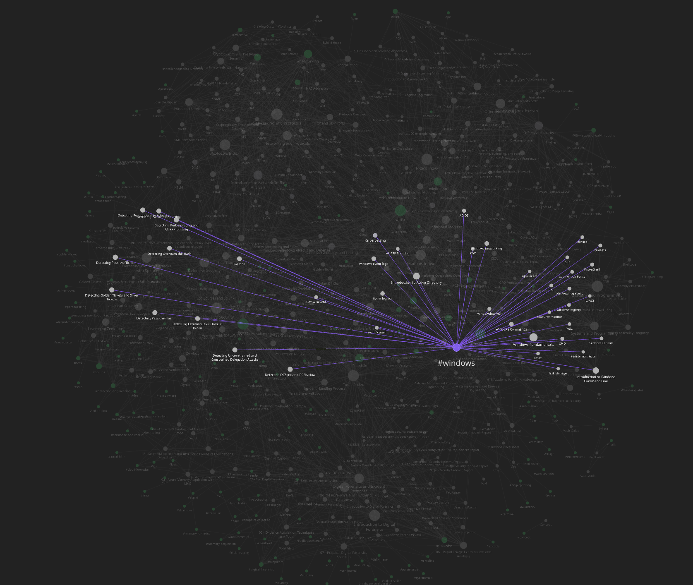

  

<h1 align="center">Infosec Wiki</h1>

  <strong>A topic-first information-security knowledge base.</strong> 
  Practical, provider-neutral references for defenders, researchers and authorized security testers.

  <a href="#browse-by-topic">Browse topics</a> ·
  <a href="INDEX.md">A–Z index</a> ·
  <a href="resources/README.md">Rules and scripts</a>

---

## Explore the knowledge graph

  

A snapshot from the companion Obsidian vault, showing how notes, tools, concepts and tags connect.

## Choose a path

| Goal | Start here | Continue with |
|---|---|---|
|  **Detection and response** | [IDS, IPS, and Detection Engineering](categories/ids-ips-detection-engineering/README.md) | [SIEM and SOC](categories/siem-soc/README.md) → [DFIR](categories/dfir/README.md) → [Malware Analysis](categories/malware-analysis/README.md) |
|  **Infrastructure security** | [Fundamentals](categories/fundamentals/README.md) | [Network Security](categories/network-security/README.md) → [Windows and Active Directory](categories/windows-active-directory/README.md) → [Cloud Security](categories/cloud-security/README.md) |
|  **Application assessment** | [Web and Application Security](categories/web-application-security/README.md) | [Offensive Security](categories/offensive-security/README.md) |
|  **Emerging technology** | [Artificial Intelligence](categories/artificial-intelligence/README.md) | [Cloud Security](categories/cloud-security/README.md) → [Fundamentals](categories/fundamentals/README.md) |

## Browse by topic

| Area | Notes | What you will find |
|---|---:|---|
|  [IDS, IPS, and Detection Engineering](categories/ids-ips-detection-engineering/README.md) | 12 | Network and endpoint detection, signatures, telemetry, and portable detection rules. |
|  [Malware Analysis](categories/malware-analysis/README.md) | 4 | Static and behavioral analysis, reverse-engineering concepts, and malware triage. |
|  [Digital Forensics and Incident Response](categories/dfir/README.md) | 4 | Evidence handling, forensic artifacts, triage, investigation, and incident response. |
|  [SIEM and SOC Operations](categories/siem-soc/README.md) | 13 | Security monitoring, log analysis, threat hunting, intelligence, and SOC workflows. |
|  [Network Security](categories/network-security/README.md) | 37 | Networking, protocols, packet analysis, segmentation, and defensive network controls. |
|  [Windows and Active Directory](categories/windows-active-directory/README.md) | 30 | Windows internals, administration, eventing, authentication, and Active Directory security. |
|  [Web and Application Security](categories/web-application-security/README.md) | 6 | Web protocols, application testing, databases, platforms, and defensive application concepts. |
|  [Offensive Security](categories/offensive-security/README.md) | 9 | Authorized security testing, enumeration, exploitation concepts, and assessment tooling. |
|  [Fundamentals](categories/fundamentals/README.md) | 14 | Operating systems, programming, cryptography, security principles, and workflow references. |
|  [Cloud Security](categories/cloud-security/README.md) | 3 | Cloud, virtualization, shared responsibility, and cloud-focused security references. |
|  [Artificial Intelligence](categories/artificial-intelligence/README.md) | 19 | Machine learning, neural networks, generative AI, and security-relevant AI concepts. |

## About this edition

This edition contains **151 reusable notes across 11 security domains**. Everything is organized by subject, with provider-neutral references and generalized or synthetic examples.

## Explore further

| Resource | Purpose |
|---|---|
| [Alphabetical note index](INDEX.md) | Find any note by title. |
| [Reusable rules and scripts](resources/README.md) | Browse portable detection rules and supporting utilities. |

---

material still work in progres missing information will be added later

