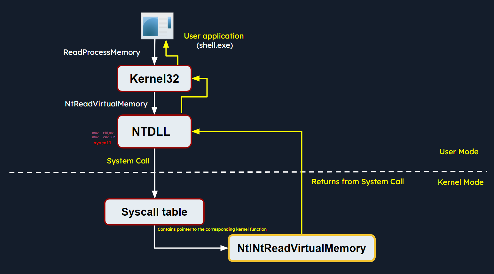

Introduction to Windows Command Line
Windows Fundamentals
# Windows Internals
Windows operating systems function in two main modes:
- `User Mode`: This mode is where most applications and user processes operate. Applications in user mode have limited access to system resources and must interact with the operating system through Application Programming Interfaces (APIs).

- `Kernel Mode`: In contrast, kernel mode is a highly privileged mode where the Windows kernel runs. The kernel has unrestricted access to system resources, hardware, and critical functions.

## Windows Architecture At A High Level

The simplified Windows architecture comprises both user-mode and kernel-mode components, each with distinct responsibilities in the system's functioning.

### User-mode Components

`User-mode components` are those parts of the operating system that don't have direct access to hardware or kernel data structures. They interact with system resources through APIs and system calls.

- `System Support Processes`: These are essential components that provide crucial functionalities and services such as logon processes (`winlogon.exe`), Session Manager (`smss.exe`), and Service Control Manager (`services.exe`). These aren't Windows services but they are necessary for the proper functioning of the system.
- `Service Processes`: These processes host Windows services like the `Windows Update Service`, `Task Scheduler`, and `Print Spooler` services. They usually run in the background, executing tasks according to their configuration and parameters.
- `User Applications`: These are the processes created by user programs, including both 32-bit and 64-bit applications. They interact with the operating system through [APIs](https://en.wikipedia.org/wiki/Windows_API) provided by Windows. These API calls get redirected to [NTDLL.DLL](https://en.wikipedia.org/wiki/Microsoft_Windows_library_files#NTDLL.DLL), triggering a transition from user mode to kernel mode, where the system call gets executed. The result is then returned to the user-mode application, and a transition back to user mode occurs.
- `Environment Subsystems`: These components are responsible for providing execution environments for specific types of applications or processes. They include the [Win32 Subsystem](https://en.wikipedia.org/wiki/Architecture_of_Windows_NT#Win32_environment_subsystem), [POSIX](https://en.wikipedia.org/wiki/Microsoft_POSIX_subsystem), and [OS/2](https://en.wikipedia.org/wiki/OS/2).
- `Subsystem DLLs`: These dynamic-link libraries translate documented functions into appropriate internal native system calls, primarily implemented in `NTDLL.DLL`. Examples include `kernelbase.dll`, `user32.dll`, `wininet.dll`, and `advapi32.dll`.

### Kernel-mode Components

`Kernel-mode components` are those parts of the operating system that have direct access to hardware and kernel data structures. These include:

- `Executive`: This upper layer in kernel mode gets accessed through functions from `NTDLL.DLL`. It consists of components like the `I/O Manager`, `Object Manager`, `Security Reference Monitor`, `Process Manager`, and others, managing the core aspects of the operating system such as I/O operations, object management, security, and processes. It runs some checks first, and then passes the call to kernel, or calls the appropriate device driver to perform the requested operation.
- `Kernel`: This component manages system resources, providing low-level services like `thread scheduling`, `interrupt and exception dispatching`, and `multiprocessor synchronization`.
- `Device Drivers`: These software components enable the OS to interact with hardware devices. They serve as intermediaries, allowing the system to manage and control hardware and software resources.
- `Hardware Abstraction Layer (HAL)`: This component provides an abstraction layer between the hardware devices and the OS. It allows software developers to interact with hardware in a consistent and platform-independent manner.
- `Windowing and Graphics System (Win32k.sys)`: This subsystem is responsible for managing the graphical user interface (GUI) and rendering visual elements on the screen.

## Windows API Call Flow
Malware often utilize Windows API calls to interact with the system and carry out malicious operations.
example of a Windows API call flow, where a user-mode application tries to access privileged operations and system resources using the [ReadProcessMemory function](https://learn.microsoft.com/en-us/windows/win32/api/memoryapi/nf-memoryapi-readprocessmemory). This function allows a process to read the memory of a different process.

Below is the syntax of `ReadProcessMemory` WINAPI function as per Microsoft documentation.

`ReadProcessMemory` is a Windows API function that belongs to the `kernel32.dll` library.
call is invoked via the `kernel32.dll`
the `kernel32.dll` module interacts with the `NTDLL.DLL` module
this function request is translated to the corresponding Native API call, which is `NtReadVirtualMemory`. The below screenshot from `x64dbg` demonstrates how this looks like in a debugger.

The `NTDLL.DLL` module utilizes system calls (syscalls).

The `syscall` instruction triggers the system call using the parameters set in the previous instructions.
The kernel maintains a table known as the `System Service Descriptor Table (SSDT)` or the `syscall table (System Call Table)`
These routines are responsible for handling system calls made by user-mode applications.

The syscall responsible for `ReadProcessMemory` is executed in the kernel, where the Windows memory management and process isolation mechanisms are leveraged. The kernel performs necessary validations, access checks, and memory operations to read the memory from the target process. The kernel retrieves the physical memory pages corresponding to the requested virtual addresses and copies the data into the provided buffer.

Once the kernel has finished reading the memory, it transitions the thread back to user mode and control is handed back to the original user mode application. The application can then access the data that was read from the target process's memory and continue its execution.

## Portable Executable
PE files accommodate a wide variety of data types including `executables (.exe)`, `dynamic link libraries (.dll)`, `kernel modules (.sys)`, `control panel applications (.cpl)`
### PE Sections
Common PE sections include:

- `Text Section (.text)`: The hub where the executable code of the program resides.
- `Data Section (.data)`: A storage for initialized global and static data variables.
- `Read-only initialized data (.rdata)`: Houses read-only data such as constant values, string literals, and initialized global and static variables.
- `Exception information (.pdata)`: A collection of function table entries utilized for exception handling.
- `BSS Section (.bss)`: Holds uninitialized global and static data variables.
- `Resource Section (.rsrc)`: Safeguards resources such as images, icons, strings, and version information.
- `Import Section (.idata)`: Details about functions imported from other DLLs.
- `Export Section (.edata)`: Information about functions exported by the executable.
- `Relocation Section (.reloc)`: Details for relocating the executable's code and data when loaded at a different memory address.

We can visualize the sections of a portable executable using a tool like `pestudio` as demonstrated below.

## Processes
It represents a slice of a program's execution in memory and consists of various resources, including memory, file handles, threads, and security contexts.

Each process is characterized by:

- `A unique PID (Process Identifier)`: A unique Process Identifier (PID) is assigned to each process within the operating system. This numeric identifier facilitates the tracking and management of the process by the operating system.
- `Virtual Address Space (VAS)`: In the Windows OS, every process is allocated its own virtual address space, offering a virtualized view of the memory for the process. The VAS is sectioned into segments, including code, data, and stack segments, allowing the process isolated memory access.
- `Executable Code (Image File on Disk)`: The executable code, or the image file, signifies the binary executable file stored on the disk. It houses the instructions and resources necessary for the process to operate.
- `Table of Handles to System Objects`: Processes maintain a table of handles, a reference catalogue for various system objects. System objects can span files, devices, registry keys, synchronization objects, and other resources.
- `Security Context (Access Token)`: Each process has a security context associated with it, embodied by an `Access Token`. This `Access Token` encapsulates information about the process's security privileges, including the user account under which the process operates and the access rights granted to the process.
- `One or More Threads Running in its Context`: Processes consist of one or more threads, where a thread embodies a unit of execution within the process. Threads enable concurrent execution within the process and facilitate multitasking.

## Dynamic-link library (DLL)

A Dynamic-link library (DLL) is a type of PE which represents "Microsoft's implementation of the shared library concept in the Microsoft Windows OS". DLLs expose an array of functions which can be exploited by malware, which we’ll scrutinize later. First, let's unravel the import and export functions in a DLL.

### Import Functions

- Import functions are functionalities that a binary dynamically links to from external libraries or modules during runtime. These functions enable the binary to leverage the functionalities offered by these libraries.
- During malware analysis, examining import functions may shed light on the external libraries or modules that the malware is dependent on. This information aids in identifying the APIs that the malware might interact with, and also the resources such as the file system, processes, registry etc.
- By identifying specific functions imported, it becomes possible to ascertain the actions the malware can perform, such as file operations, network communication, registry manipulation, and more.
- Import function names or hashes can serve as IOCs (Indicators of Compromise) that assist in identifying malware variants or related samples.

Below is an example of identifying process injection using DLL imports and function names:

In this diagram, the malware process (`shell.exe`) performs process injection to inject code into a target process (`notepad.exe`) using the following functions imported from the DLL `kernel32.exe`:

- `OpenProcess`: Opens a handle to the target process (notepad.exe), providing the necessary access rights to manipulate its memory.
- `VirtualAllocEx`: Allocates a block of memory within the address space of the target process to store the injected code.
- `WriteProcessMemory`: Writes the desired code into the allocated memory block of the target process.
- `CreateRemoteThread`: Creates a new thread within the target process, specifying the entry point of the injected code as the starting point.

As a result, the injected code is executed within the context of the target process by the newly created remote thread. This technique allows the malware to run arbitrary code within the target process.

The functions above are WINAPI (Windows API) functions. Don't worry about WINAPI functions as of now. We'll discuss these in detail later.

We can examine the DLL imports of `shell.exe` (residing in the `C:\Samples\MalwareAnalysis` directory) using `CFF Explorer` (available at `C:\Tools\Explorer Suite`) as follows.

### Export Functions

- Export functions are the functions that a binary exposes for use by other modules or applications.
- These functions provide an interface for other software to interact with the binary.
In the below screenshot, we can see an example of DLL imports (using `CFF Explorer`) and exports (using `x64dbg` - `Symbols` tab):

- `Imports`: This shows the DLLs and their functions imported by an executable `Utilman.exe`.
- `Exports`: This shows the functions exported by a DLL `Kernel32.dll`.
