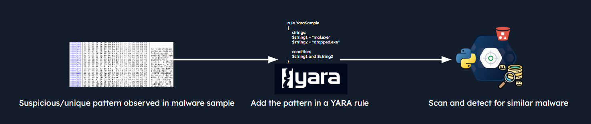
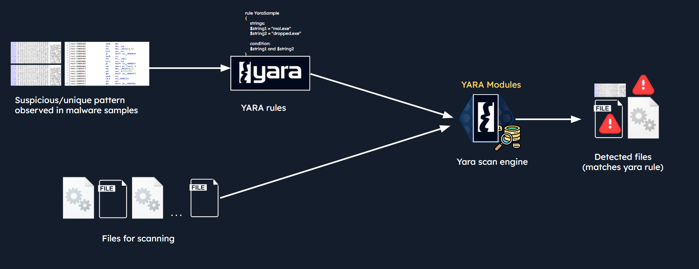
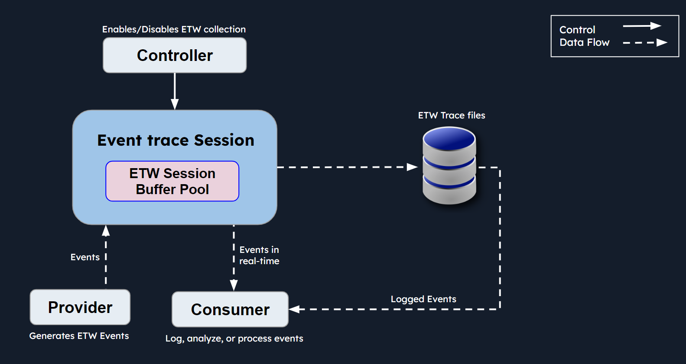

# YARA



| Category | Notes |
|---|---|
| **Type** | Pattern-matching tool / detection rule language |
| **Main Use** | Detecting files, malware, shellcode, memory artifacts, IOCs |
| **Data Sources** | Files, directories, running processes, memory dumps, ETW data, malware datasets |
| **Detection Style** | Strings, hex bytes, regex, file properties, PE metadata, entropy, imports |
| **Related Tools** | `yara`, `yarac`, `yarGen`, `Volatility`, `SilkETW`, `HxD`, `strings`, `hexdump`, `dnSpy`, `Unpac.Me` |


---

## Tools Used

| Tool | Purpose |
|---|---|
| `yara` | Scan files, folders, processes, or memory images with YARA rules |
| `yarac` | Compile YARA rules into `.yrc` format |
| `yarGen` | Generate YARA rules from malware samples |
| `strings` | Extract readable strings from binaries |
| `hexdump` | Inspect binary content from Linux terminal |
| `HxD` | Windows hex editor for manual byte/string inspection |
| `imphash_calc.py` | Calculate PE import hash |
| `entropy_pe_section.py` | Check entropy of PE sections |
| `monodis` | Disassemble .NET assemblies |
| `dnSpy` | Decompile / inspect .NET malware |
| `Volatility` | Memory forensics framework with `yarascan` plugin |
| `SilkETW` | Collect ETW data and apply YARA rules |
| `Unpac.Me` | Test YARA rules against online malware datasets |

---

## Useful Links

| Resource | Link |
|---|---|
| YARA Documentation | https://yara.readthedocs.io/en/latest/ |
| Writing YARA Rules | https://yara.readthedocs.io/en/latest/writingrules.html |
| YARA PE Module | https://yara.readthedocs.io/en/stable/modules/pe.html |
| yarGen | https://github.com/Neo23x0/yarGen |
| SilkETW | https://github.com/mandiant/SilkETW |
| Volatility | https://www.volatilityfoundation.org/releases |
| Unpac.Me | https://unpac.me/ |
| dnSpy | https://github.com/dnSpy/dnSpy |

---

## What is YARA?



`YARA` is a pattern-matching tool used to identify and classify files or memory artifacts.

It works by scanning data against rules that define suspicious patterns.

YARA rules can match:

- Text strings
- Hex bytes
- Regular expressions
- File headers
- File size
- PE metadata
- Import hashes
- Entropy
- Memory artifacts

---

## Common Use Cases

| Use Case | Description |
|---|---|
| **Malware Detection** | Detect known malware families using strings, bytes, hashes, or behavior indicators |
| **Malware Classification** | Group samples by shared code, strings, imports, or packers |
| **IOC Hunting** | Search for known filenames, domains, registry keys, mutexes, or artifacts |
| **Memory Forensics** | Scan memory dumps for malware strings or injected code |
| **Process Scanning** | Scan live process memory for shellcode or payloads |
| **Threat Hunting** | Proactively search for suspicious artifacts |
| **File Triage** | Quickly classify unknown files |
| **Rule Sharing** | Use or adapt community YARA rules |

---

## How YARA Works

```text
YARA Rules → Scan Engine → Files / Memory / Processes → Match / No Match
```

### Basic Flow

1. Analyst creates or imports YARA rules.
2. YARA scans target data.
3. The scan engine compares content against rule patterns.
4. If the condition is true, YARA returns a match.
5. Analyst reviews the matched file, process, or memory region.

---

## YARA Rule Structure

```yara
rule Example_Rule
{
    meta:
        author = "analyst"
        description = "Example YARA rule"

    strings:
        $s1 = "malicious_string"
        $s2 = "example" ascii wide
        $h1 = { 4D 5A }

    condition:
        all of them
}
```

---

## Rule Sections

| Section     | Purpose                                                    |
| ----------- | ---------------------------------------------------------- |
| `rule`      | Defines the rule name                                      |
| `meta`      | Stores documentation: author, description, reference, hash |
| `strings`   | Defines strings, hex patterns, or regex                    |
| `condition` | Defines when the rule should trigger                       |

---

## Rule Name Rules

| Rule                     | Note                                                                        |
| ------------------------ | --------------------------------------------------------------------------- |
| Case sensitive           | `Malware_Test` and `malware_test` are different                             |
| Cannot start with number | `1_rule` is invalid                                                         |
| Max length               | 128 characters                                                              |
| Reserved words           | Cannot use keywords like `rule`, `condition`, `strings`, `and`, `or`, `not` |

---

## Common String Modifiers

| Modifier   | Meaning                             |
| ---------- | ----------------------------------- |
| `ascii`    | Match ASCII string                  |
| `wide`     | Match UTF-16 / Windows-style string |
| `nocase`   | Case-insensitive match              |
| `fullword` | Match complete word only            |
| `xor`      | Match XOR-encoded string            |
| `base64`   | Match Base64-encoded string         |

Example:

```yara
strings:
    $s1 = "powershell" ascii wide nocase
```

---

## Common Conditions

| Condition             | Meaning                                           |
| --------------------- | ------------------------------------------------- |
| `all of them`         | All defined strings must match                    |
| `any of them`         | At least one string must match                    |
| `3 of them`           | At least 3 strings must match                     |
| `1 of ($x*)`          | At least one string starting with `$x` must match |
| `filesize < 200KB`    | File must be smaller than 200 KB                  |
| `uint16(0) == 0x5A4D` | File starts with `MZ`, common PE header           |
| `$s1 and $s2`         | Both strings must match                           |
| `$s1 or $s2`          | One string must match                             |

---

## PE File Checks

Windows executables usually start with:

```text
MZ
```

YARA check:

```yara
uint16(0) == 0x5A4D
```

Check for PE header:

```yara
uint16(uint32(0x3c)) == 0x4550
```

| Check          | Meaning                |
| -------------- | ---------------------- |
| `uint16(0)`    | Reads first 2 bytes    |
| `0x5A4D`       | Hex for `MZ`           |
| `uint32(0x3c)` | Reads PE header offset |
| `0x4550`       | Hex for `PE`           |

---

## YARA Modules

YARA modules extend rule capabilities.

| Module | Purpose                       |
| ------ | ----------------------------- |
| `pe`   | Inspect Windows PE metadata   |
| `math` | Entropy and numeric functions |

Example:

```yara
import "pe"
import "math"
```

---

## Example: WannaCry Rule

```yara
rule Ransomware_WannaCry
{
    meta:
        author = "Analyst"
        description = "Detects WannaCry strings"

    strings:
        $s1 = "tasksche.exe" fullword ascii
        $s2 = "www.iuqerfsodp9ifjaposdfjhgosurijfaewrwergwea.com" ascii
        $s3 = "mssecsvc.exe" fullword ascii

    condition:
        all of them
}
```

### Notes

| String              | Meaning                     |
| ------------------- | --------------------------- |
| `tasksche.exe`      | WannaCry-related executable |
| `iuqerfsodp9...com` | WannaCry kill-switch domain |
| `mssecsvc.exe`      | WannaCry service executable |

---

# Developing YARA Rules

## Manual Rule Development

Basic process:

```text
Analyze Sample → Extract Unique Indicators → Build Rule → Test Rule → Tune Rule
```

### Useful Inputs

| Input        | Example                             |
| ------------ | ----------------------------------- |
| Strings      | PDB paths, URLs, mutexes, API names |
| Hex bytes    | Unique binary sequences             |
| File size    | `filesize < 300KB`                  |
| File type    | `uint16(0) == 0x5A4D`               |
| Imphash      | `pe.imphash()`                      |
| Entropy      | `math.entropy()`                    |
| PE resources | Resource ID, size, language         |

---

## String Analysis

```bash
strings sample.exe
```

Use this to find:

* PDB paths
* Domains
* URLs
* Function names
* API calls
* Error messages
* Packers
* Malware family artifacts

Example UPX strings:

```text
UPX0
UPX1
UPX2
UPX!
```

---

## Example: UPX Packed Executable

```yara
rule UPX_packed_executable
{
    meta:
        description = "Detects UPX-packed executables"

    strings:
        $s1 = "UPX0"
        $s2 = "UPX1"
        $s3 = "UPX2"

    condition:
        all of them
}
```

### Notes

| Indicator     | Meaning              |
| ------------- | -------------------- |
| `UPX0`        | UPX section          |
| `UPX1`        | UPX section          |
| `UPX2`        | UPX section          |
| `all of them` | Reduces weak matches |

---

## Automatic Rule Generation with yarGen

`yarGen` generates YARA rules from malware samples.

It compares malware strings against goodware databases to avoid common benign strings.

### Install / Setup

```bash
pip install -r requirements.txt
python yarGen.py --update
python yarGen.py --help
```

### Generate Rule

```bash
python3 yarGen.py -m /path/to/samples -o generated_rule.yar
```

| Option | Meaning                  |
| ------ | ------------------------ |
| `-m`   | Malware/sample directory |
| `-o`   | Output YARA rule file    |

### Important

Generated rules are not final.

Always review:

* Too-generic strings
* False positives
* File size limits
* PE checks
* Condition logic
* Malware-family specificity

---

## Example: Dharma Rule Logic

Dharma sample contained unique strings:

```text
C:\crysis\Release\PDB\payload.pdb
sssssbsss
```

YARA hex string example:

```yara
rule ransomware_dharma
{
    meta:
        author = "Analyst"
        description = "Detects Dharma ransomware artifacts"

    strings:
        $pdb = { 43 3A 5C 63 72 79 73 69 73 5C 52 65 6C 65 61 73 65 5C 50 44 42 5C 70 61 79 6C 6F 61 64 2E 70 64 62 }
        $ssss = { 73 73 73 73 73 62 73 73 73 }

    condition:
        all of them
}
```

---

# Advanced Rule Examples

## APT17 / ZoxPNG RAT

Detection inputs:

| Indicator          | Reason                         |
| ------------------ | ------------------------------ |
| Unique URL strings | Malware C2 / request pattern   |
| User-Agent         | Distinct malware HTTP behavior |
| Imphash            | Groups similar PE imports      |
| File size          | Reduces false positives        |
| PE header          | Confirms Windows executable    |

Example logic:

```yara
import "pe"

rule APT17_Malware_Generic
{
    strings:
        $x1 = "Mozilla/4.0 (compatible; MSIE 8.0; Windows NT 6.1; WOW64"
        $x2 = "http://%s/imgres?q=A380"
        $s1 = "Cookie: SESSIONID=%s"
        $s2 = "Content-Type: image/x-png"

    condition:
        uint16(0) == 0x5A4D and
        filesize < 200KB and
        (
            pe.imphash() == "414bbd566b700ea021cfae3ad8f4d9b9" or
            1 of ($x*) or
            3 of ($s*)
        )
}
```

---

## Neuron / Turla .NET Malware

Detection inputs:

| Indicator             | Reason                             |
| --------------------- | ---------------------------------- |
| `.NET class names`    | Present in assembly metadata       |
| `.NET function names` | Useful for malware family matching |
| `BSJB`                | .NET CLI metadata signature        |
| PE header             | Confirms executable                |

Example strings:

```text
StorageUtils
WebServer
CommandScript
EncryptScript
ExecCMD
KillOldThread
BSJB
```

Example rule logic:

```yara
rule neuron_functions_classes_and_vars
{
    strings:
        $class1 = "StorageUtils" ascii
        $class2 = "WebServer" ascii
        $class3 = "CommandScript" ascii
        $func1 = "EncryptScript" ascii
        $func2 = "ExecCMD" ascii
        $func3 = "KillOldThread" ascii
        $dotnet = "BSJB" ascii

    condition:
        uint16(0) == 0x5A4D and
        uint16(uint32(0x3c)) == 0x4550 and
        $dotnet and
        4 of them
}
```

---

## Stonedrill / Shamoon 2.0

Detection inputs:

| Indicator              | Reason                          |
| ---------------------- | ------------------------------- |
| File enumeration APIs  | Malware searches files          |
| Resource handling APIs | Malware loads embedded resource |
| High entropy resource  | Encrypted/compressed data       |
| Resource ID `101`      | Known artifact                  |
| Unsigned PE            | Suspicious condition            |

Useful APIs:

```text
FindFirstFile
FindNextFile
FindResource
LoadResource
```

Example logic:

```yara
import "pe"
import "math"

rule suspicious_encrypted_resource_101
{
    strings:
        $a1 = "FindFirstFile" ascii wide nocase
        $a2 = "FindNextFile" ascii wide nocase
        $a3 = "FindResource" ascii wide nocase
        $a4 = "LoadResource" ascii wide nocase

    condition:
        uint16(0) == 0x5A4D and
        all of them and
        filesize < 700000 and
        pe.number_of_sections > 4 and
        pe.number_of_signatures == 0 and
        for any i in (0..pe.number_of_resources - 1):
        (
            math.entropy(pe.resources[i].offset, pe.resources[i].length) > 7.8 and
            pe.resources[i].id == 101 and
            pe.resources[i].length > 20000
        )
}
```

---

# Hunting with YARA on Windows

## Scan Files on Disk

```powershell
yara64.exe -s C:\Rules\yara\rule.yar C:\Samples\YARASigma\ -r 2>nul
```

| Option                   | Meaning                |
| ------------------------ | ---------------------- |
| `-s`                     | Print matching strings |
| `-r`                     | Recursive scan         |
| `2>nul`                  | Hide error output      |
| `C:\Rules\yara\rule.yar` | Rule file              |
| `C:\Samples\YARASigma\`  | Target directory       |

---

## Scan Running Processes

Scan all processes:

```powershell
Get-Process | ForEach-Object {
    "Scanning PID " + $_.id
    yara64.exe C:\Rules\yara\meterpreter_shellcode.yar $_.id
}
```

Scan one PID:

```powershell
yara64.exe C:\Rules\yara\meterpreter_shellcode.yar 9084 --print-strings
```

### Notes

| Result                      | Meaning                                |
| --------------------------- | -------------------------------------- |
| Match on PID                | Rule matched process memory            |
| `can not attach to process` | Permission issue; run as administrator |
| `--print-strings`           | Shows matched offsets and strings      |

---

## Example: Meterpreter Shellcode

```yara
rule meterpreter_reverse_tcp_shellcode
{
    strings:
        $s1 = { FC E8 8? 00 00 00 60 }
        $s2 = { 64 8B ?? 30 }
        $s3 = { 4C 77 26 07 }
        $s4 = "ws2_"
        $s5 = { 29 80 6B 00 }
        $s6 = { EA 0F DF E0 }
        $s7 = { 99 A5 74 61 }

    condition:
        5 of them
}
```

---

# Hunting with YARA and ETW

## What is ETW?



`ETW` = Event Tracing for Windows.

It provides low-level Windows event visibility.

### ETW Components

| Component  | Role                        |
| ---------- | --------------------------- |
| Controller | Starts/stops trace sessions |
| Provider   | Generates events            |
| Consumer   | Reads and processes events  |

---

## Useful ETW Providers

| Provider                                | Detection Use         |
| --------------------------------------- | --------------------- |
| `Microsoft-Windows-PowerShell`          | PowerShell activity   |
| `Microsoft-Windows-DNS-Client`          | DNS requests          |
| `Microsoft-Windows-Kernel-Process`      | Process activity      |
| `Microsoft-Windows-Kernel-File`         | File activity         |
| `Microsoft-Windows-Kernel-Network`      | Network activity      |
| `Microsoft-Windows-Kernel-Registry`     | Registry activity     |
| `Microsoft-Windows-DotNETRuntime`       | .NET execution        |
| `Microsoft-Windows-CodeIntegrity`       | Code/driver integrity |
| `WinRM`                                 | Remote management     |
| `Microsoft-Windows-SMBClient/SMBServer` | SMB activity          |

---

## SilkETW with YARA

SilkETW can collect ETW events and apply YARA rules to the event data.

### PowerShell Provider Example

```powershell
.\SilkETW.exe `
  -t user `
  -pn Microsoft-Windows-PowerShell `
  -ot file `
  -p ./etw_ps_logs.json `
  -l verbose `
  -y C:\Rules\yara `
  -yo Matches
```

### DNS Provider Example

```powershell
.\SilkETW.exe `
  -t user `
  -pn Microsoft-Windows-DNS-Client `
  -ot file `
  -p ./etw_dns_logs.json `
  -l verbose `
  -y C:\Rules\yara `
  -yo Matches
```

| Option        | Meaning                |
| ------------- | ---------------------- |
| `-t user`     | User-mode provider     |
| `-pn`         | Provider name          |
| `-ot file`    | Output to file         |
| `-p`          | Output path            |
| `-l verbose`  | Verbose logging        |
| `-y`          | Folder with YARA rules |
| `-yo Matches` | Only show YARA matches |

---

## Example: PowerShell ETW Rule

```yara
rule powershell_hello_world_yara
{
    strings:
        $s0 = "Write-Host" ascii wide nocase
        $s1 = "Hello" ascii wide nocase
        $s2 = "from" ascii wide nocase
        $s3 = "PowerShell" ascii wide nocase

    condition:
        3 of ($s*)
}
```

Trigger example:

```powershell
Invoke-Command -ScriptBlock { Write-Host "Hello from PowerShell" }
```

---

## Example: DNS ETW Rule

```yara
rule dns_wannacry_domain
{
    strings:
        $s1 = "iuqerfsodp9ifjaposdfjhgosurijfaewrwergwea.com" ascii wide nocase

    condition:
        $s1
}
```

Trigger example:

```powershell
ping iuqerfsodp9ifjaposdfjhgosurijfaewrwergwea.com
```

---

# Hunting with YARA on Linux / Memory Images

## Memory Image Scanning

YARA can scan raw memory dumps.

Useful when:

* The system is no longer accessible
* Malware only existed in memory
* Process injection is suspected
* DFIR team receives a memory image

---

## Memory Hunting Flow

```text
Get Memory Dump → Select / Write Rule → Scan Memory → Review Offsets → Correlate with Process
```

---

## Scan Memory Image with YARA

```bash
yara /path/to/rule.yar /path/to/memory.raw --print-strings
```

Example:

```bash
yara /home/htb-student/Rules/yara/wannacry_artifacts_memory.yar \
/home/htb-student/MemoryDumps/compromised_system.raw \
--print-strings
```

---

## Compile Rules with yarac

```bash
yarac rule.yar rule.yrc
```

| File   | Meaning                  |
| ------ | ------------------------ |
| `.yar` | Human-readable YARA rule |
| `.yrc` | Compiled YARA rule       |

### Why Compile?

* Faster scanning
* Better for large rule sets
* Useful for deployment
* Hides plain rule content from casual viewing

---

# YARA with Volatility

Volatility supports YARA scanning through `yarascan`.

## Single Pattern Scan

```bash
vol.py -f memory.raw yarascan -U "string_to_search"
```

Example:

```bash
vol.py -f compromised_system.raw yarascan \
-U "www.iuqerfsodp9ifjaposdfjhgosurijfaewrwergwea.com"
```

| Option     | Meaning                   |
| ---------- | ------------------------- |
| `-f`       | Memory image              |
| `yarascan` | Volatility YARA plugin    |
| `-U`       | Search one string/pattern |

---

## Rule File Scan

```bash
vol.py -f memory.raw yarascan -y rule.yar
```

Example:

```bash
vol.py -f compromised_system.raw yarascan \
-y /home/htb-student/Rules/yara/wannacry_artifacts_memory.yar
```

| Option | Meaning                   |
| ------ | ------------------------- |
| `-y`   | Use YARA rule file        |
| `-U`   | Use single inline pattern |

---

## Volatility Output

Look for:

| Field       | Meaning                             |
| ----------- | ----------------------------------- |
| `Rule`      | Matched YARA rule                   |
| `Owner`     | Process that owns the memory region |
| `Pid`       | Process ID                          |
| Offset      | Memory location of match            |
| Hex / ASCII | Matched memory content              |

Example finding:

```text
Rule: Ransomware_WannaCry
Owner: Process svchost.exe
Pid: 1576
```

---

# Hunting with YARA on Web Datasets

## Unpac.Me

`Unpac.Me` allows analysts to test YARA rules against a large malware dataset.

Use cases:

* Validate rules
* Find related samples
* Check false positives
* Hunt malware families
* Test rule coverage

### Basic Workflow

1. Register account.
2. Go to `Yara Hunt`.
3. Create `New Hunt`.
4. Paste YARA rule.
5. Validate rule.
6. Scan dataset.
7. Review matches.

---

# Rule Quality Notes

## Good YARA Rule Characteristics

| Good Practice               | Reason                           |
| --------------------------- | -------------------------------- |
| Use unique strings          | Reduces false positives          |
| Combine multiple indicators | Stronger detection               |
| Add file type checks        | Avoids matching wrong file types |
| Add filesize limits         | Reduces noise                    |
| Use PE/module checks        | Adds context                     |
| Add metadata                | Better rule management           |
| Test on benign files        | Validate false positives         |
| Test on related malware     | Validate detection coverage      |

---

## Weak Rule Examples

| Weak Pattern                    | Problem                          |
| ------------------------------- | -------------------------------- |
| `"cmd.exe"`                     | Too common                       |
| `"kernel32.dll"`                | Present in many Windows binaries |
| `"http"`                        | Too generic                      |
| `any of them` with weak strings | High false-positive risk         |
| Only one short string           | Easy accidental match            |

---

## Better Rule Logic

Weak:

```yara
condition:
    any of them
```

Better:

```yara
condition:
    uint16(0) == 0x5A4D and
    filesize < 300KB and
    3 of them
```

Even better:

```yara
condition:
    uint16(0) == 0x5A4D and
    filesize < 300KB and
    (
        pe.imphash() == "known_imphash" or
        1 of ($x*) or
        5 of ($s*)
    )
```

---

# Quick Command Reference

## Linux

```bash
strings sample.exe
```

```bash
hexdump sample.exe -C | grep "pattern" -n3
```

```bash
yara rule.yar sample.exe
```

```bash
yara rule.yar /path/to/folder -r
```

```bash
yara rule.yar memory.raw --print-strings
```

```bash
yarac rule.yar rule.yrc
```

```bash
vol.py -f memory.raw yarascan -U "pattern"
```

```bash
vol.py -f memory.raw yarascan -y rule.yar
```

---

## Windows

```powershell
yara64.exe C:\Rules\yara\rule.yar C:\Samples\sample.exe
```

```powershell
yara64.exe -s C:\Rules\yara\rule.yar C:\Samples\YARASigma\ -r 2>nul
```

```powershell
yara64.exe C:\Rules\yara\rule.yar <PID> --print-strings
```

```powershell
Get-Process | ForEach-Object {
    yara64.exe C:\Rules\yara\rule.yar $_.id
}
```

```powershell
.\SilkETW.exe -t user -pn Microsoft-Windows-PowerShell -ot file -p ./logs.json -l verbose -y C:\Rules\yara -yo Matches
```

---

# Important Takeaways

* YARA is used to detect patterns in files, memory, processes, and event data.
* A rule usually contains `meta`, `strings`, and `condition`.
* Strong rules combine multiple indicators.
* `yarGen` helps generate rules, but manual tuning is required.
* YARA can detect malware on disk and inside running processes.
* YARA can be combined with ETW using SilkETW.
* YARA can be combined with Volatility for memory forensics.
* Online platforms like Unpac.Me can validate rules against malware datasets.
* Always test rules against both malicious and benign samples.

