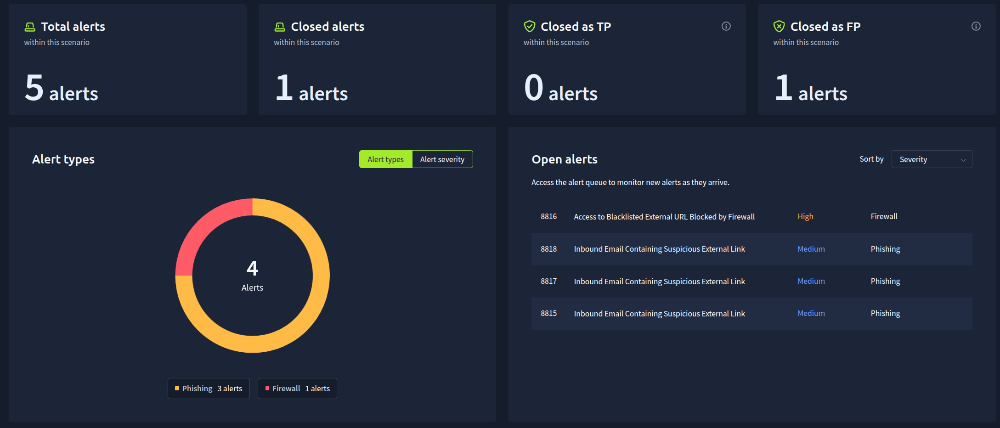
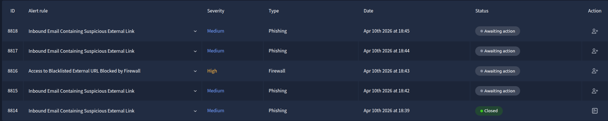
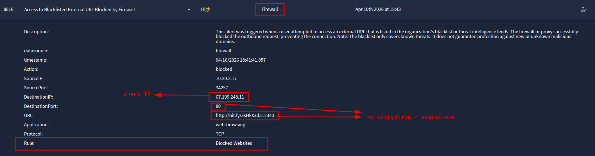
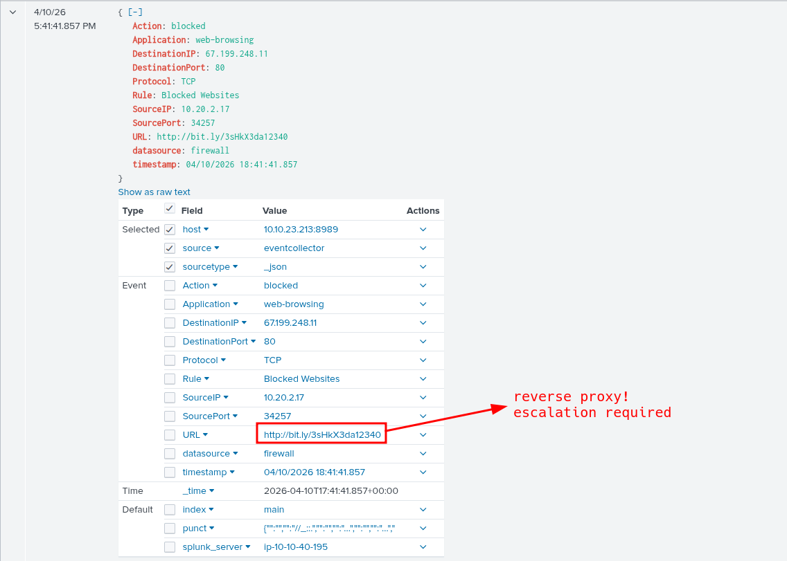
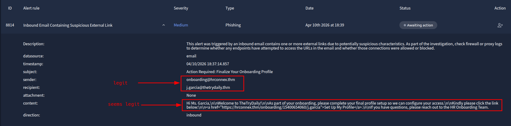
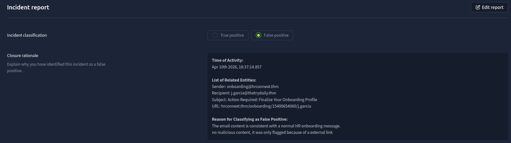
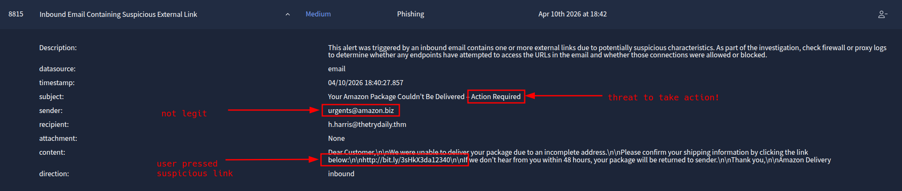
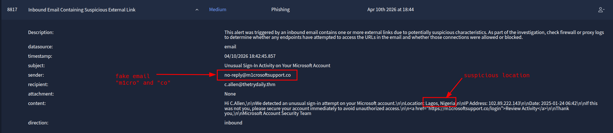
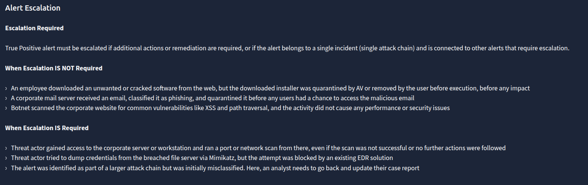

# Phishing

| Field | Value |
| --- | --- |
| **Platform** | THM |
| **SOC** | SOC-simulator |
| **Difficulty** | easy |
| **SIEM** | Splunk |
| **Topic** | phishing |

## Overview

This SOC Simulator scenario focuses on identifying and triaging phishing-related alerts.  
A total of **5 alerts** were generated in the dashboard:

- **4 phishing alerts**
- **1 firewall alert**

Because the firewall alert had the highest severity, it was reviewed first.

## Case Summary

| Case ID | Alert Type | Severity | Verdict | Escalation |
| --- | --- | --- | --- | --- |
| **8814** | Inbound Email Containing Suspicious External Link | Medium | False Positive | No |
| **8815** | Inbound Email Containing Suspicious External Link | Medium | True Positive | Yes |
| **8816** | Access to Blacklisted External URL Blocked by Firewall | High | True Positive | Yes |
| **8817** | Inbound Email Containing Suspicious External Link | Medium | True Positive | Yes |

## High-Level Analysis

The reviewed alerts show a mix of legitimate business email and clear phishing attempts.  
One alert was determined to be a **false positive** because the sender, content, and URL were consistent with a normal onboarding workflow.  
The remaining alerts were **true positives**, with clear phishing indicators such as:

- suspicious or spoofed sender domains
- urgency-based social engineering
- shortened or deceptive URLs
- fake login or package-delivery lures

There is also evidence of **alert correlation** between cases **8815** and **8816**, since both reference the same shortened URL:  
`http://bit.ly/3sHkX3da12340`

This suggests a likely phishing chain where a user received a malicious email and a host later attempted to access the linked destination, which was then blocked by the firewall.

---

# Case 8816

## Analysis

This alert was triggered when a host attempted to access a URL that matched a blacklist entry.  
The connection was successfully blocked by the firewall, which prevented the outbound connection from completing.

The URL is a shortened `bit.ly` link, which is commonly used in phishing campaigns to hide the real destination.  
Although the connection was blocked, the event still represents suspicious user or host activity and should be treated as a **true positive**.

## Incident Report

**Time of activity:**  
Apr 10th 2026 at 19:44

**List of Affected Entities:**  
Source host/IP: `10.20.2.17`  
Destination IP: `67.199.248.11`  
URL: `http://bit.ly/3sHkX3da12340`  
Firewall rule: `Blocked Websites`

**Reason for Classifying as True Positive:**  
A user endpoint attempted to access a URL that matched the organization’s blacklist, and the firewall blocked the request. The use of a shortened URL is suspicious because it hides the real destination and is commonly used in phishing or malicious delivery.

**Reason for Escalating the Alert:**  
This alert should be escalated because it shows risky user or host activity toward a known malicious or blacklisted destination. Even though the connection was blocked, the attempt may indicate a phishing click, malicious redirection, or other unsafe behavior that requires further investigation.

**Recommended Remediation Actions:**  
- Review browsing history and recent user activity on `10.20.2.17`
- Check whether the user received a phishing email or clicked a suspicious link
- Run an endpoint scan on the affected host
- Block related domains or IPs if not already covered
- Reset credentials if compromise is suspected

**List of Attack Indicators:**  
- Blacklisted external URL access attempt
- Shortened URL (`bit.ly`) used for destination obfuscation
- Outbound HTTP connection over port `80`
- Source IP: `10.20.2.17`
- Destination IP: `67.199.248.11`
- Firewall action: `blocked`

---

# Case 8814

## Analysis

This alert was triggered because an inbound email contained an external link.  
At first glance, this can look suspicious, but after reviewing the sender, subject, and message body, the email appears consistent with a legitimate onboarding workflow.

The sender address, subject line, and onboarding link all align with the context of a normal HR onboarding message.  
There is no obvious spoofing, no malicious attachment, and no strong phishing indicators in the content shown.  
This alert should therefore be classified as a **false positive**.

## Incident Report

**Time of activity:**  
Apr 10th 2026 at 18:37:14.857

**List of Related Entities:**  
Sender: `onboarding@hrconnext.thm`  
Recipient: `j.garcia@thetrydaily.thm`  
Subject: `Action Required: Finalize Your Onboarding Profile`  
URL: `hrconnext.thm/onboarding/15400654060/j.garcia`

**Reason for Classifying as False Positive:**  
The email content is consistent with a legitimate HR onboarding message. The sender, subject, and embedded link all align with the same onboarding theme and domain, and there is no obvious impersonation, malicious attachment, or mismatched URL shown in the alert. This appears to be a legitimate business email that was flagged because it contained an external link.

---

# Case 8815

## Analysis

This alert was triggered by an inbound email containing a suspicious external link.  
The sender claims to be related to Amazon, but the domain is not legitimate, and the message uses urgency to push the user to take immediate action.

The email body contains a shortened `bit.ly` URL and a common phishing lure involving package delivery failure.  
These are classic phishing indicators.  
This alert should be classified as a **true positive** and escalated.

## Incident Report

**Time of activity:**  
Apr 10th 2026 at 18:40:27.857

**List of Affected Entities:**  
Recipient: `h.harris@thetrydaily.thm`  
Sender: `urgents@amazon.biz`  
Subject: `Your Amazon Package Couldn’t Be Delivered - Action Required`  
URL: `http://bit.ly/3sHkX3da12340`  
Datasource: `email`

**Reason for Classifying as True Positive:**  
This is a true positive phishing email. The sender domain is not legitimate Amazon infrastructure, the message uses urgency to pressure the user into taking action, and it contains a shortened link that hides the real destination. These are common phishing characteristics.

**Reason for Escalating the Alert:**  
This alert should be escalated because the email contains strong social engineering indicators and a suspicious URL that may lead to credential theft or malware delivery. It is also notable that the same URL appears again in case `8816`, suggesting related follow-on activity.

**Recommended Remediation Actions:**  
- Review the affected user’s recent activity
- Check firewall, proxy, and endpoint logs for link access or follow-on traffic
- Run an endpoint scan on the user’s system
- Reset credentials if phishing exposure is suspected
- Block the sender, URL, and related domains in security controls

**List of Attack Indicators:**  
- Suspicious sender domain: `amazon.biz`
- Urgency-themed subject: `Action Required`
- Shortened URL using `bit.ly`
- Package delivery phishing lure
- Possible link to follow-on activity seen in case `8816`

---

# Case 8817

## Escalation Reference

## Analysis

This alert was triggered by an inbound email claiming there was unusual sign-in activity on a Microsoft account.  
The sender domain is a typosquatted impersonation of Microsoft and uses deceptive spelling: `m1crosoftsupport.co`.

The message attempts to create urgency and includes a fake login link that appears designed to harvest credentials.  
Because remediation is required and other users may also have received the message, this alert should be classified as a **true positive** and escalated.

## Incident Report

**Time of activity:**  
Apr 10th 2026 at 18:42:45.857

**List of Affected Entities:**  
Recipient: `c.allen@thetrydaily.thm`  
Sender: `no-reply@m1crosoftsupport.co`  
Subject: `Unusual Sign-In Activity on Your Microsoft Account`  
URL: `https://m1crosoftsupport.co/login`  
Claimed location: `Lagos, Nigeria`  
Claimed IP: `102.89.222.143`

**Reason for Classifying as True Positive:**  
This is a true positive phishing email. The sender domain is spoofed to look like Microsoft, the message creates urgency about account activity, and it includes a fake login link likely intended to steal credentials.

**Reason for Escalating the Alert:**  
Escalation is required because this is a confirmed phishing attempt delivered to a user and remediation is needed. The email may still exist in the mailbox, other users may have received the same campaign, and the recipient could interact with the link if action is not taken quickly.

**Recommended Remediation Actions:**  
- Remove the email from the recipient mailbox
- Search for additional recipients of the same phishing email
- Block the sender domain and URL in email and web security tools
- Check whether the user clicked the link or submitted credentials
- Reset credentials and review sign-in activity if user interaction is confirmed

**List of Attack Indicators:**  
- Typosquatted sender domain: `m1crosoftsupport.co`
- Fake Microsoft branding / impersonation
- Credential-harvesting login link
- Urgency-based social engineering
- Suspicious foreign location claim: `Lagos, Nigeria`
- Inbound email with suspicious external link

---

# Correlation Between Alerts

A key finding in this investigation is the relationship between cases **8815** and **8816**.

- **Case 8815** contains the phishing email with the shortened URL  
  `http://bit.ly/3sHkX3da12340`
- **Case 8816** shows a firewall block for an attempt to access that same URL

This indicates a likely phishing chain:

1. A phishing email was delivered to a user
2. The malicious or suspicious link was accessed
3. The firewall blocked the outbound request

This correlation strengthens the assessment that the activity was malicious and supports escalation.

---

## Key Lessons Learned

- phishing is one of the most common alerts in a SOC
- Not every email containing an external link is malicious
- Sender reputation, domain validation, and email context are critical
- URL shorteners are a major phishing red flag
- Typosquatted domains are strong indicators of impersonation
- Alert correlation across email and firewall telemetry improves confidence in classification

> to clarify: last remaining alert was a fault in the dectection of the SIEM

---

