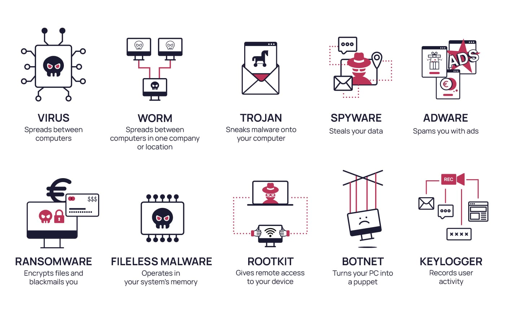

# Malware

## Definition

`Malware` is short for **malicious software**. It is a broad term used to describe software designed to infiltrate, exploit, disrupt, or damage systems, networks, and data.

## Common Objectives of Malware

Malware is commonly used to achieve one or more of the following goals:

- Disrupt normal system operations
- Steal sensitive information, including personal and financial data
- Gain unauthorized access to systems
- Conduct espionage activities
- Send spam messages
- Use compromised hosts in `Distributed Denial of Service (DDoS)` attacks
- Encrypt or lock files and demand payment through ransomware

## Common Malware Types

### Viruses
`Viruses` infect legitimate files or programs and execute when the infected file is opened or run. They can corrupt data, alter files, disrupt normal system behavior, and spread to other systems.

### Worms
`Worms` are self-replicating malware that spread across networks without user interaction. They typically exploit vulnerabilities to move between systems and can cause rapid, large-scale disruption.

### Trojans
`Trojans`, or `Trojan Horses`, disguise themselves as legitimate software to trick users into executing them. Once installed, they may create backdoors, steal data, or give attackers remote access to the system.

### Ransomware
`Ransomware` encrypts files or locks systems to make them inaccessible to the victim. Attackers then demand payment in exchange for restoring access.

### Spyware
`Spyware` secretly collects information about a user or system without consent. It may capture browsing activity, keystrokes, credentials, and other sensitive data.

### Adware
`Adware` displays unwanted advertisements on infected systems. While often less destructive than other malware types, it can still degrade system performance, invade privacy, and collect user behavior data.

### Botnets
`Botnets` are networks of infected devices controlled by an attacker through a `Command and Control (C2)` infrastructure. These devices can be used for DDoS attacks, spam campaigns, malware distribution, and other malicious activity.

### Rootkits
`Rootkits` are designed to hide malicious activity and maintain privileged access on a system. They modify system components to evade detection and make removal more difficult.

### Backdoors / RATs
`Backdoors` and `Remote Access Trojans (RATs)` provide attackers with unauthorized remote access to compromised systems. They are often used for persistence, surveillance, data theft, and follow-on attacks.

### Droppers
`Droppers` are used to deliver and install additional malicious payloads on a target system. Their main purpose is to act as a delivery mechanism for other malware.

### Information Stealers
`Information Stealers` are designed to extract valuable data such as credentials, browser data, financial information, and intellectual property. Stolen data is often used for fraud, resale, or further compromise.

> [!TIP]
> These are some of the most common malware categories, but they are not the only ones.

## Malware Sample Resources

Below are several well-known resources, both free and paid, that can be useful for malware analysis and research:

- [VirusShare](https://virusshare.com/)  
  Large malware sample repository used by researchers. It contains millions of samples that are publicly available.

- [Hybrid Analysis](https://www.hybrid-analysis.com/)  
  Online malware analysis platform that allows file submission and also provides access to public analysis results.

- [TheZoo](https://github.com/ytisf/theZoo)  
  GitHub repository containing live malware samples for research and educational purposes, along with family and behavior information.

- [Malware-Traffic-Analysis.net](https://malware-traffic-analysis.net/)  
  Provides traffic analysis exercises and malware-related `pcap` files, making it especially useful for studying malicious network behavior.

- [VirusTotal](https://www.virustotal.com/)  
  Scans files, URLs, domains, and other artifacts using many antivirus engines and analysis tools. It also offers public submissions and API access.

- [ANY.RUN](https://app.any.run/)  
  Interactive online sandbox where malware can be observed in a controlled environment. Public submissions can also be reviewed.

- [Contagio Malware Dump](https://contagiodump.blogspot.com/)  
  Archive of malware samples, reports, and related research material frequently used by analysts and researchers.

- [VX Underground](https://www.vx-underground.org/)  
  Large collection of malware source code, papers, articles, and technical resources related to malware and exploit research.