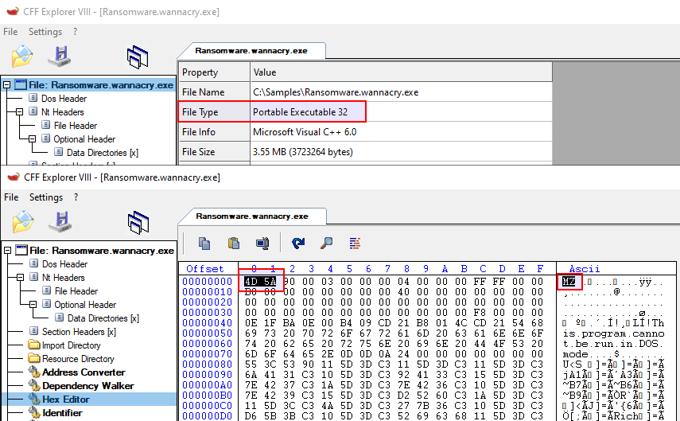
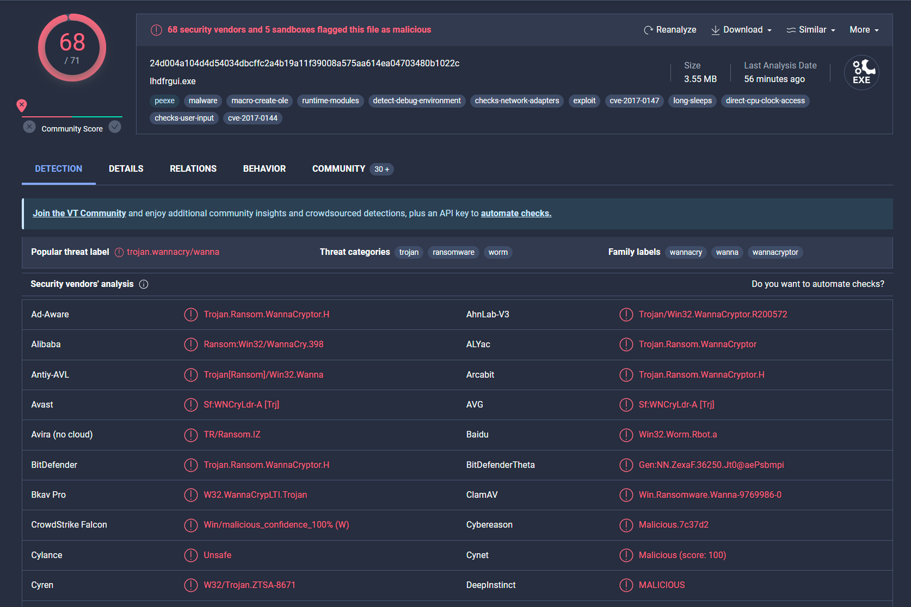
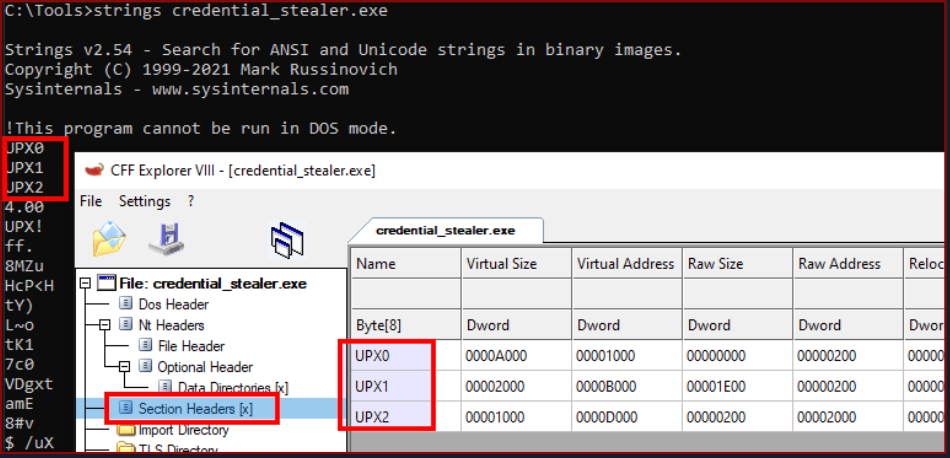

# Static Analysis on Windows

`Static analysis` is the examination of malware **without executing it**.  
On Windows, the goal is the same as on Linux: quickly extract useful information from the sample before moving to dynamic analysis or reverse engineering.

### What Static Analysis Can Reveal

- File type
- File hashes
- Strings
- Embedded elements
- Packer information
- Imports
- Exports
- Assembly-level clues

### Typical Workflow


1. Identify the file type
2. Fingerprint the sample
3. Check online reputation
4. Compare related samples
5. Extract strings
6. Detect packing
7. Unpack when possible
8. Continue with deeper analysis

---

## Identifying the File Type

The first step is to determine the **real file type** of the sample.
Do not trust the extension alone.

For example, the sample below is located at:

```text
C:\Samples\MalwareAnalysis\Ransomware.wannacry.exe
```

A Windows PE file can be identified with tools such as `CFF Explorer`.



### Key Point

At the beginning of a Windows executable, you usually see the magic bytes:

```text
4D 5A
```

This is the ASCII string `MZ`, which identifies the file as an executable.
`MZ` refers to **Mark Zbikowski**.

---

## Malware Fingerprinting

Fingerprinting creates a unique identifier for a sample using cryptographic hashes.

Common hashes:

* `MD5`
* `SHA1`
* `SHA256`

### Why It Matters

* Track malware samples
* Search for the same file on other systems
* Confirm whether a sample was already analyzed
* Share IOCs in reports and detections

### MD5

```powershell
Get-FileHash -Algorithm MD5 C:\Samples\MalwareAnalysis\Ransomware.wannacry.exe
```

Example output:

```text
Algorithm       Hash                                                                   Path
---------       ----                                                                   ----
MD5             DB349B97C37D22F5EA1D1841E3C89EB4                                       C:\Samples\MalwareAnalysis\Ransomware.wannacry.exe
```

### SHA256

```powershell
Get-FileHash -Algorithm SHA256 C:\Samples\MalwareAnalysis\Ransomware.wannacry.exe
```

Example output:

```text
Algorithm       Hash                                                                   Path
---------       ----                                                                   ----
SHA256          24D004A104D4D54034DBCFFC2A4B19A11F39008A575AA614EA04703480B1022C       C:\Samples\MalwareAnalysis\Ransomware.wannacry.exe
```

---

## File Hash Lookup

After hashing the file, check the hash in online services such as:

* `VirusTotal`
* `Cuckoo Sandbox`

This helps answer:

* Is the sample already known?
* Has it already been classified?
* Are there existing detections or reports?



### Limitation of Standard Hashes

A small change in the binary creates a completely different `MD5`, `SHA1`, or `SHA256`.
That makes exact hashes useful for identifying the **same** file, but not always **related** files.

Because of that, analysts also use similarity techniques such as:

* `IMPHASH`
* `SSDEEP`
* Section hashing

---

## Import Hashing (IMPHASH)

`IMPHASH` is a hash based on the imported functions of a PE file.

### Why It Matters

If two PE files import the same functions in the same order, they will usually have the same `IMPHASH`.
This makes it useful for finding **related samples**.

You can often find the `IMPHASH` in the details view of VirusTotal.


### Python Example

```python
import sys
import pefile
import peutils

pe_file = sys.argv[1]
pe = pefile.PE(pe_file)
imphash = pe.get_imphash()

print(imphash)
```

### Usage

```cmd
python imphash_calc.py C:\Samples\MalwareAnalysis\Ransomware.wannacry.exe
```

Output:

```text
9ecee117164e0b870a53dd187cdd7174
```

---

## Fuzzy Hashing (SSDEEP)

`SSDEEP` is a similarity hash.
Instead of looking for exact matches, it helps detect files that are **similar**.

### Use Cases

* Small malware variants
* Recompiled samples
* Slightly modified payloads

### Example

```cmd
ssdeep.exe C:\Samples\MalwareAnalysis\Ransomware.wannacry.exe
```

Output:

```text
ssdeep,1.1--blocksize:hash:hash,filename
98304:wDqPoBhz1aRxcSUDk36SAEdhvxWa9P593R8yAVp2g3R:wDqPe1Cxcxk3ZAEUadzR8yc4gB,"C:\Samples\MalwareAnalysis\Ransomware.wannacry.exe"
```

You can also find the `SSDEEP` value in VirusTotal.


---

## Section Hashing (Hashing PE Sections)

Section hashing calculates hashes for individual PE sections such as:

* `.text`
* `.rdata`
* `.data`
* `.rsrc`

This helps determine **which part of the file changed**.

### Why It Matters

Attackers often modify only part of a PE file to evade detections.
If only one section changes, section hashing helps spot that quickly.

### Python Example

```python
import sys
import pefile

pe_file = sys.argv[1]
pe = pefile.PE(pe_file)

for section in pe.sections:
    print(section.Name, "MD5 hash:", section.get_hash_md5())
    print(section.Name, "SHA256 hash:", section.get_hash_sha256())
```

### GUI Example

You can also inspect section hashes with `PeStudio`.


> [!NOTE]
> Section hashing is useful, but not perfect. Malware authors may rename or manipulate sections to make comparison harder.

---

## String Analysis

String extraction is one of the fastest ways to get clues about a sample.

### Useful Findings in Strings

* Filenames
* Dropped files
* IP addresses
* Domains
* Registry keys
* API names
* Command-line arguments
* PDB paths
* Possible malware family clues

### Sysinternals Strings

```cmd
strings C:\Samples\MalwareAnalysis\dharma_sample.exe
```

Example output:

```text
!This program cannot be run in DOS mode.
GetProcAddress
LoadLibraryA
WaitForSingleObject
InitializeCriticalSectionAndSpinCount
LeaveCriticalSection
GetLastError
EnterCriticalSection
ReleaseMutex
CloseHandle
KERNEL32.dll
C:\crysis\Release\PDB\payload.pdb
```

### Key Point

This string is especially useful:

```text
C:\crysis\Release\PDB\payload.pdb
```

A PDB path can help link a sample to a malware family.
In this case, it strongly points to `Dharma/Crysis`.

---

## FLOSS

`FLOSS` is useful when normal string extraction is not enough.

It can recover:

* Static strings
* Stack strings
* Tight strings
* Decoded strings

### Example

```cmd
floss shell.exe
```

### Why It Matters

Malware often hides or builds strings at runtime.
`FLOSS` can recover strings that normal `strings` misses.

Example findings from the sample:

* `C:\Windows\System32\notepad.exe`
* `Connection sent to C2`
* `SOFTWARE\Microsoft\Windows\CurrentVersion\Run`
* `WindowsUpdater`
* `http://ms-windows-update.com/svchost.exe`
* `45.33.32.156`
* `Sandbox detected`
* `SOFTWARE\VMware, Inc.\VMware Tools`

These strings already suggest:

* persistence
* C2 communication
* sandbox checks
* possible process injection
* network activity

---

## Unpacking UPX-packed Malware

Malware is often packed to:

* hide functionality
* reduce file size
* break static analysis
* slow reverse engineering

A common packer is `UPX` (**Ultimate Packer for eXecutables**).

### Packed Sample

```cmd
strings C:\Samples\MalwareAnalysis\packed\credential_stealer.exe
```

Example output:

```text
!This program cannot be run in DOS mode.
UPX0
UPX1
UPX2
3.96
UPX!
```

The `UPX` strings and section names strongly suggest the file is packed.



### Unpack with UPX

```cmd
upx -d -o unpacked_credential_stealer.exe C:\Samples\MalwareAnalysis\packed\credential_stealer.exe
```

Example output:

```text
Ultimate Packer for eXecutables
Copyright (C) 1996 - 2023
UPX 4.0.2

File size         Ratio      Format      Name
--------------------   ------   -----------   -----------
16896 <-      8704   51.52%    win64/pe     unpacked_credential_stealer.exe

Unpacked 1 file.
```

### Strings After Unpacking

```cmd
strings unpacked_credential_stealer.exe
```

Example output:

```text
SeDebugPrivilege
SE Debug Privilege is adjusted
lsass.exe
Searching lsass PID
Lsass PID is: %lu
lsassmem.dmp
LSASS Memory is dumped successfully
AdjustTokenPrivileges
LookupPrivilegeValueA
OpenProcessToken
MiniDumpWriteDump
OpenProcess
Process32First
Process32Next
ADVAPI32.dll
dbghelp.dll
KERNEL32.DLL
msvcrt.dll
```

### Why It Matters

Before unpacking, the strings reveal almost nothing useful.
After unpacking, the real functionality becomes visible.

In this example, the strings strongly suggest:

* privilege adjustment
* LSASS access
* process enumeration
* memory dumping
* credential theft behavior

---

## conclusions

Static analysis on Windows is a fast way to profile malware without running it.

A practical workflow is:

1. Identify the file type
2. Calculate hashes
3. Check online reputation
4. Use similarity hashing
5. Review sections
6. Extract strings
7. Detect packers
8. Unpack when possible

These steps help determine what a sample is, what it may do, and whether it is related to known malware.

