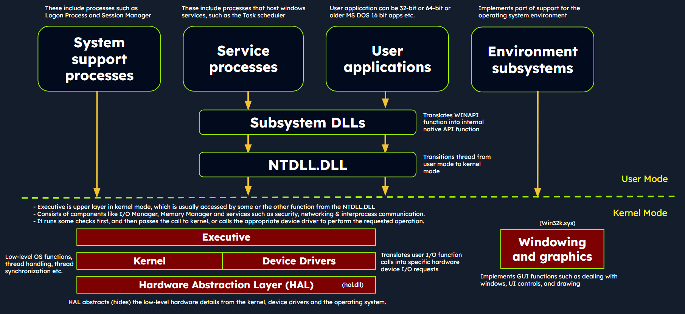
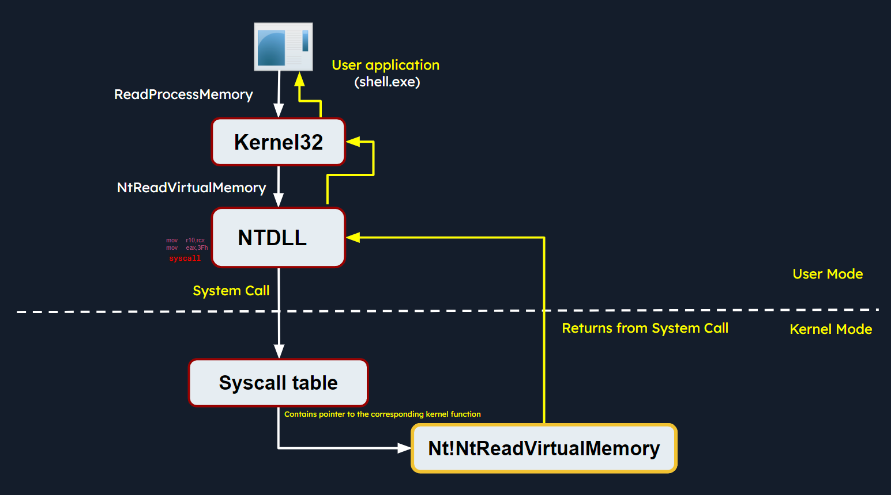
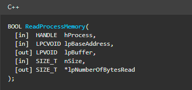
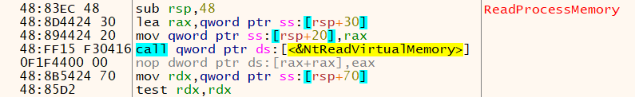
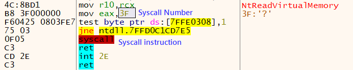
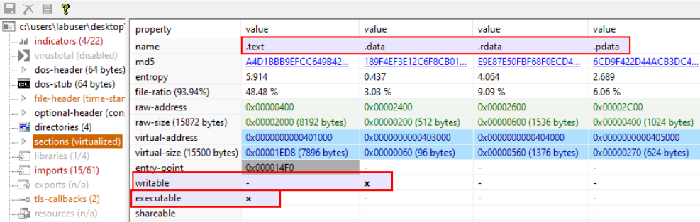
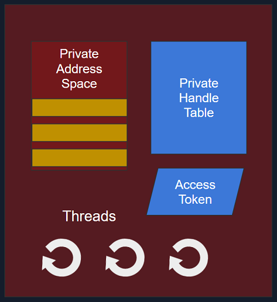
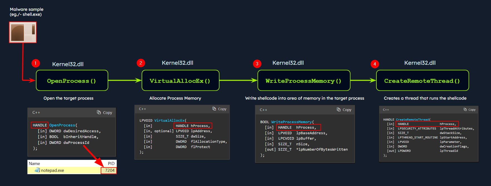
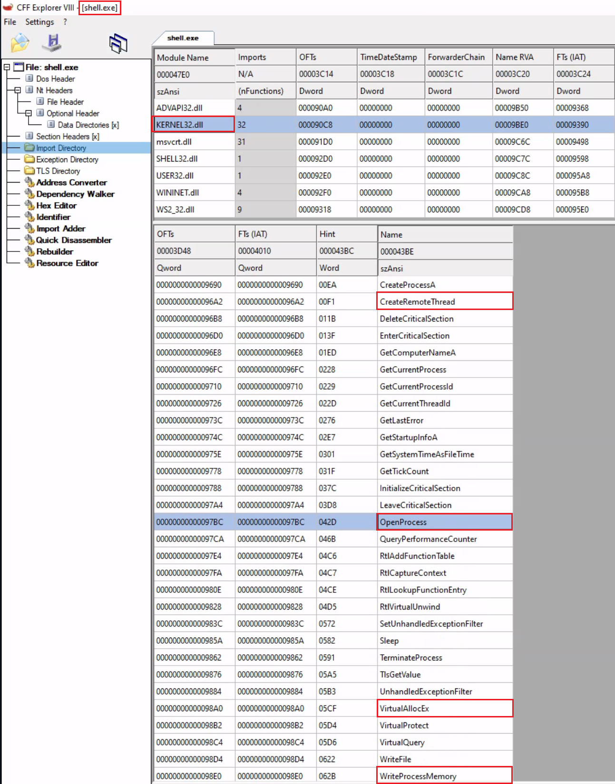
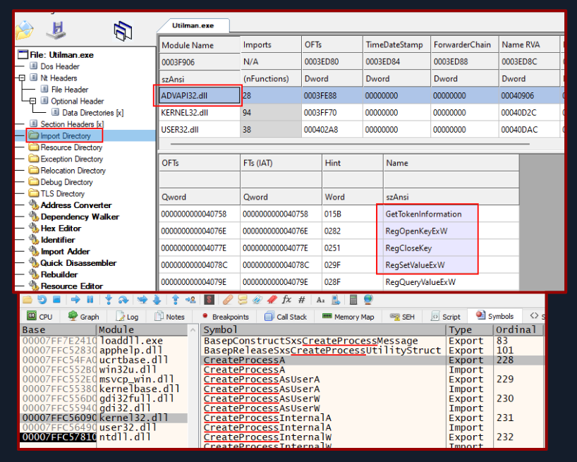

# Windows Internals

## Overview

Windows operates in two main modes:

- `User Mode`  
  Where applications and most user processes run. Access to hardware and critical system resources is limited, so processes must interact with the operating system through APIs.

- `Kernel Mode`  
  The privileged mode where the Windows kernel runs. It has direct access to hardware, memory, and core operating system functions.

---

## Windows Architecture

At a high level, Windows is divided into **user-mode** and **kernel-mode** components.

### User-Mode Components

User-mode components do not directly access hardware or kernel data structures.

- `System Support Processes`  
  Core processes required for Windows to function properly, such as `winlogon.exe`, `smss.exe`, and `services.exe`.

- `Service Processes`  
  Processes that host Windows services such as `Windows Update`, `Task Scheduler`, and `Print Spooler`.

- `User Applications`  
  Regular 32-bit and 64-bit applications launched by users. These interact with the OS through [Windows APIs](https://en.wikipedia.org/wiki/Windows_API).

- `Environment Subsystems`  
  Provide execution environments for different application types, such as [Win32](https://en.wikipedia.org/wiki/Architecture_of_Windows_NT#Win32_environment_subsystem), [POSIX](https://en.wikipedia.org/wiki/Microsoft_POSIX_subsystem), and [OS/2](https://en.wikipedia.org/wiki/OS/2).

- `Subsystem DLLs`  
  Libraries such as `kernelbase.dll`, `user32.dll`, `wininet.dll`, and `advapi32.dll` that translate API calls into lower-level native calls, mainly through `NTDLL.DLL`.

### Kernel-Mode Components

Kernel-mode components have direct access to hardware and internal operating system structures.

- `Executive`  
  Handles major OS functions such as I/O, object management, security, and process management.

- `Kernel`  
  Responsible for thread scheduling, interrupt handling, exception dispatching, and processor synchronization.

- `Device Drivers`  
  Allow Windows to communicate with hardware and software devices.

- `Hardware Abstraction Layer (HAL)`  
  Provides a consistent interface between Windows and the hardware.

- `Win32k.sys`  
  Handles window management and graphics-related functions.

---

## Windows API Call Flow

Malware often relies on Windows API calls to interact with the operating system and perform malicious actions.

A common example is [`ReadProcessMemory`](https://learn.microsoft.com/en-us/windows/win32/api/memoryapi/nf-memoryapi-readprocessmemory), a Windows API function used to read the memory of another process.

### Example Flow

1. A user-mode application calls `ReadProcessMemory`
2. The call is made through `kernel32.dll`
3. `kernel32.dll` passes the request to `NTDLL.DLL`
4. The request is translated into the native API call `NtReadVirtualMemory`
5. A `syscall` transfers execution from user mode to kernel mode
6. The kernel validates access, reads the memory, and returns the result
7. Execution returns to the original user-mode application

### Relevant Visuals

### Key Notes

- `NTDLL.DLL` acts as a bridge between user mode and kernel mode
- The `syscall` instruction is used to enter kernel mode
- The kernel uses internal syscall handling structures such as the `System Service Descriptor Table (SSDT)`
- The kernel performs access checks and memory operations before returning data to the caller

---

## Portable Executable (PE)

A `Portable Executable (PE)` is the standard file format used by Windows for:

- `.exe`
- `.dll`
- `.sys`
- `.cpl`

### Common PE Sections

- `.text` - Executable code
- `.data` - Initialized global and static data
- `.rdata` - Read-only data such as constants and strings
- `.pdata` - Exception handling information
- `.bss` - Uninitialized global and static data
- `.rsrc` - Resources such as icons, images, and version info
- `.idata` - Import information
- `.edata` - Export information
- `.reloc` - Relocation data

---

## Processes

A process is a running instance of a program in memory. It contains the resources needed for execution.

### Main Process Elements

- `PID (Process Identifier)`  
  A unique numeric identifier assigned to each process.

- `Virtual Address Space (VAS)`  
  Each process has its own isolated memory space.

- `Executable Image`  
  The file on disk that contains the program code.

- `Handle Table`  
  Stores references to system objects such as files, registry keys, and devices.

- `Access Token`  
  Defines the security context of the process, including user identity and privileges.

- `Threads`  
  A process contains one or more threads that execute code.

---

## Dynamic-Link Libraries (DLLs)

A `Dynamic-Link Library (DLL)` is a type of PE file that provides reusable code and functions to other programs.

DLLs are important in malware analysis because malware often depends on Windows DLLs to perform actions such as process injection, registry access, and network communication.

---

## Import Functions

Import functions are functions a binary uses from external DLLs at runtime.

### Why Imports Matter in Malware Analysis

- They show which libraries the malware depends on
- They help reveal possible behavior such as:
  - file operations
  - registry access
  - process injection
  - network communication
- They can be used as `IOCs (Indicators of Compromise)`

### Example: Process Injection

A malware sample such as `shell.exe` may inject code into `notepad.exe` using:

- `OpenProcess`
- `VirtualAllocEx`
- `WriteProcessMemory`
- `CreateRemoteThread`

This sequence is a classic sign of process injection.

You can inspect imports with tools such as `CFF Explorer`.

---

## Export Functions

Export functions are functions a binary exposes for use by other programs or modules.

### Why Exports Matter

- They define what functionality a DLL offers
- They help analysts understand how a DLL may be used by other software
- They can reveal interesting functionality during reverse engineering

Example of imports and exports:

- `Imports` show which DLL functions an executable uses
- `Exports` show which functions a DLL makes available to other programs