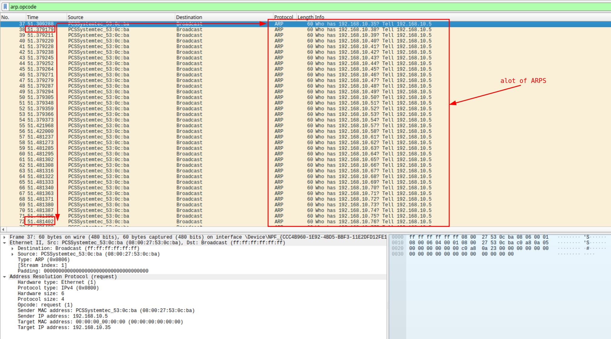
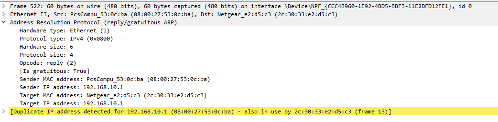

# ARP Scanning & Denial-of-Service – PCAP Analysis

## Analysis Information

| Field | Value |
|------|------|
| Attack Type | ARP Scanning / ARP-based DoS |
| PCAP Files | ARP_Scan.pcapng, ARP_Poison.pcapng |
| Tools Used | Wireshark, tcpdump |
| Protocol Focus | ARP |
| Objective | Detect ARP scanning and DoS behavior |

---

# Overview

In this analysis, we examine **ARP scanning** and how it can evolve into a **denial-of-service (DoS)** attack.

Attackers often start with ARP to:
- discover live hosts (reconnaissance)
- then poison ARP caches at scale
- disrupt communication across the network



---

# ARP Scanning

## Indicators of ARP Scanning

Typical red flags:

- Broadcast ARP requests to sequential IPs  
  (e.g. `.1 → .2 → .3 → ...`)
- Requests to non-existent hosts  
- High volume of ARP traffic from a single host  

---

## Packet Analysis – ARP Scan

### Step 1 – Open PCAP

```

wireshark ARP_Scan.pcapng

```

---

### Step 2 – Filter ARP Traffic

```

arp.opcode

```

---

### Step 3 – Identify Scanning Pattern

```

arp.opcode == 1

```

Look for:

- One MAC sending requests to many IPs
- Sequential IP targeting
- Broadcast destination

---

## Observation

We observe:

- A single host sending ARP requests to multiple IPs
- Pattern:  
```

Who has 192.168.10.1?
Who has 192.168.10.2?
Who has 192.168.10.3?

```
- Active hosts replying with ARP responses

---

## Conclusion – ARP Scan

This behavior indicates:

> Network reconnaissance using ARP scanning

Common tools:

- Nmap
- arp-scan

---

# Denial-of-Service via ARP

After scanning, the attacker escalates to **ARP poisoning at scale**.



---

## Step 1 – Open PCAP

```

wireshark ARP_Poison.pcapng

```

---

## Step 2 – Detect Abnormal ARP Replies

```

arp.opcode == 2

```

---

## Indicators of DoS

- Attacker assigns its MAC to multiple IPs
- Router ARP cache gets poisoned
- Clients receive incorrect gateway mapping

---

## Example Behavior

Attacker sends:

```

192.168.10.6 → attacker MAC
192.168.10.7 → attacker MAC
192.168.10.8 → attacker MAC

```

---

## Critical Red Flag – Gateway Spoofing

Duplicate IP detection:

```

arp.duplicate-address-detected

```

Example:

```

192.168.10.1 → attacker MAC
192.168.10.1 → router MAC

```

---

## Impact

- Traffic disruption
- Loss of connectivity
- Potential MITM if forwarding enabled

---

# Combined Analysis

### Filter attacker traffic

```

eth.addr == <attacker-mac>

```

Look for:

- large number of ARP replies
- mapping changes across multiple hosts
- inconsistent network behavior

---

# Indicators of Compromise (IOCs)

- Sequential ARP requests (scan)
- Broadcast flood from one host
- Multiple IPs mapped to same MAC
- Duplicate gateway IP detection
- Sudden spike in ARP traffic

---

# Response Actions

## 1. Identification

- Locate attacker MAC address
- Trace device physically or via switch logs

## 2. Containment

- Disconnect affected switch port
- Isolate compromised device

## 3. Mitigation

- Enable Dynamic ARP Inspection (DAI)
- Use static ARP entries (critical systems)
- Implement port security
- Monitor ARP traffic continuously

---

# Summary

This analysis demonstrates a typical attack chain:

1. ARP scanning to discover live hosts  
2. ARP poisoning to disrupt network communication  
3. Possible escalation to MITM  

Key insight:

> ARP attacks often start quietly (recon) and escalate quickly into full network disruption.

---


