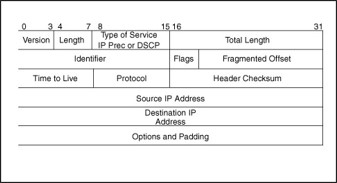
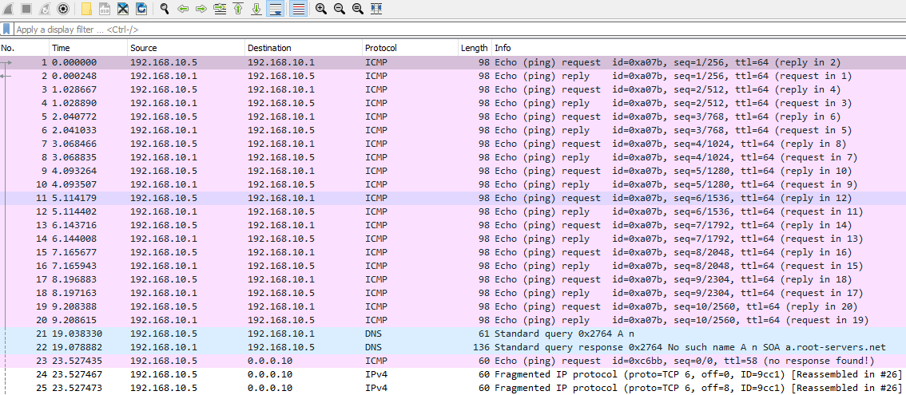
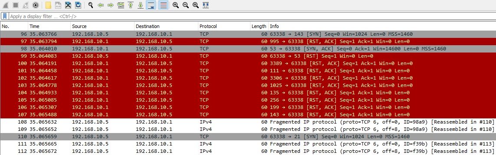

# Fragmentation Attacks – PCAP Analysis

## Analysis Information

| Field | Value |
|------|------|
| Attack Type | Fragmentation / IDS Evasion |
| PCAP File | nmap_frag_fw_bypass.pcapng |
| Tools Used | Wireshark, tcpdump |
| Protocol Focus | IPv4 |
| Objective | Detect fragmentation abuse and evasion techniques |

---

# Overview

In this analysis, we investigate **IP fragmentation attacks**, commonly used for:

- IDS/IPS evasion  
- Firewall bypass  
- Resource exhaustion  
- Denial-of-service  

Attackers manipulate how packets are split and reassembled to bypass detection mechanisms.

---

# How Fragmentation Works (Normal Behavior)

The IP layer allows large packets to be split into smaller fragments.



## Key Fields

- **Total Length** → full packet size  
- **Fragment Offset** → position of fragment  
- **Flags** → indicates more fragments  
- **Source/Destination IP** → communication endpoints  

Normal behavior:

1. Large packet is split into fragments  
2. Fragments are transmitted  
3. Destination reassembles packets  

---

# Abuse of Fragmentation

Attackers exploit fragmentation to:

- evade IDS/IPS (no reassembly)
- bypass firewall filtering
- overload network controls
- cause DoS conditions

Example:

```

nmap -f 10 <target>

```

This forces very small packet fragments.

---

# Packet Analysis

## Step 1 – Open PCAP

```

wireshark nmap_frag_fw_bypass.pcapng

```

---

## Step 2 – Identify Initial Activity

Look for:

- ICMP echo requests (host discovery)
- normal Nmap scan behavior

```

icmp

```

---

## Step 3 – Detect Fragmented Packets

Filter:

```

ip.flags.mf == 1 or ip.frag_offset > 0

```

Indicators:

- many fragmented packets
- unusually small packet sizes
- repeated fragmentation from one host

---

## Step 4 – Identify Suspicious Pattern

Observation:

- one source IP sending fragmented packets
- multiple destination ports targeted

This suggests:

> Fragmented port scan

---

## Step 5 – Detect Port Scanning Behavior

Filter:

```

tcp.flags.syn == 1 and tcp.flags.ack == 0

```

Look for:

- SYN packets to many ports
- RST responses from target

Example behavior:

- SYN → port 22  
- RST ← (closed)  
- SYN → port 80  
- RST ←  

---

## Step 6 – Combine Fragmentation + Scan

Filter combination:

```

(ip.flags.mf == 1 or ip.frag_offset > 0) && tcp

```

This reveals:

- fragmented TCP scan traffic
- evasion attempt

---

## Step 7 – Key Indicator

Main red flag:

> One host → many ports + fragmentation

This is a strong indicator of:

- Nmap fragmentation scan
- firewall/IDS evasion attempt



---

# Indicators of Compromise (IOCs)

- High number of fragmented packets
- Very small fragment sizes (low MTU)
- One source targeting many ports
- SYN scan behavior combined with fragmentation
- RST responses from target host
- Abnormal IP fragment offsets



---

# Detection Challenges

- Some IDS/IPS do not reassemble packets
- Firewalls may inspect fragments individually
- Attack traffic appears incomplete

---

# Mitigation

- Enable packet reassembly on IDS/IPS
- Normalize fragmented traffic
- Drop suspicious small fragments
- Monitor abnormal MTU usage
- Rate-limit fragmented packets

---

# Summary

This PCAP demonstrates a **fragmentation-based evasion attack**.

Key findings:

- Attacker used fragmented packets to scan ports
- Target responded with RST (closed ports)
- Fragmentation used to bypass detection

---

#  What I learned?
- Always check IP layer anomalies
- Fragmentation + scanning = major red flag
- Look for one host targeting many ports
- Use combined filters (IP + TCP)
- IDS evasion techniques often rely on fragmentation
