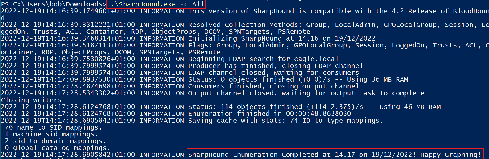
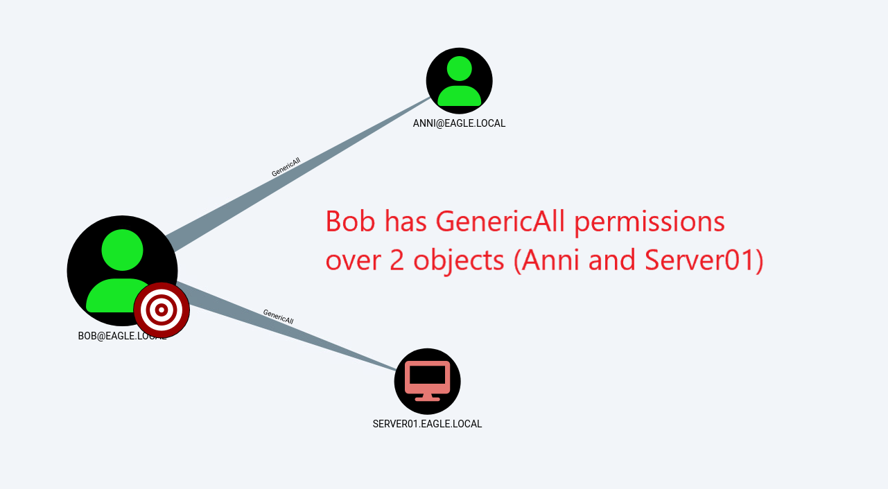
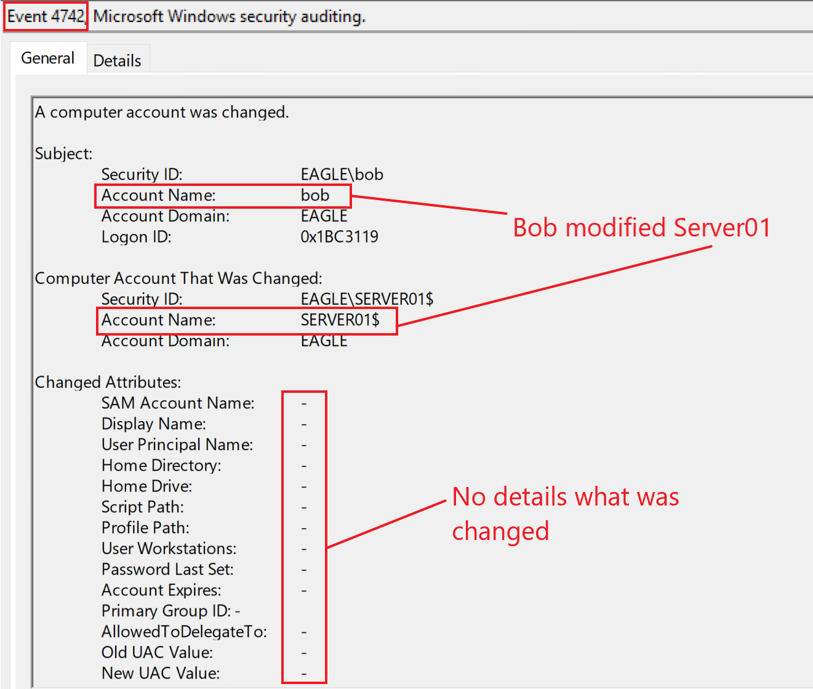
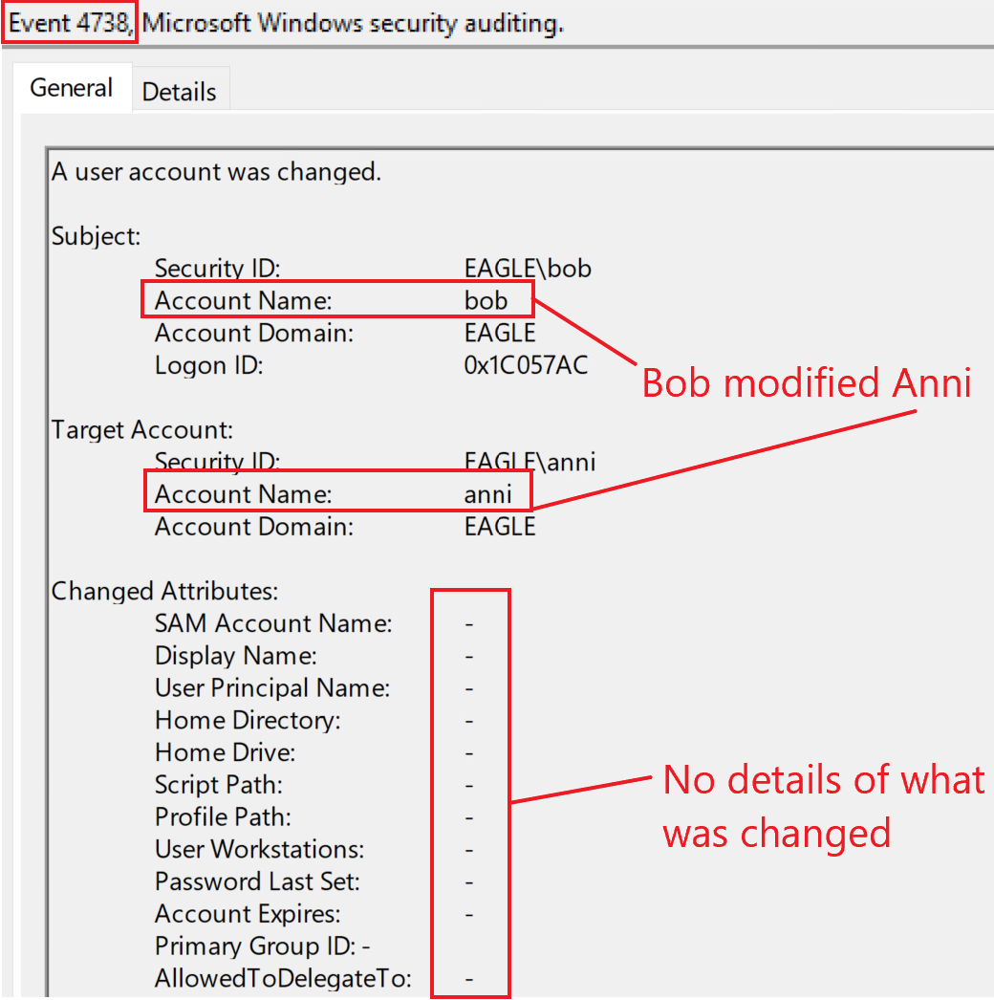

# ACLs on Objects

## Description

In Active Directory, [Access Control Lists (ACLs)](https://learn.microsoft.com/en-us/windows/win32/secauthz/access-control-lists) define which trustees have access to a specific object and what type of access they have.

Each `ACL` contains multiple `Access Control Entries (ACEs)`, and each `ACE` defines:

- the trustee
- the permission or type of access granted

In practice, these permissions can allow actions such as:

- password resets
- modification of group membership
- deletion of objects
- changes to object attributes

By default, highly privileged groups such as `Domain Admins` have powerful rights over many objects in the domain, including the ability to reset passwords.

In real Active Directory environments, misconfigured ACLs are common. Examples include:

- all Domain Users added as local Administrators on all servers
- overly broad rights allowing everyone to modify objects
- all Domain Users having access to extended computer properties such as `LAPS` passwords

These misconfigurations can create direct privilege escalation paths.

---

## Attack Walkthrough

To identify abusable ACLs, we can use [BloodHound](https://github.com/BloodHoundAD/BloodHound) to map relationships between objects and [SharpHound](https://github.com/BloodHoundAD/SharpHound) to collect the data.

When running `SharpHound`, we can use `All` as the value for the `-c` parameter, which is the short form of `CollectionMethod`:

The ZIP file generated by `SharpHound` can then be imported into `BloodHound` for analysis.

In this example, we focus on escalation paths starting from the user `Bob`:

`Bob` has full rights over the user `Anni` and the computer `Server01`.

### 1. Full rights over the user Anni

If Bob has full control over `Anni`, he can modify the account and add an SPN value. Once an SPN is present, Bob can perform a `Kerberoasting` attack against that account.

### 2. Full rights over the computer object Server01

If Bob has full control over `Server01`, this can also be valuable.

For example, if `LAPS` is used in the environment, Bob may be able to read the password stored in the computer object attributes and then authenticate as the local Administrator on that server.

In addition to `BloodHound`, we can also use [ADACLScanner](https://github.com/canix1/ADACLScanner) to generate reports of:

- `DACLs` — Discretionary Access Control Lists
- `SACLs` — System Access Control Lists

---

## Prevention

There are three main defensive actions that help reduce this risk:

- begin `continuous assessment` to identify dangerous ACLs in the AD environment
- `educate` privileged employees and administrators so they do not assign unnecessary rights
- `automate` access management as much as possible and ensure privileged access is granted only to dedicated administrative accounts

Additional good practices include:

- regularly review delegated permissions on sensitive users, groups, and computers
- restrict who can modify privileged accounts and server objects
- audit access to attributes that may contain sensitive data, such as `LAPS` passwords
- remove legacy delegations that are no longer needed

---

## Detection

Detection depends on what action the attacker performs through the abused ACL.

In the first case above, Bob modifies `Anni` by adding an SPN value. This allows Bob to later perform `Kerberoasting` against the account.

When the SPN value is added, event ID `4738` — **A user account was changed** — is generated.

If privileged users follow a naming convention such as `adminxxxx`, then any sensitive user modification not associated with such an account should be treated as suspicious.

If ACL abuse results in a password reset, event ID `4724` will be logged.

If a computer object is modified, event ID `4742` is generated. Although this event is limited in the level of detail it provides, it still indicates that a change was made and may reveal that a compromised user account is being abused.

The following event ID `4742` was generated when Bob modified `Server01`:

### Detection Ideas

- monitor event ID `4738` for unexpected changes to user accounts
- monitor event ID `4724` for suspicious password resets
- monitor event ID `4742` for changes to computer objects
- baseline which users are allowed to manage privileged objects
- alert when non-administrative users modify sensitive accounts, groups, or computers
- monitor access to attributes that may expose local admin credentials such as `LAPS`

---

## Honeypot Approach

Misconfigured ACLs can also be used as a detection mechanism.

There are two practical ways to approach this:

1. Assign relatively high rights to a honeypot user account that is already exposed through another technique, such as fake credentials stored in the `Description` field
2. Create a honeypot user that many users, or even everyone, can modify, while ensuring the account appears active and believable

In the second scenario, any change involving that honeypot account should be treated as suspicious.

For example, any event ID `4738` associated with the honeypot user should trigger an alert.

