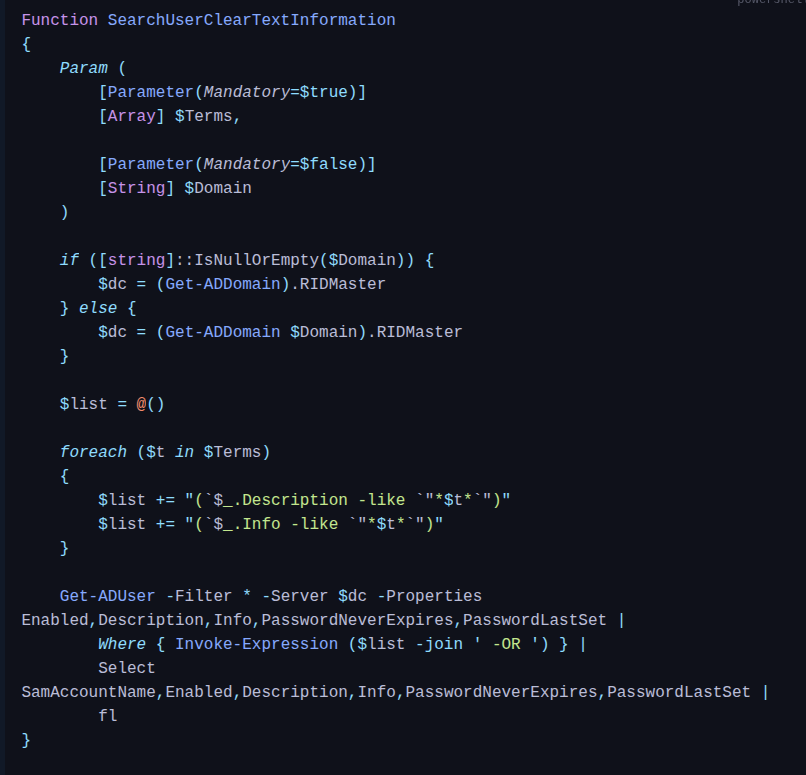
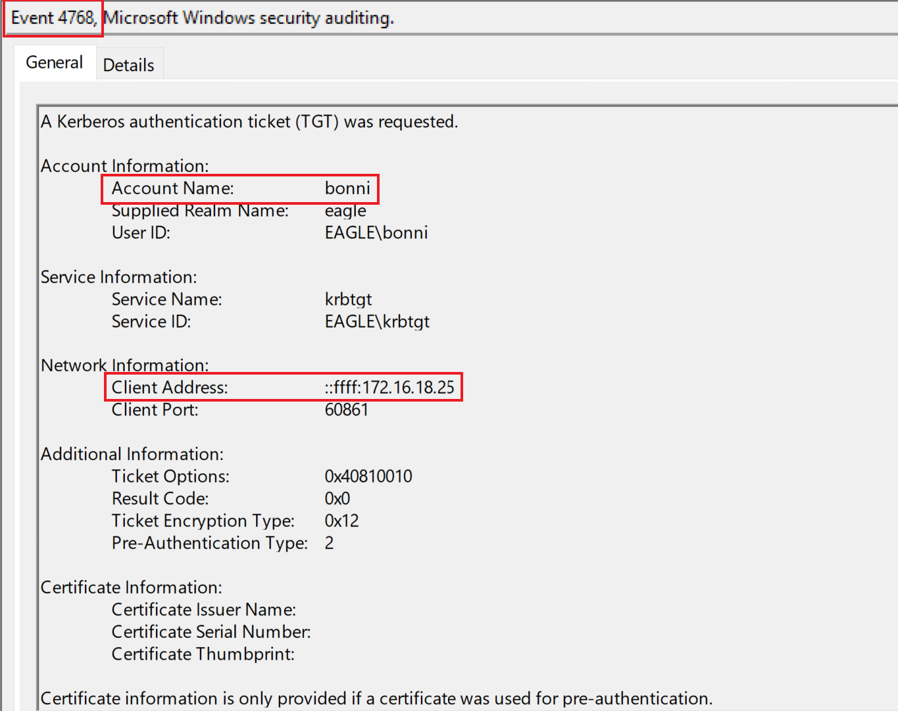
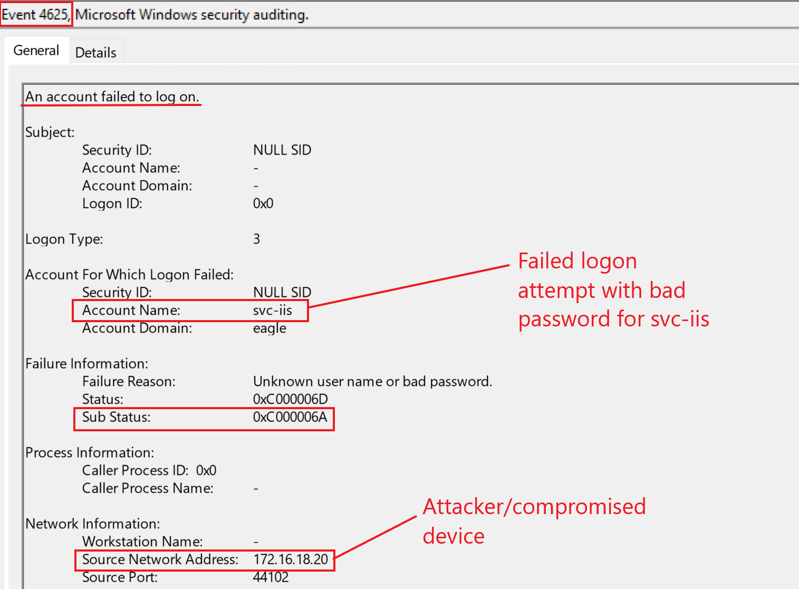
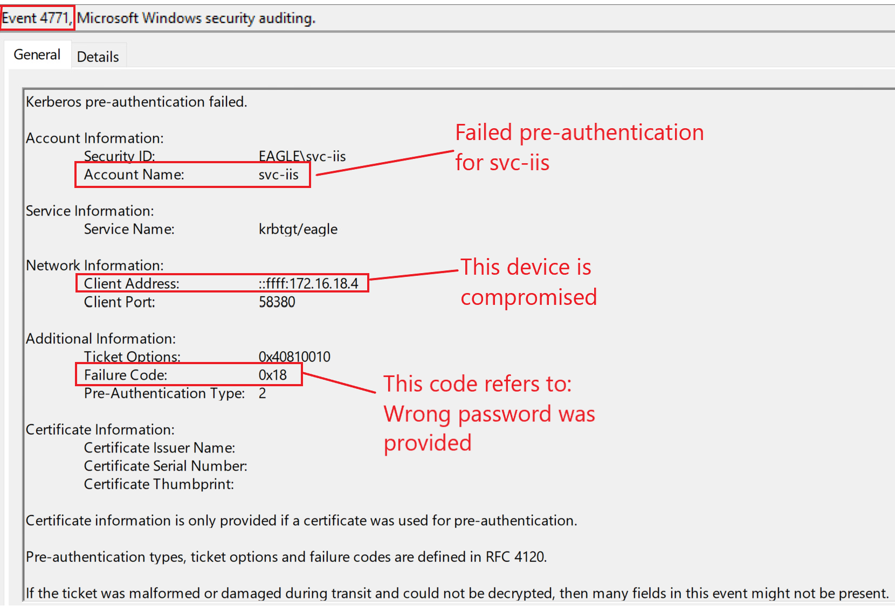
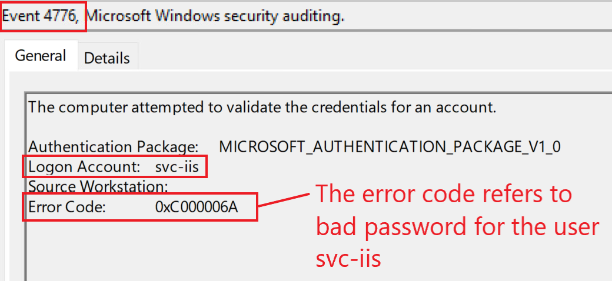

# Credentials in Object Properties

## Description

In Active Directory, objects such as a `user` account contain a variety of properties that store information, for example:

- whether the account is enabled
- when the account expires
- when the password was last changed
- the account name
- office location and phone number

A common bad practice in older environments was to store a user’s or service account’s password directly in the `Description` or `Info` properties.

This creates a serious risk because these fields may be readable by users who should never have access to credentials.

---

## Attack Walkthrough

A simple PowerShell script can query the domain and search for specific strings inside the `Description` or `Info` fields.



For example, searching for the term `pass` may reveal accounts with cleartext credentials stored in their properties:

```powershell id="pn4xke"
PS C:\Users\bob\Downloads> SearchUserClearTextInformation -Terms "pass"

SamAccountName       : bonni
Enabled              : True
Description          : pass: Slavi123
Info                 :
PasswordNeverExpires : True
PasswordLastSet      : 05/12/2022 15.18.05
```

In this case, the account `bonni` has a password exposed in the `Description` field.

---

## Prevention

There are several ways to reduce the risk of this misconfiguration:

* perform continuous assessments to identify credentials stored in object properties
* educate privileged employees and administrators not to store passwords in `Description` or `Info` fields
* automate as much of the account creation and management process as possible
* reduce manual handling of service accounts and privileged accounts
* review legacy user and service account objects for exposed credentials

The main goal is to ensure that credentials are never stored in cleartext in any directory object property.

---

## Detection

The best way to detect abuse of exposed credentials in object properties is by baselining authentication behavior.

If an attacker finds and uses credentials stored in a property, we may observe suspicious authentication events such as:

* `4624` — successful logon
* `4625` — failed logon
* `4768` — Kerberos TGT requested

Below is an example of event ID `4768`:



One limitation is that event ID `4738`, which is generated when a user object is modified, does **not** show the exact property that was changed and does not reveal the new value. This makes it harder to detect when someone adds credentials to `Description` or `Info`.

### Detection Ideas

* monitor event IDs `4624`, `4625`, and `4768` for accounts with suspicious or unexpected activity
* baseline normal logon behavior for service accounts and privileged users
* investigate authentication attempts from unusual systems or user workstations
* run periodic scans for sensitive strings in `Description` and `Info` fields
* prioritize monitoring for accounts with old passwords or `PasswordNeverExpires` enabled

---

## Honeypot Approach

To create a honeypot for this attack, the following conditions should be met:

* the password or credential should be placed in the `Description` field, since it is the easiest location for an attacker to discover
* the password must be fake or incorrect
* the account should be enabled and show recent login activity
* a service account is usually the most believable option, because these are more often created manually by administrators
* the account should have a password last set date older than two years to make the credential appear realistic

Because the password is intentionally wrong, any authentication attempt using it becomes suspicious and can serve as a strong detection signal.

The following event IDs can indicate this type of abuse:

* `4625`
* `4771`
* `4776`





