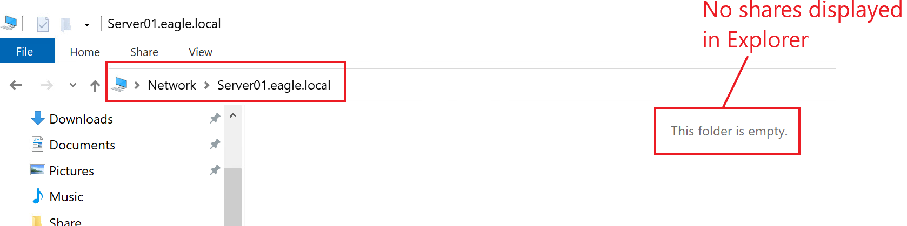
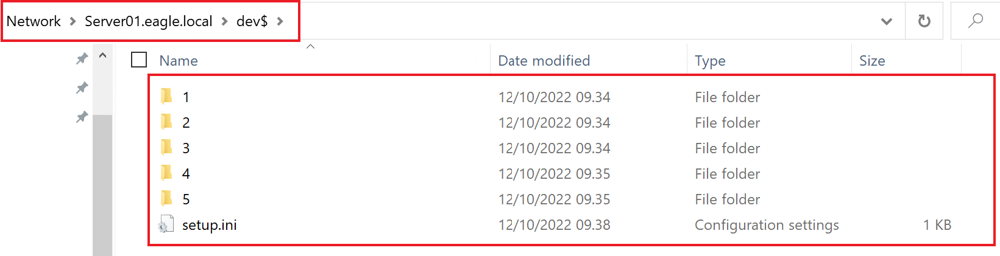
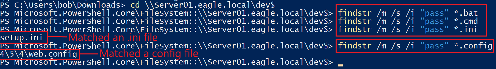
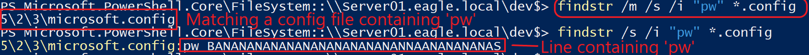
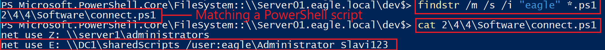
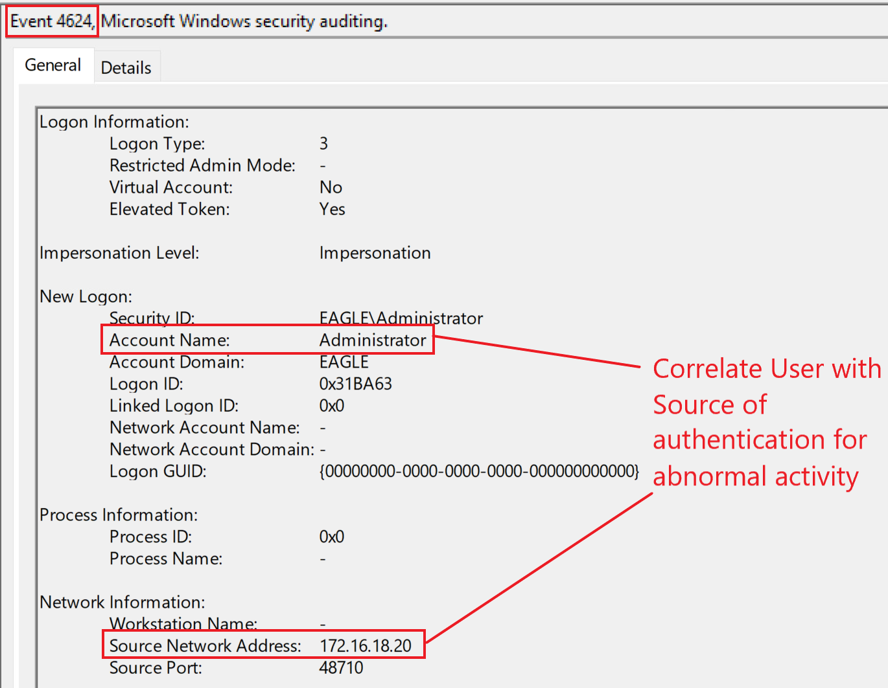
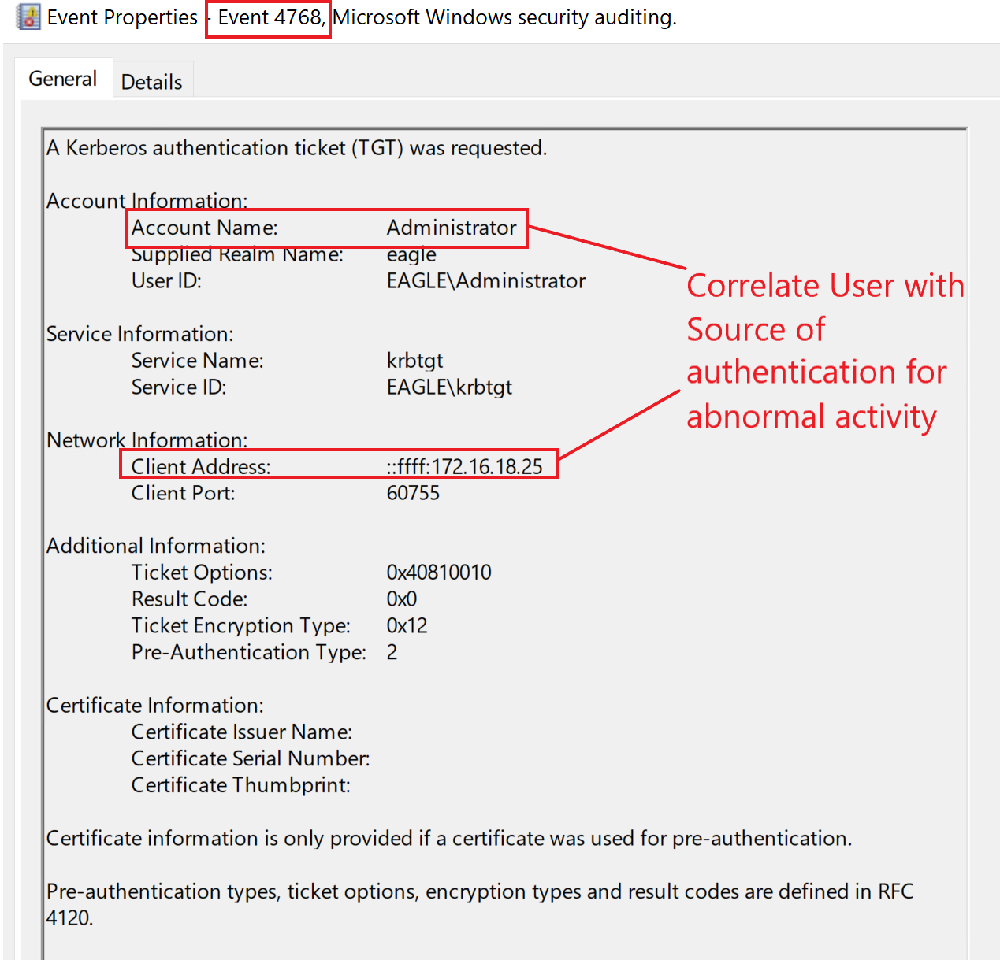

# Credentials in Shares

## Description

Credentials exposed in network shares are probably one of the most common misconfigurations in Active Directory environments.

We often find credentials in network shares inside scripts and configuration files such as:

- `batch`
- `cmd`
- `PowerShell`
- `conf`
- `ini`
- `config`

By contrast, credentials on a user’s local machine are more often found in text files, Excel sheets, or Word documents.

A network share may end up being accessible to every user for several reasons:

- an administrator initially creates the share with proper restrictions but later opens it too broadly
- an administrator stores scripts with credentials in a share without realizing it is widely accessible
- a share is intentionally opened temporarily for file transfer and then forgotten
- hidden shares (folders ending with a dollar sign, such as `$`) are incorrectly assumed to be secure simply because they are not easily visible in Windows Explorer

---

## Attack Walkthrough

The first step is identifying which shares exist in the domain.

Many tools can do this, such as PowerView’s [Invoke-ShareFinder](https://github.com/darkoperator/Veil-PowerView/blob/master/PowerView/functions/Invoke-ShareFinder.ps1).

The following output shows non-default shares that the current user can access with at least read permissions:

```powershell 
PS C:\Users\bob\Downloads> Invoke-ShareFinder -domain eagle.local -ExcludeStandard -CheckShareAccess

\\DC2.eagle.local\NETLOGON      - Logon server share
\\DC2.eagle.local\SYSVOL        - Logon server share
\\WS001.eagle.local\Share       -
\\WS001.eagle.local\Users       -
\\Server01.eagle.local\dev$     -
\\DC1.eagle.local\NETLOGON      - Logon server share
\\DC1.eagle.local\SYSVOL        - Logon server share
```

One interesting example is the share named `dev$`.

Because of the dollar sign, this share will not normally appear when browsing the server through Windows Explorer. This often creates a false sense of security.



However, once we know the `UNC` path, we can browse to it directly and access its contents.



After locating accessible shares, the next step is searching for credentials inside files.

Some automated tools exist for this, such as [SauronEye](https://github.com/vivami/SauronEye), which can parse large collections of files and search for interesting keywords.

We can also use the built-in Windows command `findstr`. Useful arguments include:

* `/s` searches the current directory and all subdirectories
* `/i` ignores case
* `/m` shows only filenames that contain a matching term

The following screenshots show this approach:







Note that running `findstr` with these arguments has recently started to be detected by `Windows Defender` as suspicious behavior.

---

## Prevention

The best way to prevent this attack is to lock down every share in the domain so that permissions are granted only where necessary.

There is no technical control that fully prevents users or administrators from leaving credentials behind in scripts or exposed files. For that reason, regular scanning is necessary.

Recommended mitigations include:

* review and restrict share permissions across the domain
* remove unnecessary read access from open shares
* audit hidden shares as carefully as visible shares
* scan regularly for exposed credentials in scripts and configuration files
* review legacy shares and temporary shares that may have been forgotten

A practical approach is to perform recurring scans, for example weekly, to identify:

* newly exposed shares
* old shares that remain too open
* files containing passwords, connection strings, or embedded credentials

---

## Detection

One detection opportunity is to monitor authentication activity involving exposed accounts.

If an attacker finds credentials in a share and attempts to use them, we may see suspicious logon activity. In a mature environment, this becomes even more visible if privileged users are expected to authenticate only from designated systems such as `Privileged Access Workstations (PAWs)`.

Useful event IDs include:

* `4624` — successful logon
* `4625` — failed logon
* `4768` — Kerberos TGT requested

Below is an example of a successful logon with event ID `4624` for the `Administrator` account:



If Kerberos is used for authentication, event ID `4768` may also be generated:



Another useful detection technique is identifying `one-to-many` connection patterns.

For example, when a tool such as `Invoke-ShareFinder` scans the domain, a single workstation may start connecting to hundreds or even thousands of other systems in a short period of time. That is usually abnormal and may indicate share enumeration activity.

### Detection Ideas

* alert on privileged account usage from unusual hosts
* monitor event IDs `4624`, `4625`, and `4768` for accounts exposed in shares
* detect large-scale share enumeration across many hosts
* look for one workstation making connections to many systems in a short period
* investigate use of `findstr`, PowerView, or similar tooling on endpoints where it is not expected

---

## Honeypot Approach

This attack provides another strong use case for a honeypot account in Active Directory: a semi-privileged username with a **wrong password** placed in a realistic file on a network share.

A good setup for this trap includes:

* a `service account` created more than two years ago
* a last password change at least one year ago
* the account still appearing active in the environment
* a realistic file containing fake credentials, such as a script or configuration file
* a modification date on the file that is later than the account’s last password change

The script containing the fake credentials should look believable. For example, if the honeypot account is an `MSSQL` service account, the file could contain a realistic connection string.

Because the password is intentionally wrong, we would mainly expect **failed authentication attempts**.

The following event IDs can indicate this type of abuse:

* `4625`
* `4771`
* `4776`


