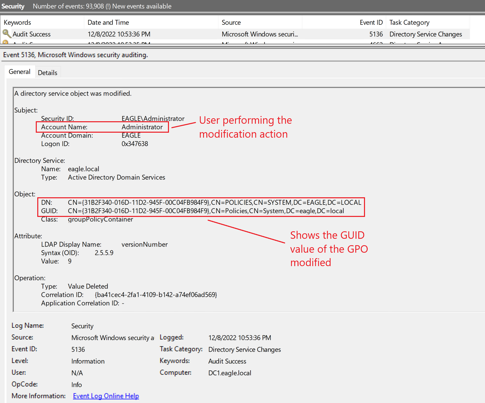
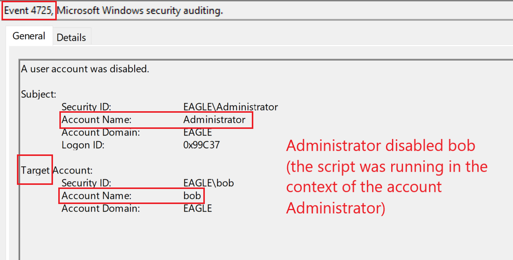

# GPO Permissions / GPO Files

## Description

A [Group Policy Object (GPO)](https://learn.microsoft.com/en-us/previous-versions/windows/desktop/policy/group-policy-objects) is a collection of policy settings in `Active Directory` used to centrally manage systems and users.

Each GPO has a unique name and can contain zero or more policy settings.

### How GPOs Are Applied

- GPOs are linked to an `Organizational Unit (OU)` in Active Directory
- The settings apply to:
  - objects directly inside that OU
  - objects in child OUs
- By default, GPOs often apply to `Authenticated Users`
- Application can be restricted through:
  - `security filtering` (for example, specific AD groups)
  - `WMI filters` (for example, only Windows 10 devices)

### Normal Permission Model

Newly created GPOs are normally editable only by:

- `Domain Admins`
- other highly privileged administrative roles

### Security Risk

The main issue appears when less privileged users are delegated permission to edit GPOs.

If a GPO can be modified by broad groups such as:

- `Authenticated Users`
- `Domain Users`

then any compromised account in those groups could potentially abuse the GPO.

### Possible Abuse

An attacker with GPO edit rights can modify the policy to execute malicious actions, such as:

- adding startup scripts
- creating scheduled tasks
- forcing systems to run attacker-controlled files

Because GPOs can affect all systems in linked OUs, this can lead to compromise of:

- multiple computers
- entire OU scopes
- potentially large parts of the domain

### Related Misconfiguration: File Share Abuse

Even when the GPO itself is configured correctly, there can still be risk if:

- administrators deploy software through GPO
- startup scripts are stored on network shares
- the underlying `NTFS` or share permissions are weak

In that case, an attacker may replace the legitimate file with a malicious one, causing systems to execute it through the GPO deployment process.

### Impact

Successful abuse can result in:

- widespread code execution
- compromise of many domain-joined systems
- privilege escalation
- lateral movement across the environment

---

## Prevention

One way to prevent this attack is to restrict GPO modification permissions to a specific administrative group or a dedicated account only.

Recommended mitigations include:

- lock down GPO edit permissions to trusted administrators only
- review GPO permissions regularly
- avoid delegating GPO modification rights to broad groups
- review file share and `NTFS` permissions for any scripts or software deployed through GPO
- monitor older GPOs and linked deployment paths for legacy misconfigurations

---

## Detection

Fortunately, it is relatively straightforward to detect when a GPO is modified.

If `Directory Service Changes` auditing is enabled, event ID `5136` will be generated when a GPO is changed.



From a defensive point of view, if a user who is **not expected** to have the right to modify a GPO suddenly appears in these events, this should immediately be treated as suspicious.

### Detection Ideas

- Alert on event ID `5136` for GPO modifications
- Investigate modifications performed by unexpected users
- Monitor for changes to GPO-linked scripts, scheduled tasks, or software deployment paths
- Review both Active Directory permissions and underlying file share permissions
- Correlate GPO changes with new process execution or authentication activity on affected hosts

---

## Honeypot Approach

A common idea is that, because this attack is relatively easy to detect, it may be worth intentionally keeping a misconfigured GPO in the environment as a trap for attackers.

However, if a honeypot GPO is implemented, several precautions should be taken:

- the GPO should be linked only to non-critical servers or systems
- continuous monitoring must be in place for GPO modifications
- if the GPO is modified, the user performing the action should be disabled immediately
- the GPO should be automatically unlinked from all locations if a modification is detected

The following PowerShell script demonstrates how this can be automated. In this example, the honeypot GPO is identified by its GUID, and the response is to disable the account associated with the change.

```powershell id="ms1qaw"
# Define filter for the last 15 minutes
$TimeSpan = (Get-Date) - (New-TimeSpan -Minutes 15)

# Search for event ID 5136 (GPO modified) in the past 15 minutes
$Logs = Get-WinEvent -FilterHashtable @{LogName='Security';id=5136;StartTime=$TimeSpan} -ErrorAction SilentlyContinue |`
Where-Object {$_.Properties[8].Value -match "CN={73C66DBB-81DA-44D8-BDEF-20BA2C27056D},CN=POLICIES,CN=SYSTEM,DC=EAGLE,DC=LOCAL"}


if($Logs){
    $emailBody = "Honeypot GPO '73C66DBB-81DA-44D8-BDEF-20BA2C27056D' was modified`r`n"
    $disabledUsers = @()
    ForEach($log in $logs){
        If(((Get-ADUser -identity $log.Properties[3].Value).Enabled -eq $true) -and ($log.Properties[3].Value -notin $disabledUsers)){
            Disable-ADAccount -Identity $log.Properties[3].Value
            $emailBody = $emailBody + "Disabled user " + $log.Properties[3].Value + "`r`n"
            $disabledUsers += $log.Properties[3].Value
        }
    }
    # Send an alert via email - complete the command below
    # Send-MailMessage
    $emailBody
}
```

If the script detects that the honeypot GPO was modified, the output would look like this:

```powershell id="9sxn4m"
PS C:\scripts> # Define filter for the last 15 minutes
$TimeSpan = (Get-Date) - (New-TimeSpan -Minutes 15)

# Search for event ID 5136 (GPO modified) in the past 15 minutes
$Logs = Get-WinEvent -FilterHashtable @{LogName='Security';id=5136;StartTime=$TimeSpan} -ErrorAction SilentlyContinue |`
Where-Object {$_.Properties[8].Value -match "CN={73C66DBB-81DA-44D8-BDEF-20BA2C27056D},CN=POLICIES,CN=SYSTEM,DC=EAGLE,DC=LOCAL"}


if($Logs){
    $emailBody = "Honeypot GPO '73C66DBB-81DA-44D8-BDEF-20BA2C27056D' was modified`r`n"
    $disabledUsers = @()
    ForEach($log in $logs){
        # Write-Host "User performing the modification is " $log.Properties[3].Value
        If(((Get-ADUser -identity $log.Properties[3].Value).Enabled -eq $true) -and ($log.Properties[3].Value -notin $disabledUsers)){
            Disable-ADAccount -Identity $log.Properties[3].Value
            $emailBody = $emailBody + "Disabled user " + $log.Properties[3].Value + "`r`n"
            $disabledUsers += $log.Properties[3].Value
        }
    }
    # Send an alert via email
    # Send-MailMessage
    $emailBody
}

Honeypot GPO '73C66DBB-81DA-44D8-BDEF-20BA2C27056D' was modified
Disabled user bob


PS C:\scripts>
```

As shown above, the user `bob` was detected modifying the honeypot GPO and was immediately disabled.

Disabling the user then generates event ID `4725`:




