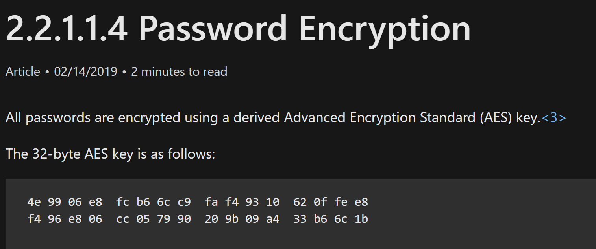
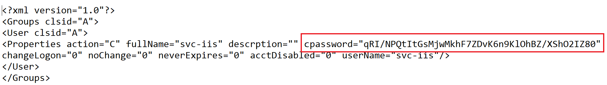
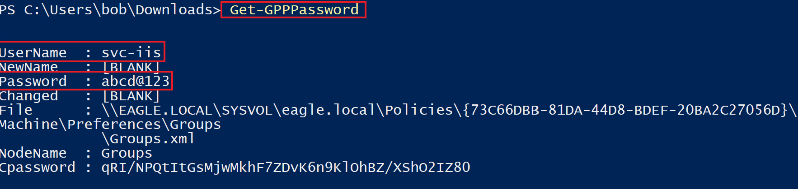
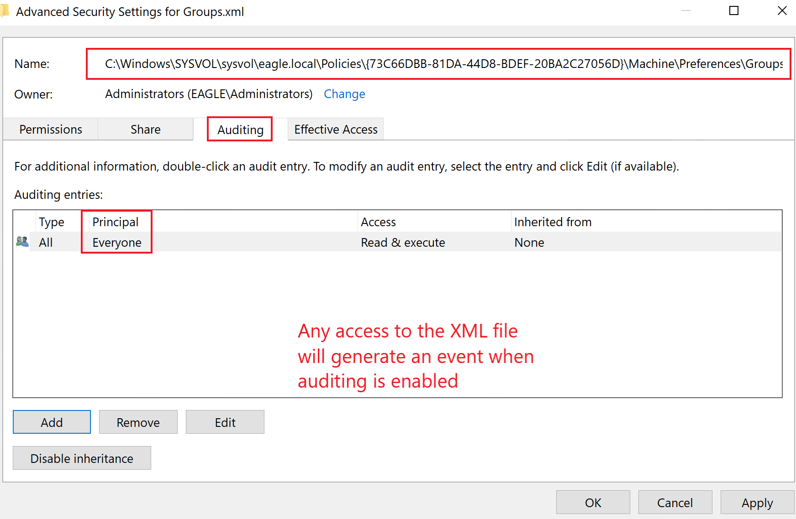
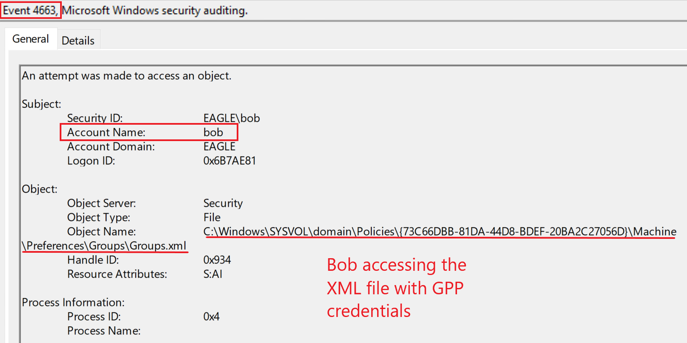
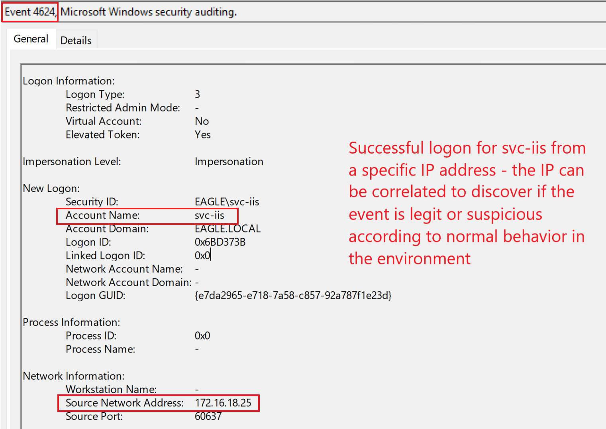

# GPP Passwords

## Description

`SYSVOL` is a network share present on all Domain Controllers. It contains logon scripts, Group Policy data, and other domain-wide files required by Active Directory.

All Group Policies are stored in:

```text
\\<DOMAIN>\SYSVOL\<DOMAIN>\Policies\
```

A historical weakness in `Group Policy Preferences (GPP)` is that credentials could be stored in XML files using the `cpassword` property.

Because the `SYSVOL` folder is accessible to all **Authenticated Users** in the domain, any authenticated user or computer can read these files. Microsoft also published the [AES private key on MSDN](https://learn.microsoft.com/en-us/openspecs/windows_protocols/ms-gppref/2c15cbf0-f086-4c74-8b70-1f2fa45dd4be?redirectedfrom=MSDN), which means the stored credentials can be decrypted by anyone with access to the file.



This is what an example XML file containing an encrypted password looks like. Note that the property is called `cpassword`:



---

## Attack Walkthrough

To abuse `GPP Passwords`, we can use the [Get-GPPPassword](https://github.com/PowerShellMafia/PowerSploit/blob/master/Exfiltration/Get-GPPPassword.ps1) function from `PowerSploit`.

This script automatically parses XML files in the `Policies` folder inside `SYSVOL`, identifies files containing the `cpassword` property, and attempts to decrypt the stored credentials.

```powershell
PS C:\Users\bob\Downloads> Import-Module .\Get-GPPPassword.ps1
```



---

## Prevention

Once the encryption key became public and this issue started to be abused, Microsoft released patch `KB2962486` in 2014 to prevent caching credentials in Group Policy Preferences.

However, many Active Directory environments built after 2014 still contain credentials in `SYSVOL`, usually because of misconfiguration or poor legacy cleanup.

Recommended mitigations include:

* Remove all `cpassword` entries from GPP XML files
* Do not store credentials in Group Policy Preferences
* Review the `SYSVOL` share regularly for XML files containing passwords
* Rotate any credentials that were previously exposed in GPP
* Treat older Active Directory environments as especially high risk

> **Critical:** If an organization built its Active Directory environment before 2014, there is a strong possibility that credentials may still be cached in `SYSVOL`.

---

## Detection

There are two main detection opportunities for this attack.

### 1. Access to the XML file

Accessing a GPP XML file containing credentials should be treated as suspicious, especially if file access auditing is enabled.



Once auditing is configured, access to the file will generate event ID `4663`.



### 2. Logon attempts using the exposed credentials

Another way to detect abuse is to monitor authentication attempts involving the account whose credentials were exposed.

Depending on whether the password is still valid, this may generate one of the following events:

* `4624` — successful logon
* `4625` — failed logon
* `4768` — TGT requested



### Detection Ideas

* Audit read access to sensitive XML files in `SYSVOL`
* Alert on event ID `4663` for GPP files containing `cpassword`
* Monitor for new logon attempts involving accounts exposed in GPP
* Investigate authentication activity from unusual hosts or user workstations
* Prioritize service accounts or semi-privileged accounts found in GPP files

---

## Honeypot Approach

This attack provides a strong opportunity for a defensive trap.

A practical approach is to place a semi-privileged account in GPP with a **wrong password**. Service accounts are especially suitable for this because:

* The password is usually expected to be old
* It is easy to make the account appear legitimate
* The last password change can be kept older than the modification date of the GPP XML file
* The user can be scheduled to perform a dummy task so that recent logon activity exists

If the user’s password were changed after the XML file was modified, an attacker may assume the exposed password is no longer valid and ignore it. For that reason, the account should be designed to look realistic.

Because the password stored in the file is intentionally wrong, we would mainly expect **failed authentication attempts**.

The following events can indicate an attacker trying to use the bogus credentials:

* `4625`
* `4771`
* `4776`

Here is how these events look in the playground environment when an attacker attempts authentication with the wrong password:


