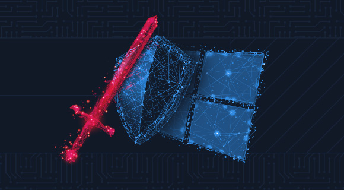

# Windows Attack & Defense

we will dive deep into several different attacks. The objective for each attack is to:

- Describe it.
- Provide a walkthrough of how we can carry out the attack.
- Provide preventive techniques and compensating controls.
- Discuss detection capabilities.
- Discuss the 'honeypot' approach of detecting the attack, if applicable.

