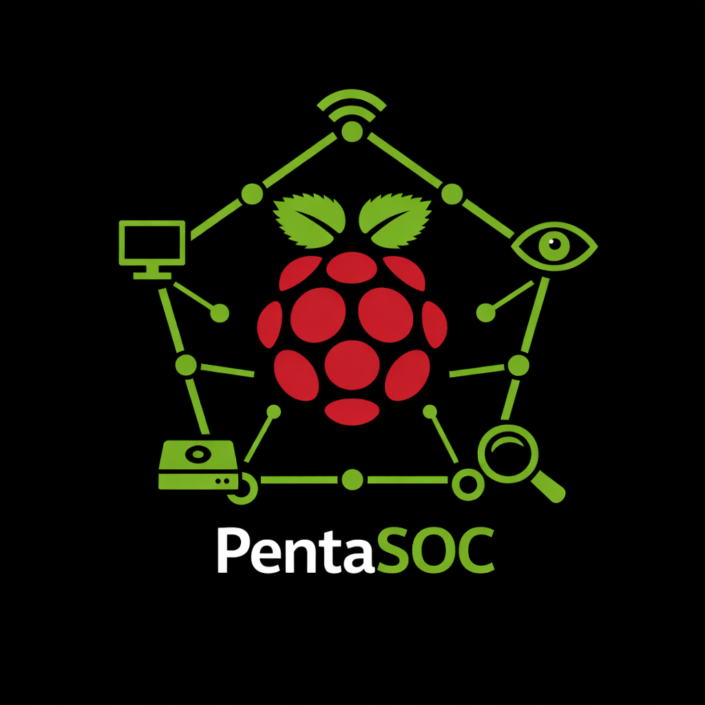

  
  

<h1 align="center">PentaSOC</h1>

<strong>SOC • Monitoring • Detection</strong>

  Raspberry Pi-based blue team homelab focused on monitoring, detection engineering,
  traffic visibility, and practical security operations.

## Overview

This homelab is built around a small Raspberry Pi cluster and is focused on **blue team practice**, **monitoring**, and **practical security engineering**.  
The goal is not to build the most complex environment possible, but to create a lab that supports repeatable workflows such as:

- Log collection
- Network monitoring
- Detection engineering
- Alert triage
- Basic incident investigation
- Portfolio-worthy documentation

The lab is also designed to stay lightweight, structured, and easy to expand over time.

---

## Objectives

| Area | Purpose |
|------|---------|
| Monitoring | Observe system health, resource usage, and service availability |
| IDS / IPS | Inspect network traffic and detect suspicious behavior |
| SIEM | Centralize logs and alerts for analysis |
| Virtualization / Services | Host security tooling and supporting services |
| Portfolio Projects | Build documented detections, investigations, and write-ups |

---

## Hardware

| Device | Specs | Role |
|--------|-------|--------------|
| Raspberry Pi 5 | 16 GB RAM, 512 GB SSD | Core security node / SIEM |
| Raspberry Pi 5 | 8 GB RAM, 256 GB SSD | Network sensor |
| Raspberry Pi 5 | 8 GB RAM, 256 GB SSD | Monitoring and dashboard node |
| Raspberry Pi 5 | 4 GB RAM, 2 TB SSD | NAS / storage node |
| Raspberry Pi 4 | 2 GB RAM | Access Point |
| PoE+ Switch | Power + connectivity | Powers and connects the Raspberry Pi nodes |
| 8-Port Switch | Main network switch | Connects laptop, desktop, WLAN, and lab infrastructure |

---

## Planned Node Layout

| Node | OS | Main Purpose | Services |
|------|----|--------------|----------|
| Pi 5 - 16 GB | Ubuntu Server | Central security stack | Wazuh / log analysis / management services |
| Pi 5 - 8 GB | Ubuntu Server | Network visibility | Suricata |
| Pi 5 - 8 GB | Ubuntu Server | Monitoring and display | Prometheus, Node Exporter, Grafana |
| Pi 5 - 4 GB | Raspberry Pi OS Lite | Storage | NAS, backups, PCAP and log archive |
| Pi 4 - 2 GB | Raspberry Pi OS Lite | Wireless lab access | AP services |

---

## Design Choices

| Component | Decision |
|-----------|----------|
| Remote access | Tailscale for secure management access |
| Containerization | Docker / Compose |
| Kubernetes | Not planned for now |
| Monitoring display | Dedicated screen for simple dashboard / full lab overview |
| Focus | Practical blue team workflows over infrastructure complexity |

---

## Main Focus Areas

| Focus Area | Examples |
|-----------|----------|
| Detection Engineering | Port scans, brute force attempts, suspicious DNS, malicious web traffic |
| Monitoring | Host health, service availability, storage usage, sensor status |
| Network Security | Traffic inspection, IDS alerts, packet capture review |
| Incident Practice | Alert triage, investigation notes, remediation ideas |
| Documentation | GitHub write-ups, architecture notes, detection reports |

---

## Planned Tooling

| Category | Tools |
|----------|------|
| SIEM | Wazuh |
| IDS / IPS | Suricata |
| Monitoring | Prometheus, Grafana, Node Exporter |
| Secure Access | Tailscale |
| Storage / Evidence | NAS for logs, PCAPs, backups, and investigation data |

---

## Project Goal

This homelab is intended to function as a **personal blue team training environment** and as a **portfolio platform**.  
Each service and node is chosen to support practical learning, realistic alerting workflows, and well-documented security projects.

---
