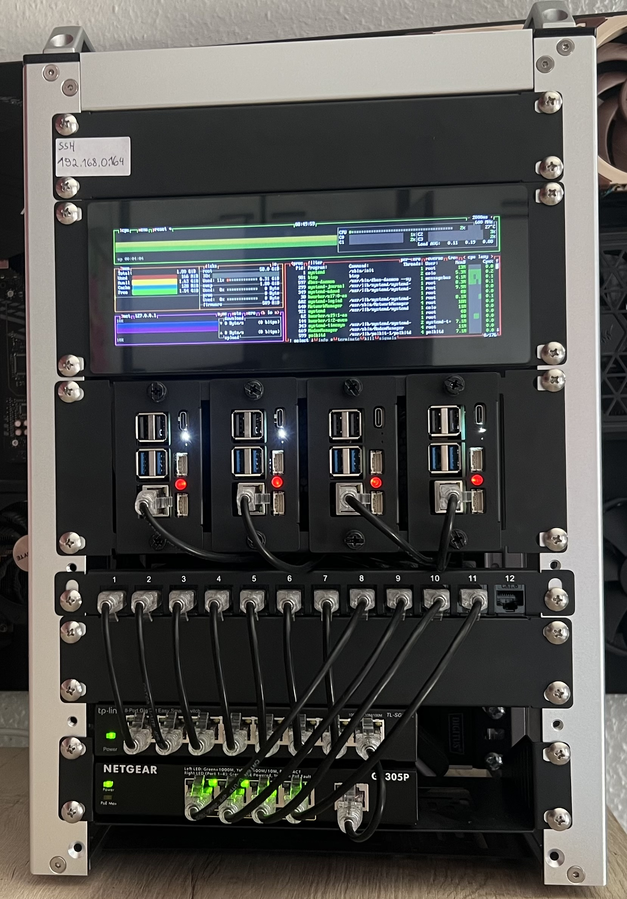

# NexusLab

## Overview

This homelab is a compact Raspberry Pi-based environment built for **blue team practice**, **monitoring**, and **security engineering**.  
The objective is to create a lab that supports realistic defensive workflows while also serving as a platform for **documented portfolio projects**.

Rather than focusing on infrastructure for its own sake, this setup is designed around practical use cases such as log collection, traffic inspection, alert triage, basic incident investigation, and service monitoring.

---

## Goals

| Area | Purpose |
|------|---------|
| Monitoring | Track system health, uptime, performance, and service availability |
| IDS / IPS | Inspect network traffic and detect suspicious activity |
| SIEM | Centralize logs and alerts for analysis and investigation |
| Storage | Retain PCAPs, logs, backups, and investigation material |
| Portfolio | Produce structured write-ups, detections, and homelab documentation |

---

## Hardware

| Device | Specs | Role |
|--------|-------|------|
| Raspberry Pi 5 | 16 GB RAM, 512 GB SSD | Core security node / SIEM |
| Raspberry Pi 5 | 8 GB RAM, 256 GB SSD | Network sensor |
| Raspberry Pi 5 | 8 GB RAM, 256 GB SSD | Monitoring and dashboard node |
| Raspberry Pi 5 | 4 GB RAM, 2 TB SSD | NAS / evidence and backup storage |
| Raspberry Pi 4 | 2 GB RAM | Access Point |
| PoE+ Switch | Power + connectivity | Powers and connects the Pi nodes |
| 8-Port Switch | Main network switch | Connects workstation devices and lab network |

---

## Planned Node Layout

| Node | OS | Main Purpose | Services |
|------|----|--------------|----------|
| Pi 5 - 16 GB | Ubuntu Server | Central security stack | Wazuh, log collection, management services |
| Pi 5 - 8 GB | Ubuntu Server | Network monitoring | Suricata |
| Pi 5 - 8 GB | Ubuntu Server / Raspberry Pi OS | Monitoring and dashboard display | Prometheus, Grafana, Node Exporter |
| Pi 5 - 4 GB | Raspberry Pi OS Lite | Storage and retention | NAS, backups, PCAP archive, log archive |
| Pi 4 - 2 GB | Raspberry Pi OS Lite | Lab wireless access | AP services |

---

## Design Principles

| Decision | Rationale |
|----------|-----------|
| Tailscale for remote access | Secure management access without exposing services publicly |
| Docker / Compose | Lightweight deployment and easier service management |
| No Kubernetes for now | Keeps the lab focused on blue team workflows rather than platform complexity |
| Dedicated monitoring display | Provides a simple live overview of lab health and services |
| Portfolio-oriented build | Every component should support learning, detection, or documentation |

---

## Focus Areas

| Focus Area | Example Use Cases |
|-----------|-------------------|
| Detection Engineering | Port scans, brute force attempts, suspicious DNS, malicious web traffic |
| Monitoring | CPU, memory, disk usage, uptime, service status, storage health |
| Network Security | Traffic inspection, IDS alerts, packet analysis |
| Incident Handling | Alert triage, investigation notes, remediation planning |
| Documentation | Architecture notes, detection write-ups, incident summaries |

---

## Tooling

| Category | Tools |
|----------|------|
| SIEM | Wazuh |
| IDS / IPS | Suricata |
| Monitoring | Prometheus, Grafana, Node Exporter |
| Secure Access | Tailscale |
| Storage | NAS for logs, PCAPs, backups, and investigation data |

---

## Portfolio Direction

This homelab is not only a practice environment, but also a platform for creating structured portfolio material.  
Planned outputs include:

- Detection engineering write-ups
- Monitoring dashboards
- Incident investigation summaries
- Network traffic analysis notes
- Homelab architecture and deployment documentation

---

## Status

This project is currently evolving and will continue to expand over time as new services, detections, and workflows are added.

---
