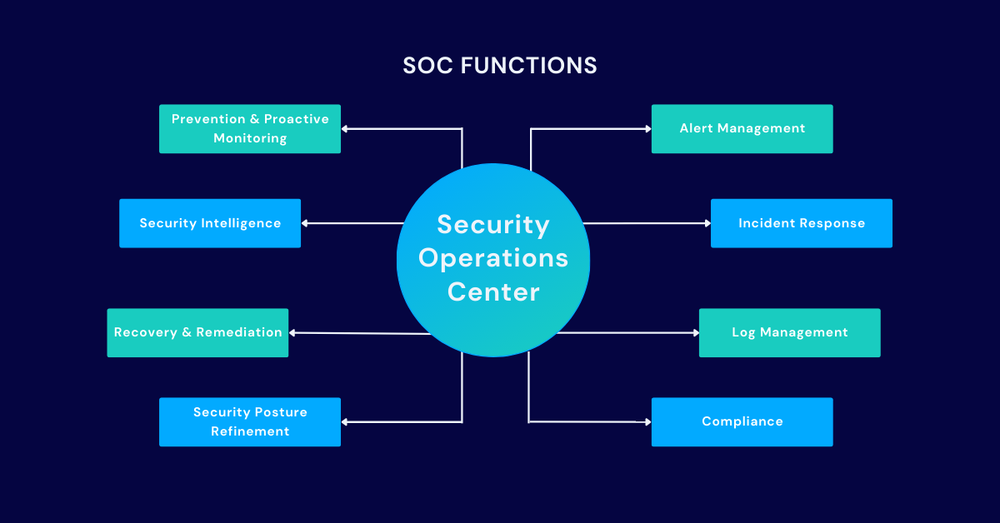
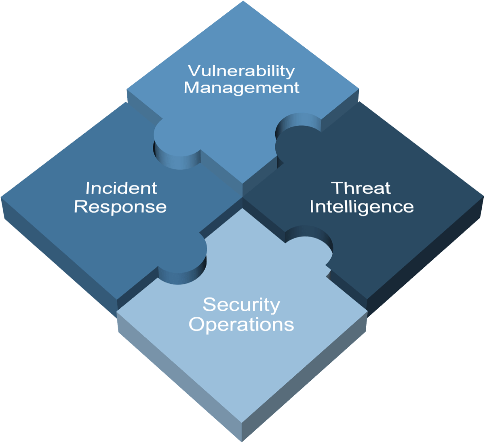

# SOC Definition & Fundamentals

A **Security Operations Center (SOC)** is a function or team responsible for the **continuous monitoring, detection, investigation, and response** of security events within an organization.

Its main purpose is to reduce risk by identifying threats early, investigating suspicious activity, and coordinating the response before a security issue becomes a larger incident.

A SOC is not only a room full of screens. It is a combination of:

- **people**
- **processes**
- **technology**

Together, these elements allow an organization to maintain ongoing visibility over its environment and respond to threats in a structured way.

---

## What a SOC Does

A SOC focuses on the **operational side of cybersecurity**.  
Its role is not mainly to design security strategy or architecture, but to run day-to-day security operations.

Typical SOC responsibilities include:

- monitoring security alerts and events
- triaging suspicious activity
- investigating potential incidents
- escalating or responding to confirmed threats
- coordinating with incident response and IT teams
- improving detections and reducing false positives
- supporting threat hunting and threat intelligence
- reporting on security activity and trends

In short, the SOC helps answer questions such as:

- **What is happening in the environment right now?**
- **Is this activity malicious or benign?**
- **How severe is it?**
- **What needs to be done next?**

---

## Core Objective of a SOC

The core objective of a SOC is to:

> **Detect, analyze, and respond to threats as quickly and effectively as possible.**

This helps the organization:

- limit the impact of attacks
- reduce attacker dwell time
- protect critical systems and data
- improve overall security visibility
- strengthen long-term defensive capability

---

## How a SOC Works

A SOC operates continuously by collecting and analyzing security data from across the environment.

This usually includes logs and telemetry from:

- endpoints
- servers
- network devices
- firewalls
- identity systems
- cloud platforms
- applications
- email security tools

The SOC uses this data to detect suspicious behavior, investigate alerts, and decide whether an event is a real security incident.

A simplified SOC workflow looks like this:

1. **Collect data**
2. **Monitor and detect suspicious activity**
3. **Triage alerts**
4. **Investigate**
5. **Respond or escalate**
6. **Document findings**
7. **Improve detections and processes**

This makes the SOC a central operational hub for security monitoring and response.

---

## Core Capabilities of a SOC

A mature SOC usually provides the following capabilities.

### Continuous Monitoring
The SOC monitors the environment 24/7 or during defined coverage hours to identify suspicious events as early as possible.

### Detection & Alerting
The SOC uses detection rules, analytics, threat intelligence, and behavioral indicators to generate alerts on potentially malicious activity.

### Alert Triage
Not every alert is a real threat. Analysts must quickly determine whether an alert is:

- benign
- suspicious
- a true positive incident

### Incident Investigation
When suspicious activity is confirmed, the SOC investigates:

- what happened
- when it happened
- which systems or users are involved
- how far the threat progressed
- what the likely impact is

### Response & Escalation
Depending on the SOC model, the team may:

- contain the threat directly
- escalate to incident response
- support forensic analysis
- coordinate with IT, legal, or management

### Detection Improvement
A SOC should continuously improve by:

- reducing false positives
- refining detection rules
- adding use cases
- learning from incidents
- updating playbooks

---

## Key Technologies Used by a SOC

A SOC relies heavily on security tooling to collect, correlate, and analyze data.

### Common technologies

- **SIEM**  
  Centralizes logs and correlates events from multiple sources.

- **EDR**  
  Provides visibility and detection on endpoints such as laptops and servers.

- **IDS / IPS**  
  Detects or blocks suspicious network activity.

- **SOAR**  
  Automates repetitive response tasks and workflow steps.

- **Threat Intelligence Platforms**  
  Provide context on known adversaries, IOCs, and campaigns.

- **Case Management Platforms**  
  Help analysts track alerts, investigations, evidence, and response actions.

These tools are only effective when supported by good processes and skilled analysts.

---

## Roles Within a SOC

A SOC team usually contains different roles depending on the size and maturity of the organization.

### Leadership Roles

#### SOC Director
Responsible for overall strategy, budget, staffing, and alignment with business security objectives.

#### SOC Manager
Oversees day-to-day SOC operations, manages analysts, and coordinates response activities.

---

### Analyst Roles

#### Tier 1 Analyst
The first line of defense. Tier 1 analysts:

- monitor alerts
- perform initial triage
- identify obvious false positives
- escalate suspicious cases

#### Tier 2 Analyst
Tier 2 analysts perform deeper investigations. They:

- analyze escalated alerts
- validate incidents
- identify patterns and attacker behavior
- support containment decisions

#### Tier 3 Analyst
Tier 3 analysts handle advanced and complex cases. They often:

- perform deep investigations
- support threat hunting
- improve detections
- advise on difficult incidents

---

### Specialized Roles

#### Detection Engineer
Builds and improves detection logic for SIEM, EDR, IDS/IPS, and other monitoring tools.

#### Incident Responder
Takes lead during active incidents and coordinates containment, eradication, and recovery.

#### Threat Intelligence Analyst
Tracks adversaries, campaigns, IOCs, and TTPs to improve SOC awareness and detection capability.

#### Security Engineer
Implements and maintains the technical security infrastructure used by the SOC.

#### Compliance / Governance Specialist
Ensures that monitoring and response practices support regulatory and policy requirements.

#### Security Awareness & Training Coordinator
Helps reduce human risk by educating users on phishing, suspicious behavior, and reporting procedures.

> In smaller organizations, one person may perform multiple roles.  
> In larger SOCs, these responsibilities are more specialized.

---

## The Tiered Analyst Model

Many SOCs use a tiered structure.

| Tier | Main Focus |
|---|---|
| **Tier 1** | Monitor, triage, escalate |
| **Tier 2** | Investigate, validate, contain |
| **Tier 3** | Advanced analysis, threat hunting, detection improvement |

This model helps distribute work efficiently:

- Tier 1 handles volume
- Tier 2 handles depth
- Tier 3 handles complexity

---

## SOC vs Incident Response

The SOC and the Incident Response (IR) team work closely together, but they are not exactly the same.

### SOC
Focused on:

- monitoring
- detection
- triage
- early investigation
- operational visibility

### Incident Response
Focused on:

- confirmed incidents
- containment
- eradication
- recovery
- post-incident analysis

In some organizations, the SOC performs part of the response work.  
In others, the SOC escalates confirmed incidents to a dedicated IR team.

---

## Important SOC Concepts

There are a few core concepts every SOC should understand.

### Triage
Triage means quickly assessing an alert to decide:

- is it real?
- how urgent is it?
- what should happen next?

### False Positive
A false positive is an alert that looks suspicious but is actually benign.

### True Positive
A true positive is a legitimate detection of malicious or unauthorized activity.

### Dwell Time
Dwell time is the amount of time an attacker remains in the environment before being detected.

### Use Case
A use case is a defined detection scenario built to identify a specific type of malicious activity.

### Playbook
A playbook is a documented response procedure for a recurring alert or incident type.

These concepts are fundamental because SOC work is not just about tools. It is about making consistent and correct decisions.

---

## SOC Maturity and Evolution

SOCs have evolved over time.

### SOC 1.0
Early SOCs focused heavily on:

- network and perimeter monitoring
- isolated tools
- large alert volumes
- limited correlation between systems

This often led to fragmented visibility and inefficient operations.

### SOC 2.0
SOC 2.0 introduced a more intelligence-driven model with:

- integrated telemetry
- better correlation
- threat intelligence
- anomaly detection
- improved situational awareness
- stronger incident response and forensic support

### Cognitive / Next-Generation SOC
More mature SOCs aim to improve decision-making through:

- automation
- advanced analytics
- machine learning or AI assistance
- closer alignment between business context and detection logic
- stronger collaboration between security and operational teams

The goal is not only to detect more, but to detect **better and faster**.

---

## What Makes a SOC Effective

A SOC is effective when it has more than just tools.

### Critical success factors

- skilled analysts
- well-defined processes
- tuned and reliable detections
- clear escalation paths
- good asset and log visibility
- strong collaboration with IR, IT, and management
- continuous improvement based on lessons learned

A SOC that only collects alerts without context, tuning, or response capability will struggle to provide real security value.

---

## Common Challenges in a SOC

SOC teams often face recurring problems, such as:

- too many false positives
- alert fatigue
- lack of visibility into certain systems
- poor log quality
- unclear ownership of response actions
- shortage of skilled analysts
- weak documentation or playbooks
- limited business context

Understanding these challenges is important because a SOC is not just built once. It must be continuously improved.

---

## Why a SOC Matters

A SOC is a critical part of an organization's cybersecurity capability because it provides:

- continuous security visibility
- faster detection of threats
- structured handling of suspicious events
- better coordination during incidents
- improved resilience against future attacks

Without a SOC or equivalent function, organizations often detect attacks too late, respond inconsistently, or miss important warning signs entirely.

---

## Summary

A **Security Operations Center (SOC)** is the operational core of an organization's cyber defense.

Its purpose is to:

- monitor the environment
- detect suspicious activity
- investigate alerts
- respond to threats
- improve defensive capability over time

A SOC depends on three key elements:

- **people**
- **processes**
- **technology**

Strong SOC operations require not only tools like **SIEM**, **EDR**, and **IDS/IPS**, but also skilled analysts, clear workflows, and continuous tuning and improvement.

In practice, a good SOC helps an organization move from **reactive security** to **continuous, structured defense**.

---