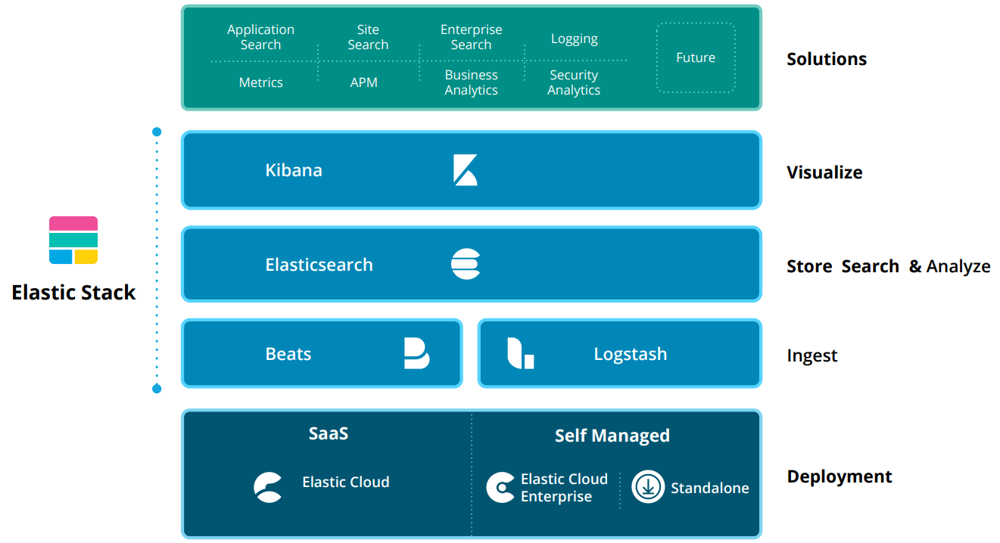
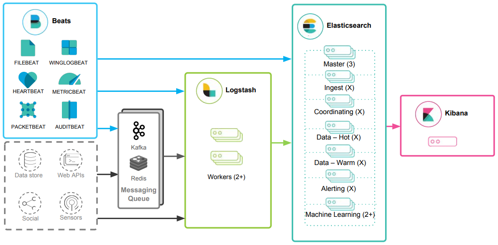
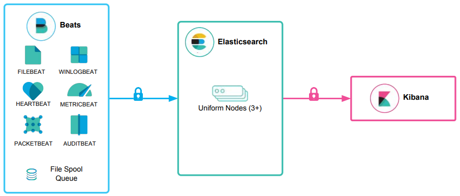
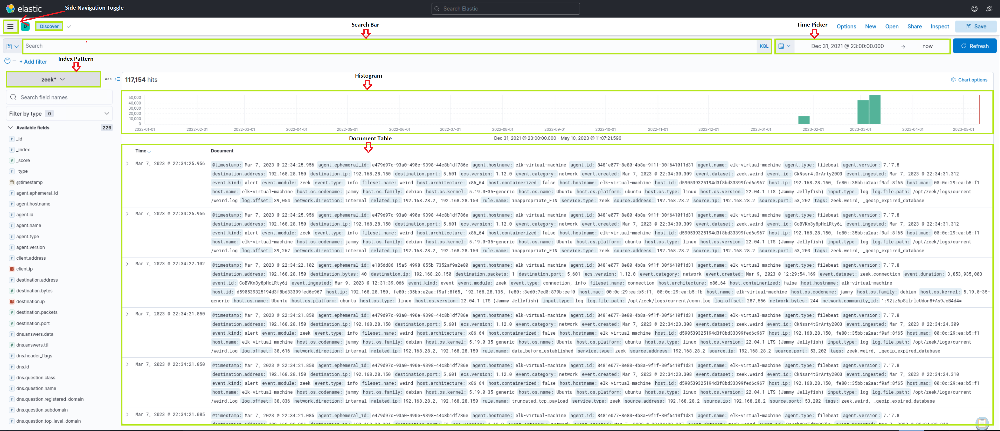

# Elastic Stack 



The **Elastic Stack** is a collection of tools used to **ingest, store, search, analyze, and visualize** data.

It is commonly used for:

- log management
- observability
- threat detection
- security monitoring
- SIEM use cases

The core idea is simple:

> collect data from many sources, store it centrally, and make it searchable and easy to analyze.

---

## What Is the Elastic Stack?



The Elastic Stack is mainly built around four components:

- **Beats**
- **Logstash**
- **Elasticsearch**
- **Kibana**

A common data flow looks like this:


```text
Beats -> Logstash -> Elasticsearch -> Kibana
```

In simpler deployments, Logstash may be skipped:



```text
Beats -> Elasticsearch -> Kibana
```

In larger environments, technologies such as **Kafka**, **Redis**, or **RabbitMQ** can be added for buffering and resiliency.

---

## Core Components

## 1. Elasticsearch

**Elasticsearch** is the core of the stack.

It is a **distributed search and analytics engine** that:

* stores data
* indexes data
* allows fast searches
* supports analytics and correlations

It uses **JSON documents** and exposes **REST APIs**, which makes it flexible and powerful for both security and operational use cases.

**Main role:** store and search the data.

---

## 2. Logstash

**Logstash** is used to collect, transform, and forward data.

Its work is usually divided into three parts:

### Input

Collect data from different sources, such as:

* files
* syslog
* TCP/UDP streams
* agents and forwarders

### Filter

Transform and enrich events, for example:

* parse fields
* normalize formats
* rename values
* add tags or metadata

### Output

Send the processed records to destinations such as:

* Elasticsearch
* message queues
* other systems

**Main role:** ingest, transform, and forward data.

---

## 3. Kibana

**Kibana** is the interface analysts use to work with the data stored in Elasticsearch.

It allows users to:

* search data
* filter events
* build dashboards
* create charts and tables
* investigate security events

For SOC analysts, Kibana is often the **main working interface** of the Elastic Stack.

**Main role:** search, investigate, and visualize data.

---

## 4. Beats

**Beats** are lightweight data shippers installed on systems to send logs and metrics to the Elastic Stack.

Examples include:

* **Filebeat** → ships log files
* **Metricbeat** → ships system and service metrics
* **Winlogbeat** → ships Windows event logs

**Main role:** collect data from endpoints and forward it.

---

## How the Elastic Stack Works

At a high level, the process looks like this:

1. **Beats collect data**
2. **Logstash processes and enriches the data** *(optional in some deployments)*
3. **Elasticsearch stores and indexes the data**
4. **Kibana is used to search and visualize the data**

This pipeline gives analysts centralized visibility across systems, applications, endpoints, and network sources.

---

## Elastic Stack as a SIEM



The Elastic Stack can also be used as a **SIEM** (**Security Information and Event Management**) solution.

In a SIEM use case, the stack collects and analyzes security data from sources such as:

* firewalls
* IDS/IPS
* endpoints
* Windows event logs
* authentication systems
* cloud services

This allows analysts to:

* centralize security telemetry
* search for suspicious activity
* correlate events across sources
* create dashboards and alerts
* investigate incidents more efficiently

In practice, SOC analysts often spend most of their time in **Kibana**, using it to hunt, triage, and investigate alerts.

---

## Kibana Query Language (KQL)

**KQL** (**Kibana Query Language**) is a simple query language used in Kibana to search and filter data.

It is easier to use than raw Elasticsearch Query DSL for everyday investigations.

### Basic syntax

A basic KQL query uses the format:

```text
field:value
```

Example:

```text
event.code:4625
```

This filters for Windows failed logon events.

---

## Common KQL Features

### Free text search

Search for a value across multiple fields:

```text
"svc-sql1"
```

### Logical operators

Use `AND`, `OR`, and `NOT`:

```text
event.code:4625 AND winlog.event_data.SubStatus:0xC0000072
```

### Time filtering

```text
@timestamp >= "2023-03-03T00:00:00.000Z" AND @timestamp <= "2023-03-06T23:59:59.999Z"
```

### Wildcards

```text
user.name:admin*
```

This matches usernames starting with `admin`.

---

## Example KQL Query

This example searches for **failed logons against disabled accounts**:

```text
event.code:4625 AND winlog.event_data.SubStatus:0xC0000072
```

This is useful because failed logons against disabled accounts may indicate:

* password guessing
* brute force attempts
* attacker enumeration
* use of old or stolen credentials

---

## How to Identify Available Fields

Before writing strong KQL queries, analysts need to know which fields exist in the data.

Two common ways to do this are:

### 1. Use Discover

The **Discover** view in Kibana helps analysts:

* explore available data
* inspect records
* identify field names
* understand field values

This is often the fastest way to learn the structure of a dataset.

### 2. Use Elastic documentation

Elastic provides detailed documentation for:

* ECS fields
* Winlogbeat fields
* Filebeat fields
* module-specific fields

This is useful when learning which fields are standard and which are source-specific.

---

## Elastic Common Schema (ECS)

**Elastic Common Schema (ECS)** is a standardized field structure used across the Elastic Stack.

It provides a consistent way to name and organize data from different sources.

For example, instead of every source using different field names for the same concept, ECS creates a common structure.

### Why ECS matters

Using ECS gives several advantages:

* **Unified searches** across multiple data sources
* **Easier query writing** in KQL
* **Better event correlation**
* **Cleaner dashboards and visualizations**
* **Compatibility with Elastic Security and other Elastic features**

For SOC work, ECS is important because it makes investigations more consistent and scalable.

---

## Why the Elastic Stack Is Useful in a SOC

The Elastic Stack is valuable in security operations because it allows analysts to:

* centralize logs from many systems
* search large volumes of data quickly
* build detections and dashboards
* investigate suspicious events
* correlate activity across different sources

This supports key SOC tasks such as:

* alert triage
* threat hunting
* incident investigation
* detection engineering
* reporting and visualization

---

