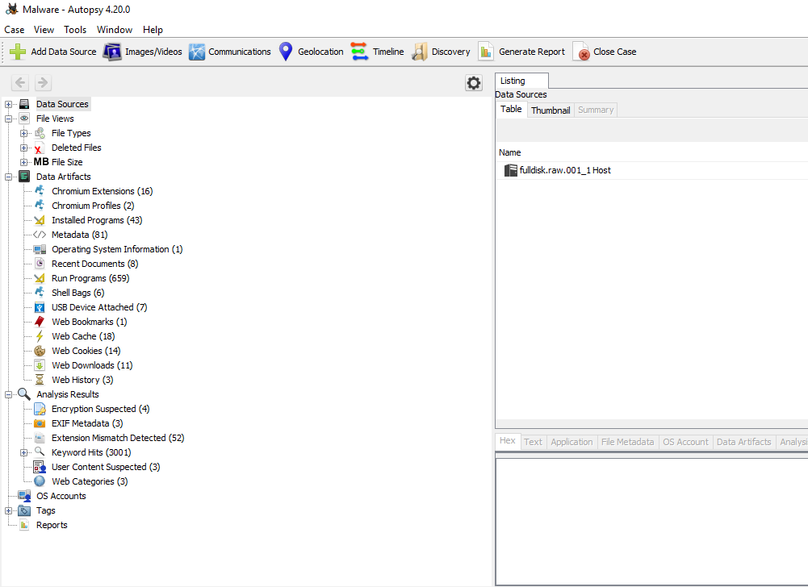
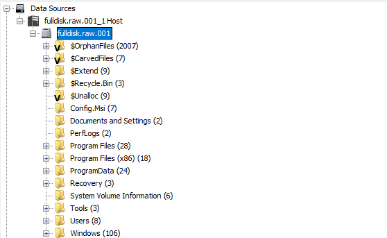
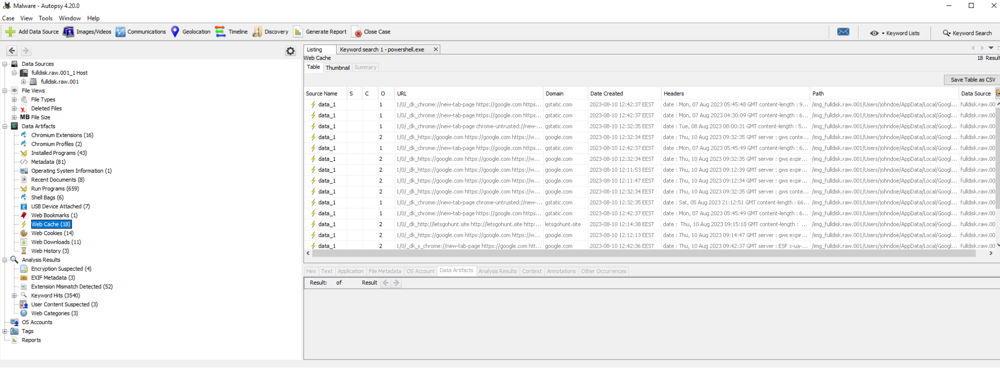
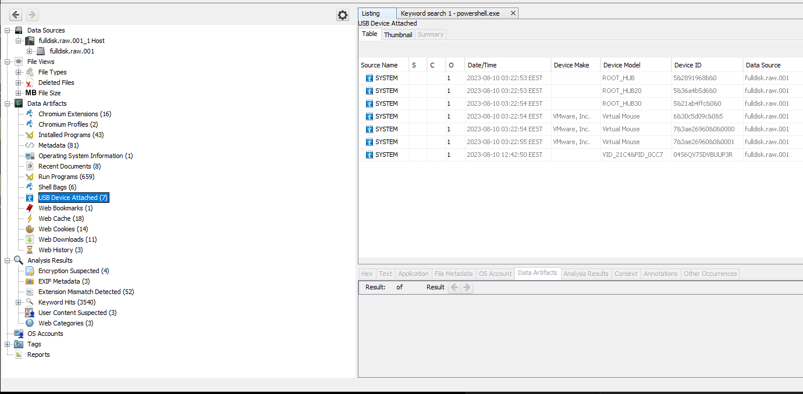
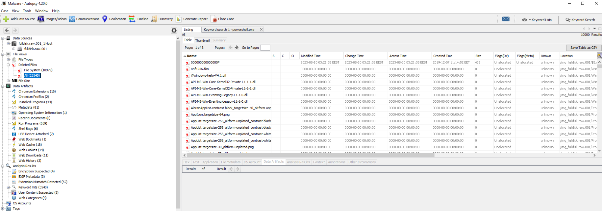
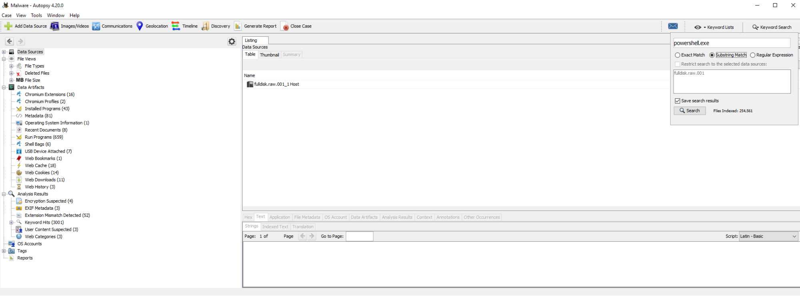
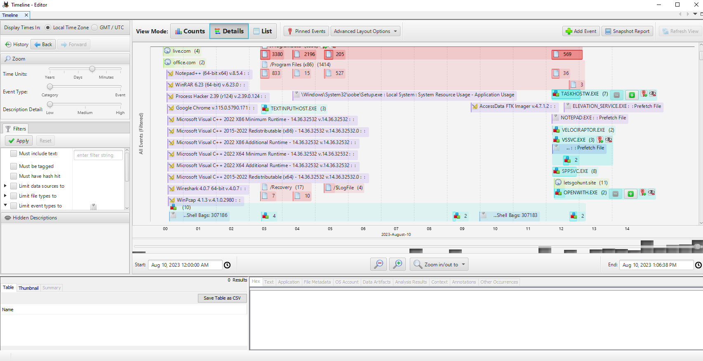

# Disk Forensics

| Category | Details |
|---|---|
| Topic | Disk Image Examination / Disk Forensics |
| Goal | Analyze a disk image to recover files, inspect artifacts, investigate user activity, and reconstruct timelines |
| Main Tool | Autopsy |
| Backend Toolset | Sleuth Kit |
| Evidence Type | Disk image, raw image, forensic image |
| Example Image | `fulldisk.raw.001` |
| Main Use Case | Incident response, deleted file recovery, web artifact analysis, keyword searching, timeline reconstruction |

---

## Tool Summary

| Name | Use Case | Link |
|---|---|---|
| Autopsy | GUI forensic platform for disk image analysis, timeline analysis, keyword search, deleted file recovery, web/email artifact extraction | https://www.autopsy.com/ |
| Sleuth Kit | Open-source forensic toolkit used by Autopsy for filesystem and disk image analysis | https://www.sleuthkit.org/ |
| Hex Viewer | View raw file content in hexadecimal format | Built into Autopsy |
| Keyword Search | Search files, artifacts, and unallocated space for specific terms or patterns | Built into Autopsy |
| Timeline Analysis | Reconstruct events based on file timestamps and artifact activity | Built into Autopsy |
| File Carving | Recover files from unallocated or deleted disk space | Built into Autopsy |
| Hash Lookup | Compare files against known-good or known-bad hash sets | Built into Autopsy |

---

## Concept Summary

Disk forensics is the examination and analysis of storage media such as hard drives, SSDs, USB drives, or forensic disk images.

Unlike memory forensics, which focuses on volatile RAM, disk forensics focuses on persistent data. This means the evidence remains available after the system is powered off, unless it has been deleted, overwritten, encrypted, or intentionally wiped.

Disk forensics is used to investigate:

- File system structure
- Deleted files
- User activity
- Browser history
- Email artifacts
- Downloaded files
- Executed programs
- USB device usage
- Metadata and timestamps
- Malware stored on disk
- Suspicious scripts or binaries
- Timeline of attacker activity

The main goal is to reconstruct what happened on a system by analyzing files, metadata, artifacts, and timestamps.

---

## Key Forensic Capabilities

### File Structure Insight

A forensic tool should show the full file hierarchy of the disk image.

This allows an analyst to inspect:

- User folders
- Windows directories
- Program files
- Recycle Bin
- Temporary folders
- Deleted or orphaned files
- Unallocated space

This is useful when you already know where suspicious files are often located.

Common locations:

```text
C:\Users\<user>\Downloads
C:\Users\<user>\Desktop
C:\Users\<user>\AppData
C:\Windows\Temp
C:\ProgramData
C:\Recycle.Bin
````

---

### Hex Viewer

A hex viewer shows the raw bytes of a file.

This is useful for:

* Inspecting unknown file types
* Checking file headers
* Finding hidden data
* Looking for embedded payloads
* Verifying file signatures
* Analyzing suspicious malware files

Example:

A file named `document.pdf` may actually start with an executable header:

```text
4D 5A
```

`4D 5A` means `MZ`, which indicates a Windows executable.

---

### Web Artifact Analysis

Web artifacts help reconstruct browser activity.

They can show:

* Visited URLs
* Cached pages
* Downloads
* Search terms
* Browser extensions
* Cookies
* Web cache entries
* Timestamps of browsing activity

This is useful when investigating:

* Phishing links
* Malware downloads
* Drive-by downloads
* Suspicious websites
* User activity before infection

Example artifact:

```text
powershell.exe found in Web Cache
```

This could indicate that a browser page or cached object referenced PowerShell.

---

### Email Carving

Email carving is the recovery or extraction of email artifacts from the disk image.

This is useful for:

* Insider threat investigations
* Phishing investigations
* Data leakage cases
* Suspicious attachments
* Communication history

Email artifacts may include:

* Sender
* Recipient
* Subject
* Body content
* Attachments
* Timestamps

---

### Image Viewer

A forensic image viewer allows quick inspection of image files.

This is useful for:

* Policy violations
* Evidence review
* Suspicious screenshots
* Exfiltrated visual data
* User-created image files

---

### Metadata Analysis

Metadata is information about files and system artifacts.

Useful metadata includes:

| Metadata      | Use                                            |
| ------------- | ---------------------------------------------- |
| Created time  | When the file was created                      |
| Modified time | When the file content changed                  |
| Accessed time | When the file was last accessed                |
| File path     | Where the file was stored                      |
| File size     | Can indicate abnormal or packed files          |
| Hash          | Used to identify known-good or known-bad files |
| Disk location | Helps locate file fragments or carved data     |

Metadata is important because it helps correlate events.

Example:

```text
Malware alert at 10:42
Suspicious executable created at 10:41
PowerShell shortcut accessed at 10:42
```

This builds a stronger timeline.

---

## Autopsy Overview



Autopsy is a graphical forensic platform built on top of the open-source Sleuth Kit.

It provides a user-friendly interface for analyzing disk images.

Autopsy can be used for:

* File system browsing
* Deleted file recovery
* Keyword searching
* Timeline analysis
* Web artifact analysis
* Email artifact extraction
* Hash-based file identification
* USB device history
* File carving
* Metadata analysis

After loading a disk image, Autopsy processes the data and organizes artifacts in the side panel.

---

## Main Autopsy Sections

### Data Sources



The Data Sources section allows you to browse the disk image like a file explorer.

You can inspect:

```text
OrphanFiles
CarvedFiles
Extend
Recycle.Bin
$Unalloc
Config.Msi
Documents and Settings
PerfLogs
Program Files
Program Files (x86)
ProgramData
Recovery
System Volume Information
Tools
Users
Windows
```

Use this section to manually inspect files and directories.

---

### Web Artifacts



Web artifacts contain browser-related evidence.

Useful for finding:

* Visited websites
* Cached URLs
* Download activity
* Malicious links
* Search queries
* Browser extensions

Example investigation question:

```text
Did the user visit a malicious website before the infection?
```

---

### Attached Devices



Autopsy can show USB devices that were connected to the system.

Useful information includes:

* Device make
* Device model
* Device ID
* First connected time
* Last connected time

This is useful for investigating:

* Data theft
* USB malware
* Unauthorized removable storage
* Insider threat activity

---

### Deleted Files



Autopsy can show deleted files recovered from the disk image.

Deleted files may still be recoverable if their data has not been overwritten.

Use this to find:

* Deleted malware
* Removed documents
* Cleared evidence
* Deleted scripts
* Suspicious executables

Important: a deleted file is not automatically gone. It often remains on disk until overwritten.

---

### Keyword Search



Keyword search is used to search across the disk image for specific terms.

Examples:

```text
powershell.exe
cmd.exe
password
malware
http://
.exe
.bat
.ps1
```

Use keyword search to find:

* Commands
* File names
* URLs
* IP addresses
* Email addresses
* Suspicious scripts
* Malware indicators

---

### Keyword Lists

Keyword lists allow targeted searches using predefined patterns.

Common keyword lists:

| Keyword List        | Finds                      |
| ------------------- | -------------------------- |
| Phone Numbers       | Possible phone numbers     |
| IP Addresses        | IPv4 or IPv6 addresses     |
| Email Addresses     | Email artifacts            |
| URLs                | Web links                  |
| Credit Card Numbers | Possible payment card data |

This is useful for quickly extracting indicators of compromise or sensitive data.

---

### Timeline Analysis



Timeline analysis maps file and artifact activity over time.

It helps reconstruct what happened before, during, and after an incident.

Timeline events may include:

* File creation
* File modification
* File access
* Program execution
* Web activity
* Archive extraction
* USB usage
* Deleted file activity

Example use case:

```text
1. User visited suspicious website
2. File was downloaded
3. PowerShell was executed
4. Malware file was created
5. Suspicious process launched
6. Files were deleted
```

This gives a clear incident sequence.

---

## Practical Investigation Workflow

```text
1. Load the disk image into Autopsy
2. Let Autopsy process the image
3. Review Data Sources
4. Check user folders
5. Search for suspicious keywords
6. Review web artifacts
7. Check downloads and browser cache
8. Inspect deleted files
9. Check attached USB devices
10. Review metadata and hashes
11. Build a timeline
12. Export important evidence
```

---

## Commands / Actions Explained

Disk forensics in this course is mainly performed through the Autopsy GUI, so there are fewer terminal commands compared to memory forensics.

The important actions are performed inside Autopsy.

---

### Load a Disk Image

Purpose:

* Add the forensic image as evidence
* Let Autopsy parse the filesystem and artifacts

Typical source:

```text
fulldisk.raw.001
```

Use this when starting a new case.

---

### Browse Data Sources

Purpose:

* Explore the disk structure
* Manually inspect files and folders

Useful locations:

```text
Users
Windows
Program Files
ProgramData
Recycle.Bin
$Unalloc
CarvedFiles
OrphanFiles
```

Use this to find suspicious files by location.

---

### Search for a Keyword

Example keyword:

```text
powershell.exe
```

Purpose:

* Find references to suspicious commands or files
* Locate artifacts linked to malware execution
* Search across files, logs, registry artifacts, and unallocated space

Use this when you already have an indicator.

Example indicators:

```text
powershell.exe
cmd.exe
wscript.exe
rundll32.exe
regsvr32.exe
certutil.exe
```

---

### Search Using Keyword Lists

Purpose:

* Automatically search for common patterns

Useful lists:

```text
IP Addresses
Email Addresses
URLs
Phone Numbers
Credit Card Numbers
```

Use this to extract IOCs or sensitive data from the disk image.

---

### Review Web Cache

Purpose:

* Analyze browser cache and web activity

Use this to answer:

```text
Which websites were visited?
Was a suspicious URL opened?
Was a payload downloaded from the browser?
Which browser artifacts exist?
```

---

### Review USB Devices

Purpose:

* Identify external devices connected to the system

Use this to answer:

```text
Was a USB drive connected?
When was it first connected?
When was it last connected?
What device model or ID was used?
```

This is important in data theft and insider threat cases.

---

### Recover Deleted Files

Purpose:

* Identify files that were deleted but still recoverable

Use this to find:

```text
Deleted malware
Deleted documents
Deleted archives
Deleted scripts
Deleted evidence
```

Deleted files can provide strong evidence because attackers often try to remove traces after execution.

---

### Use Timeline Analysis

Purpose:

* Reconstruct the incident chronologically

Use this to correlate:

```text
Browser activity
File downloads
Program execution
File creation
File modification
File deletion
USB activity
```

Timeline analysis is one of the most important parts of disk forensics because it connects isolated artifacts into a clear story.

---

## Common Investigation Questions

| Question                           | Where to Look                          |
| ---------------------------------- | -------------------------------------- |
| What files existed on the system?  | Data Sources                           |
| Were files deleted?                | Deleted Files, Recycle Bin, `$Unalloc` |
| Was a malicious website visited?   | Web Artifacts, Web Cache               |
| Was PowerShell used?               | Keyword Search, Timeline               |
| Was a USB device connected?        | Attached Devices                       |
| Were suspicious files downloaded?  | Downloads folder, Web Artifacts        |
| When did the activity happen?      | Timeline Analysis                      |
| Was malware stored on disk?        | File search, hash lookup, metadata     |
| What user was involved?            | User folders, NTUSER.DAT artifacts     |
| Can deleted evidence be recovered? | CarvedFiles, Deleted Files             |

---

## Red Flags

Look for:

* Suspicious files in `Downloads`, `Desktop`, `Temp`, or `AppData`
* Deleted executables or scripts
* Suspicious PowerShell references
* Browser cache entries containing suspicious URLs
* Unknown USB devices
* Files with mismatched extensions and headers
* Executables with strange names
* Recently created files around the incident time
* Evidence in `$Unalloc`
* Suspicious archive files such as `.zip`, `.rar`, `.7z`
* Script files such as `.ps1`, `.bat`, `.vbs`, `.js`
* LOLBins referenced in artifacts

Common suspicious binaries:

```text
powershell.exe
cmd.exe
wscript.exe
cscript.exe
rundll32.exe
regsvr32.exe
certutil.exe
bitsadmin.exe
mshta.exe
```

---

## Disk Forensics vs Memory Forensics

| Disk Forensics                    | Memory Forensics                            |
| --------------------------------- | ------------------------------------------- |
| Analyzes persistent storage       | Analyzes volatile RAM                       |
| Evidence survives reboot          | Evidence is lost after shutdown             |
| Good for files and timelines      | Good for processes and runtime artifacts    |
| Finds deleted files               | Finds running malware                       |
| Finds browser and email artifacts | Finds network connections and injected code |
| Uses tools like Autopsy           | Uses tools like Volatility                  |

---

