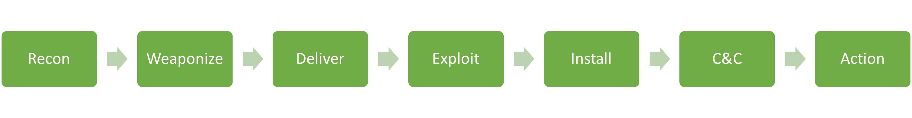
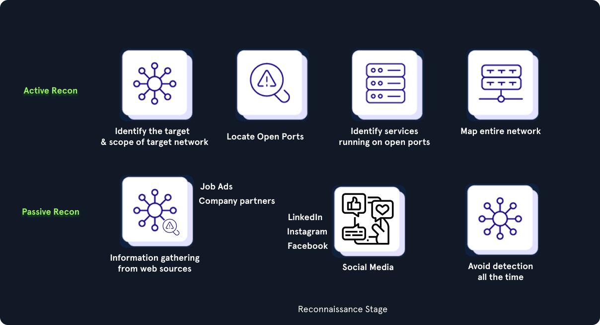
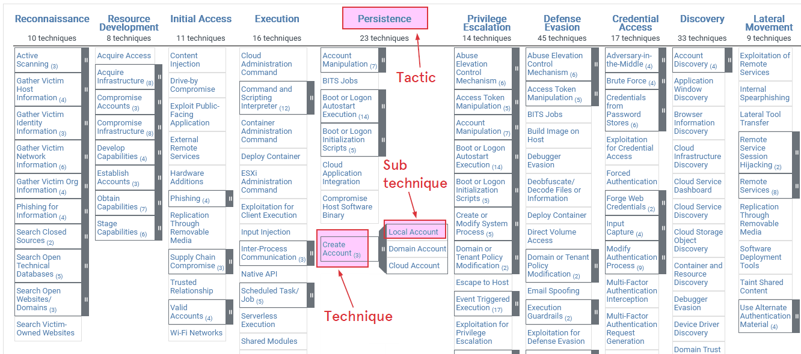
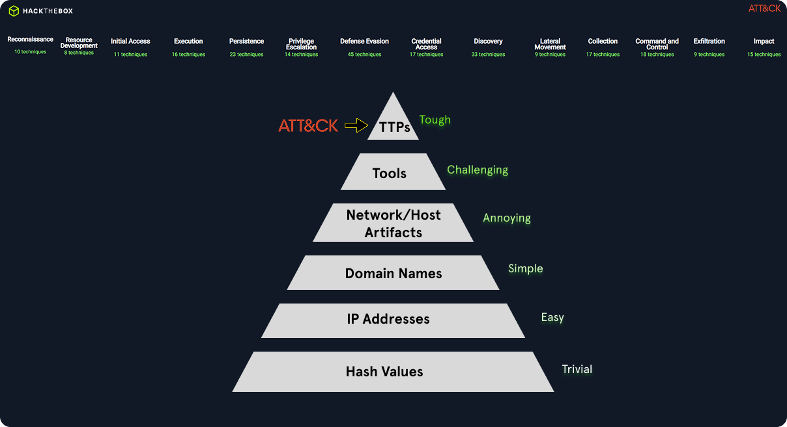

# Cyber Kill Chain
It is important to understand how attacks typically unfold and how defenders analyze adversary behavior. 
Three core concepts help with this:

- **Cyber Kill Chain** → explains the broad stages of an attack
- **MITRE ATT&CK** → describes attacker behavior in more detail
- **Pyramid of Pain** → shows which detections are easiest or hardest for attackers to change

Together, these models help analysts understand **what the attacker is doing**, **how far the intrusion has progressed**, and **where defensive actions will have the most impact**.

---

## 1. Cyber Kill Chain

The **Cyber Kill Chain** is a model that describes the lifecycle of a cyberattack from the attacker’s initial research to the final objective. It helps incident responders determine:

- where the attacker is in the attack lifecycle
- what access they may already have
- what the likely next steps are
- where the attack can still be disrupted

The kill chain consists of **seven stages**.

<!-- Add Cyber Kill Chain image here -->

### 1.1 Reconnaissance
The **Reconnaissance** stage is the starting point of the attack. The attacker selects a target and gathers as much information as possible about the organization.

This can happen in two ways:

#### Passive reconnaissance
The attacker gathers information without directly interacting with the target systems.

Examples:

- LinkedIn profiles
- Instagram, Facebook, and other social media
- company websites
- technical documentation
- job advertisements
- information about partners and suppliers

This information can reveal valuable details such as:

- operating systems in use
- antivirus or EDR products
- firewall vendors
- cloud technologies
- exposed business processes
- employee names and roles

#### Active reconnaissance
The attacker directly interacts with the target infrastructure to discover weaknesses.

Examples:

- scanning public IP ranges
- identifying open ports
- enumerating exposed services
- fingerprinting applications
- mapping internet-facing infrastructure

**Goal:** identify entry points, technologies, users, and weak spots that can be abused later.

---

### 1.2 Weaponization
In the **Weaponization** stage, the attacker prepares the malicious payload or exploit that will be used to gain initial access.

This often includes:

- creating or modifying malware
- embedding malware inside an exploit or delivery file
- preparing a lightweight stager
- designing the payload to evade antivirus and detection tools

The payload is usually intended to:

- provide remote access
- survive reboots
- remain stealthy
- allow additional tools to be downloaded later

**Goal:** prepare an effective and low-detection payload for the target environment.

---

### 1.3 Delivery
The **Delivery** stage is when the malicious payload is sent to the victim.

Common delivery methods include:

- phishing emails
- malicious attachments
- links to attacker-controlled websites
- fake login portals for credential theft
- phone-based social engineering
- infected USB devices or removable media

In many attacks, the attacker tries to make the payload easy to execute. The victim usually only needs to:

- open an attachment
- click a link
- enter credentials
- run a file or script

**Goal:** place the malicious content in front of the victim in a convincing way.

---

### 1.4 Exploitation
The **Exploitation** stage begins when the payload is triggered or a vulnerability is successfully abused.

At this point, the attacker attempts to:

- execute code on the target system
- exploit a software vulnerability
- abuse user interaction
- gain the first foothold in the environment

**Goal:** obtain code execution or initial access to the system.

---

### 1.5 Installation
The **Installation** stage is when malware or persistence mechanisms are placed on the compromised host.

Common examples include:

#### Droppers
Small programs that install and launch malware on the system.

#### Backdoors
Malware that gives the attacker continued remote access.

#### Rootkits
Malware designed to hide itself and avoid detection by security tools.

This stage is important because it often determines whether the attacker can remain in the environment after the initial compromise.

**Goal:** maintain access and prepare the host for continued attacker activity.

---

### 1.6 Command and Control (C2)
In the **Command and Control** stage, the attacker establishes communication with the compromised machine.

This allows the attacker to:

- send commands
- receive data
- deploy more tools
- update malware
- maintain remote access

Advanced threat actors often use multiple tools or redundant access methods so that even if one is detected and removed, they can still return to the network.

**Goal:** create a reliable remote control channel to the infected host.

---

### 1.7 Actions on Objectives
This is the final stage of the attack, where the attacker carries out their real objective.

Examples include:

- data exfiltration
- credential theft
- privilege escalation
- lateral movement
- persistence expansion
- ransomware deployment
- encryption or destruction of systems

The exact objective depends on the adversary. Some groups focus on espionage and data theft, while others aim for financial impact through ransomware.

**Goal:** achieve the intended business, operational, or destructive effect of the intrusion.

---

## 2. Important Limitation of the Kill Chain

Although the Cyber Kill Chain is useful, attackers do **not** always operate in a strict linear sequence.

In real incidents:

- stages may repeat
- attackers may move back and forth between stages
- reconnaissance often happens again after initial access
- new tools may be delivered later inside the network
- lateral movement can introduce a new mini kill chain on another host

For example, after compromising one machine, the attacker may begin **reconnaissance again** to identify additional systems, accounts, and opportunities deeper in the network.

Because of this, the Cyber Kill Chain should be used as a **practical investigation model**, not as a rigid rule.

---

## 3. Why the Cyber Kill Chain Matters in Incident Handling

The Cyber Kill Chain helps analysts determine:

- how far the attacker has progressed
- what level of access may already exist
- what the likely next steps are
- where containment should happen first

The main defensive objective is clear:

> **Stop the attacker as early as possible in the kill chain.**

The earlier the attacker is detected, the lower the potential impact on the environment.

---

## 4. MITRE ATT&CK Framework

The **MITRE ATT&CK Framework** is another model used to understand adversary behavior. While the Cyber Kill Chain gives a **high-level attack lifecycle**, MITRE ATT&CK provides a **more detailed and granular view** of what attackers actually do during an intrusion.

It is widely used by:

- SOC analysts
- incident responders
- detection engineers
- threat hunters
- malware analysts

The ATT&CK Enterprise Matrix documents adversary behavior observed in real-world enterprise environments such as:

- Windows
- Linux
- macOS
- cloud
- network devices
- mobile platforms

It is presented as a matrix where:

- **columns** represent attacker goals (**tactics**)
- **cells** represent specific attacker methods (**techniques**)

<!-- Add MITRE ATT&CK image here -->

### 4.1 Tactic
A **tactic** is a high-level adversary objective during an intrusion.

Examples:

- **Initial Access**
- **Persistence**
- **Privilege Escalation**
- **Credential Access**
- **Lateral Movement**
- **Command and Control**
- **Impact**

A tactic answers the question:

> **What is the attacker trying to achieve at this stage?**

---

### 4.2 Technique
A **technique** is a specific method used by the attacker to achieve a tactic.

Examples:

- **T1105 – Ingress Tool Transfer**  
  Attackers transfer tools or payloads into the environment, often using built-in utilities such as `curl` or `wget`.

- **T1021 – Remote Services**  
  Attackers use services such as SSH, RDP, or SMB to move laterally between systems.

A technique answers the question:

> **How is the attacker achieving that objective?**

---

### 4.3 Sub-technique
A **sub-technique** is a more precise version of a technique. It describes a specific implementation or target.

Examples:

- **T1003.001 – OS Credentials: LSASS Memory**  
  Attackers dump credentials from LSASS process memory.

- **T1021.002 – Remote Services: SMB/Windows Admin Shares**  
  Attackers use SMB shares with valid credentials for remote interaction and lateral movement.

Sub-techniques allow defenders to report activity with much greater precision.

For example, instead of saying:

- "credential dumping was detected"

an analyst can say:

- "we detected **T1003.001 – LSASS memory dumping**"

This improves:

- detection engineering
- reporting quality
- threat intelligence sharing
- case documentation
- containment decisions

---

## 5. Cyber Kill Chain vs. MITRE ATT&CK

The two frameworks are related, but they serve different purposes.

| Framework | Purpose | Level of Detail |
|---|---|---|
| **Cyber Kill Chain** | Explains the broad attack lifecycle | High-level |
| **MITRE ATT&CK** | Describes detailed attacker tactics and techniques | Granular |

In practice:

- the **Cyber Kill Chain** helps analysts understand **where** the attacker is
- **MITRE ATT&CK** helps analysts understand **what exactly the attacker is doing**

Both frameworks are often used together during investigations.

---

## 6. Pyramid of Pain

The **Pyramid of Pain** shows how difficult it is for an attacker to change something once defenders detect and block it.

At the bottom of the pyramid are indicators that are easy for attackers to replace. At the top are behavioral patterns that are much harder to change.

<!-- Add Pyramid of Pain image here -->

### 6.1 Lower levels: easy for attackers to change
Examples:

- **Hash values**
- **IP addresses**
- **Domain names**

These are useful indicators, but they cause only limited disruption.

For example:

- blocking a malicious IP involved in Command and Control may stop one communication channel
- however, the attacker can often switch quickly to another IP or domain

This means such detections create **low pain** for the adversary.

---

### 6.2 Middle levels: more disruptive
Higher in the pyramid are indicators such as:

- **network artifacts**
- **host artifacts**
- **malware artifacts**
- **tooling characteristics**

Examples:

- registry run keys
- filenames
- mutex names
- scheduled tasks
- suspicious service creation
- repeated command-line patterns

These are harder to replace than simple hashes or IPs and therefore more valuable for defenders.

---

### 6.3 Top levels: highest pain
At the top of the pyramid are:

- **Tools**
- **Tactics, Techniques, and Procedures (TTPs)**

This is where MITRE ATT&CK becomes especially important.

Examples:

- **T1059 – Command and Scripting Interpreter**  
  Abuse of PowerShell or shell scripting

- **T1055 – Process Injection**  
  Injecting malicious code into another process

- **T1547.001 – Registry Run Keys / Startup Folder**  
  Persistence through registry autorun entries

Detecting and disrupting these behaviors forces the attacker to change how they operate, not just which file or IP they use.

This creates **maximum pain** for the adversary.

---

## 7. Why the Pyramid of Pain Matters

The Pyramid of Pain teaches an important defensive lesson:

- **Hash/IP/domain detections** are still useful, but they are easy to evade
- **Behavior-based detections** are more resilient and more effective in the long term

In mature security operations, the goal is to move detection capability upward:

### Lower maturity detections
- file hashes
- single malicious IPs
- known domains

### Higher maturity detections
- process injection behavior
- unusual PowerShell execution
- credential dumping behavior
- remote service abuse
- persistence via specific ATT&CK techniques

This is why modern SOC work often focuses heavily on **MITRE ATT&CK-based detections** rather than only on simple indicators of compromise.

---

## 8. Practical Use in Incident Response

During an investigation, analysts often combine all three models:

### Cyber Kill Chain
Used to determine:

- how far the attacker has progressed
- what phase of the attack is occurring

### MITRE ATT&CK
Used to determine:

- which tactics and techniques were observed
- what the attacker is likely to do next
- how to describe activity in a standardized way

### Pyramid of Pain
Used to determine:

- whether the detection is low-value or high-value
- how much disruption containment actions will cause to the attacker
- where detection engineering should improve over time

Together, these models support:

- triage
- investigation
- containment
- eradication
- detection tuning
- reporting

---

## 9. MITRE ATT&CK Integration in TheHive

TheHive is a case management platform used by cybersecurity teams to manage alerts and incidents in a centralized way.

It allows analysts to:

- create and manage cases
- group related alerts
- track observables and evidence
- document investigations
- associate alerts with MITRE ATT&CK TTPs

This is valuable because it connects raw security alerts to known adversary behavior. Instead of only seeing a technical alert, analysts can understand:

- which ATT&CK tactic is involved
- which technique may be in use
- how the alert fits into the broader intrusion

This improves both investigation quality and reporting consistency.

---

## 10. Example of MITRE ATT&CK Mapping

Below is an example of how attacker activity can be mapped to ATT&CK:

| Tactic | Technique | ID | Description |
|---|---|---|---|
| Initial Access | Exploit Public-Facing Application | T1190 | Confluence vulnerability exploited |
| Execution | Command and Scripting Interpreter: PowerShell | T1059.001 | PowerShell used to download payload |
| Persistence | Windows Service | T1543.003 | Service created for persistence |
| Credential Access | OS Credentials: LSASS Memory | T1003.001 | Credentials dumped from LSASS |
| Lateral Movement | Remote Services: RDP | T1021.001 | RDP used for lateral movement |
| Impact | Data Encrypted for Impact | T1486 | Ransomware encrypted files |

This kind of mapping helps analysts quickly understand the attacker’s actions and the likely progression of the compromise.

---

## 11. Key Takeaways

### Cyber Kill Chain
- explains the broad phases of an attack
- helps determine how far the attacker has progressed
- supports early detection and containment

### MITRE ATT&CK
- provides detailed visibility into attacker behavior
- organizes activity into tactics, techniques, and sub-techniques
- improves detection, reporting, and threat hunting

### Pyramid of Pain
- shows which detections are easiest or hardest for attackers to change
- emphasizes the value of behavior-based detection
- encourages defenders to focus on TTPs, not only simple IOCs

---

## 12. Conclusion

The **Cyber Kill Chain**, **MITRE ATT&CK**, and the **Pyramid of Pain** are complementary models that help defenders understand and respond to cyberattacks more effectively.

- The **Cyber Kill Chain** shows the overall attack lifecycle.
- **MITRE ATT&CK** explains the specific tactics and techniques used by the adversary.
- The **Pyramid of Pain** shows which detections cause the most disruption to the attacker.

For incident handling, these frameworks are extremely valuable because they help analysts:

- understand adversary intent
- estimate what has already happened
- predict likely next steps
- choose stronger containment and detection strategies

Ultimately, the objective is not only to detect an attacker, but to detect them in a way that **forces them to change their behavior, slows their progress, and prevents them from reaching their final objective**.
