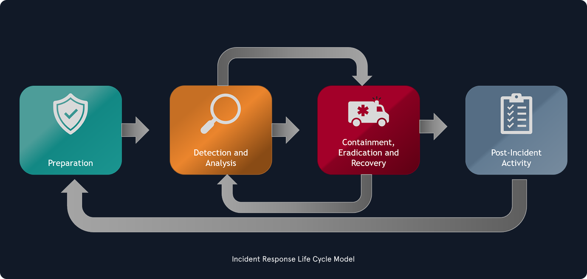
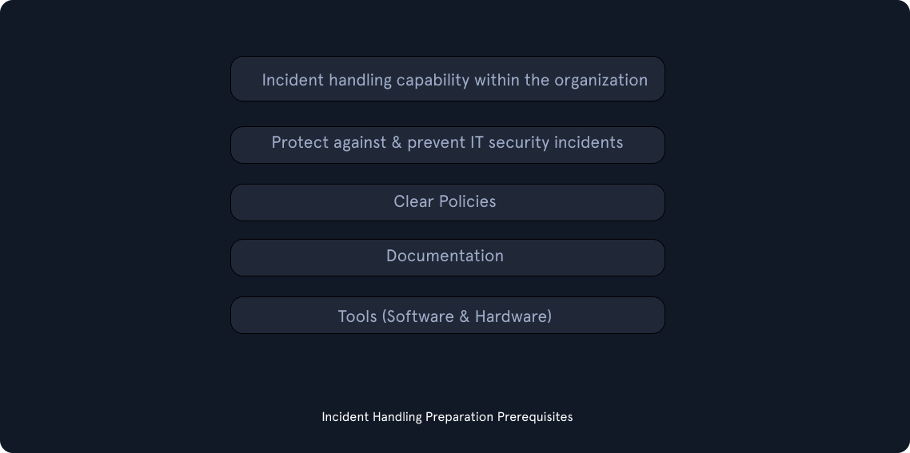
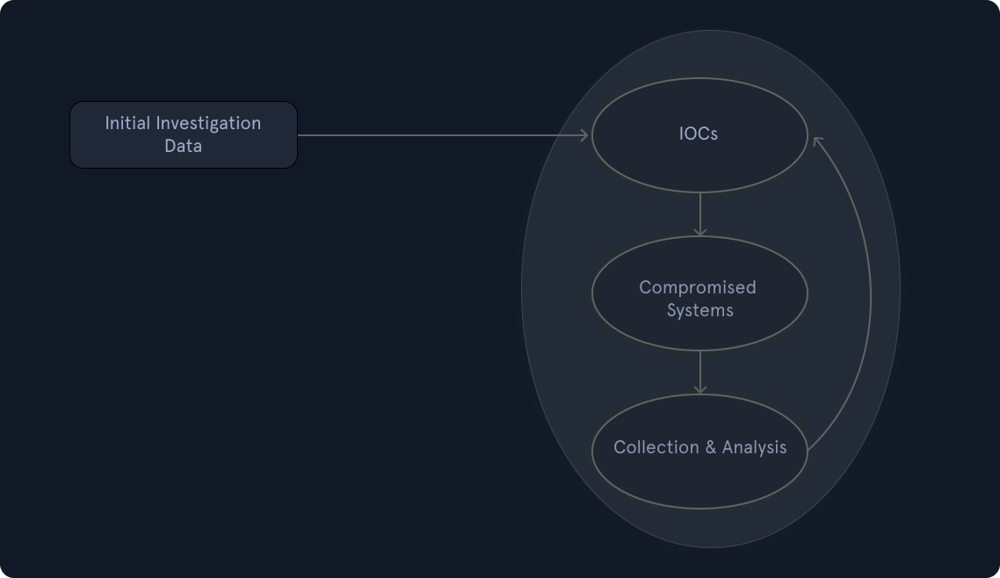
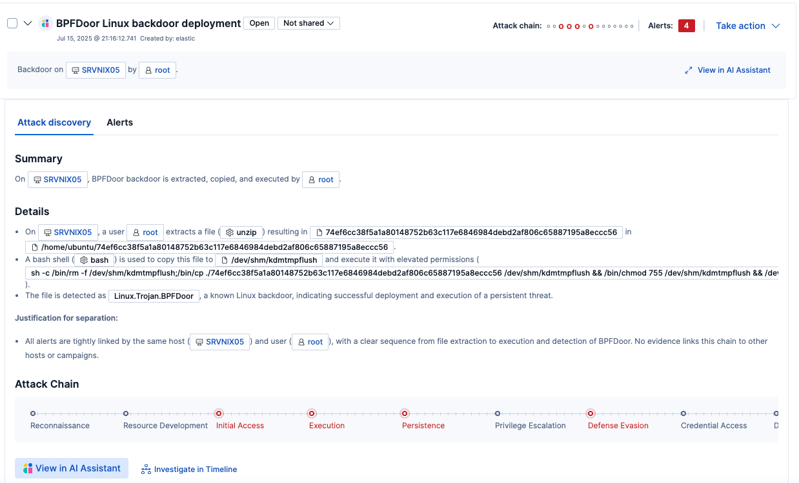
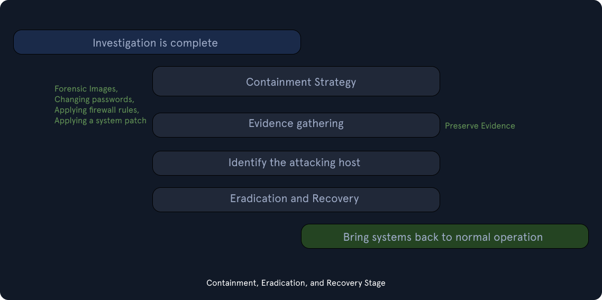
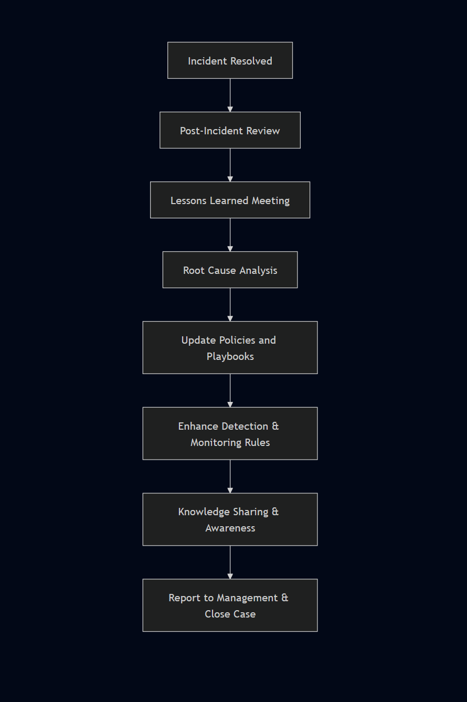

# Incident Handling Process

The **Incident Handling Process** defines how an organization prepares for, detects, investigates, contains, and recovers from security incidents.

It is important to note that this process is **not the same as the Cyber Kill Chain**. The kill chain describes how an attacker operates, while the incident handling process describes **how defenders respond**.

According to **NIST**, the process has **four main stages**:

1. **Preparation**
2. **Detection & Analysis**
3. **Containment, Eradication & Recovery**
4. **Post-Incident Activity**

> Incident handling is a **cyclical process**, not a strictly linear one. As new evidence appears, the next steps may change.

---

## 1. Purpose of Incident Handling

Incident handling has two main goals:

### Investigation
The investigation phase aims to:

- identify the initial compromised system (**patient zero**)
- build an incident timeline
- determine which tools, malware, and techniques were used
- document impacted systems and attacker activity

### Recovery
The recovery phase focuses on:

- creating a remediation plan
- restoring systems safely
- returning the business to normal operations

At the end of the process, the organization should also produce a report and perform **lessons learned** activities.

---

## 2. The Four Stages

## 2.1 Preparation

The **Preparation** stage is about building the capability to handle incidents before they happen.

This includes:

- skilled incident handlers
- a trained workforce
- clear policies and documentation
- the right software and hardware tools
- preventive security controls across the environment

### Key preparation requirements

#### People
- trained incident handlers
- internal or outsourced IR capability
- security-aware employees

#### Documentation
- incident response policy, plan, and procedures
- contact lists for legal, compliance, IT, management, communications, and external responders
- network diagrams
- asset inventory
- forensic cheat sheets
- reporting procedures

#### Tools
- forensic workstations or dedicated laptops
- disk, memory, and live-response tools
- log and network analysis tools
- write blockers and storage drives
- chain of custody forms
- secure evidence storage
- ticketing/case management platform
- documentation system **independent from the organization’s infrastructure**

> Assume that part of the environment may be compromised. Documentation and incident communications should not depend entirely on internal systems like corporate email.

### Important preparation principle

Documentation is not only something you create before an incident.  
It is also something you maintain **during** the incident.

Notes should include:

- timestamp
- action performed
- result
- person responsible

A good rule is to always document:

- **who**
- **what**
- **when**
- **where**
- **why**
- **how**

---

## 2.2 Detection & Analysis

This stage begins when suspicious activity is identified.

Detection can come from many sources, such as:

- an employee reporting suspicious behavior
- alerts from EDR, IDS, firewall, SIEM, or antivirus
- threat hunting
- third-party notifications

### Detection layers

It is useful to think about detection at multiple levels:

- **Network perimeter**  
  firewalls, internet-facing IDS/IPS, DMZ monitoring

- **Internal network**  
  local firewalls, internal IDS/IPS, segmentation visibility

- **Endpoint**  
  antivirus, EDR, host-based telemetry

- **Application**  
  application logs, service logs, web logs

### Initial investigation

Before launching a full incident response, analysts should first gather context.

Some of the first questions to answer are:

- When was the incident reported?
- Who detected or reported it?
- How was it detected?
- What type of incident is it?
- Which systems are affected?
- Is the incident still ongoing?
- Who accessed the systems already?
- What is the role and importance of the affected systems?

This step is critical because context matters.  
A compromise on a **CEO laptop** and a compromise on a **test workstation** do not have the same business impact.

### Building the timeline

As soon as the initial facts are collected, analysts should begin building an **incident timeline**.

A simple timeline can include:

| Date | Time | Hostname | Event Description | Data Source |
|---|---|---|---|---|
| 09/09/2021 | 13:31 CET | SQLServer01 | Mimikatz detected | Antivirus |

The timeline helps analysts:

- stay organized
- understand attacker progression
- connect separate pieces of evidence
- identify whether new findings belong to the same incident

### Severity and scope

During detection and analysis, analysts should also evaluate:

- exploitation impact
- exploitation requirements
- whether critical systems are involved
- number of impacted systems
- whether the exploit is used in the wild
- whether worm-like behavior is possible

These questions help determine urgency, escalation level, and response priority.

### Confidentiality and communication

Incident information should be shared on a **need-to-know basis**.

This is important because:

- the adversary may still be inside the environment
- the incident may involve sensitive business or customer data
- legal or regulatory obligations may apply
- only approved persons should communicate internally or externally

---

## 2.3 Investigation Workflow

Once the investigation is active, analysts usually work in a repeating cycle:

1. **Create and use IOCs**
2. **Identify new leads and impacted systems**
3. **Collect and analyze data from those systems**

This process repeats until the team understands the incident well enough to contain and remove it.

### Indicators of Compromise (IOCs)

An **Indicator of Compromise (IOC)** is evidence that a system may be involved in an incident.

Examples:

- malicious IP addresses
- file hashes
- filenames
- domains
- registry paths
- mutex names

IOCs can be:

- discovered internally during the investigation
- obtained from external intelligence sources
- documented using formats such as **STIX**, **OpenIOC**, or **YARA**

### Important caution

During investigations, responders must be careful with the tools they use.  
Some tools can leave traces or even cache privileged credentials on compromised systems.

This means incident handlers must **know exactly how their tools behave** before using them in a live environment.

### Data collection and analysis

Once new leads are identified, data should be collected carefully.

Common approaches include:

- **live response** on running systems
- **disk acquisition**
- **memory capture**
- **log collection**
- **network evidence collection**

Analysts should minimize interaction with the system to avoid altering evidence.

> Chain of custody must be maintained if the evidence may later be needed for legal action.

---

## 2.4 Containment, Eradication & Recovery

After the investigation provides enough clarity, the team moves into response actions.

This stage has three parts:

### Containment
The goal of containment is to **stop the incident from spreading**.

Containment actions should be **coordinated across all affected systems**.  
Partial containment can warn the attacker and lead to unpredictable behavior.

#### Short-term containment
Actions with minimal footprint, for example:

- isolate a host in a separate VLAN
- unplug a network cable
- block or redirect malicious C2 communication
- preserve forensic evidence before major changes

#### Long-term containment
More persistent changes, for example:

- password resets
- firewall rule changes
- host-based controls
- system patches
- shutting down selected systems

### Eradication
Once the incident is contained, the team removes the root cause and remaining attacker presence.

Examples:

- delete malware
- remove persistence mechanisms
- rebuild compromised systems
- restore from backups
- apply additional hardening

### Recovery
In the recovery phase, systems are returned to production safely.

This includes:

- verifying that systems function correctly
- validating business data and services
- reintroducing systems in a controlled way
- monitoring them closely after restoration

Typical things to watch for after recovery:

- unusual logons
- suspicious processes
- unexpected registry changes
- repeated attacker behavior

> Recovery in larger incidents may take weeks or months and is often done in phases.

---

## 2.5 Post-Incident Activity

Once the incident is resolved, the work is not finished.

The **Post-Incident Activity** stage focuses on:

- documenting what happened
- identifying lessons learned
- improving future readiness
- updating plans, playbooks, and detection content

### Final reporting

A good incident report should answer questions such as:

- What happened?
- When did it happen?
- How did the team respond?
- What worked well?
- What needs improvement?
- What containment and eradication actions were taken?
- Which preventive measures should be added?
- What tools or capabilities are missing?

### Lessons learned

A lessons learned review should involve all relevant stakeholders and should happen shortly after the incident.

This review can lead to improvements in:

- policies
- playbooks
- detections
- monitoring
- team structure
- tooling
- training

---

## 3. Key Principles

Throughout the incident handling process, several principles remain important:

- **Do not skip steps**
- **Do not contain only part of the incident**
- **Document everything**
- **Protect evidence**
- **Keep communications controlled**
- **Base decisions on validated facts**
- **Treat the process as iterative, not one-time**

---

## 4. Summary

The **Incident Handling Process** is a structured method for dealing with security incidents.

It consists of four stages:

1. **Preparation**  
   Build people, process, documentation, and tools before incidents happen.

2. **Detection & Analysis**  
   Detect suspicious activity, gather context, investigate, and build a timeline.

3. **Containment, Eradication & Recovery**  
   Stop the spread, remove the threat, and restore operations safely.

4. **Post-Incident Activity**  
   Report, review, and improve the organization’s future response capability.

In practice, strong incident handling is not only about reacting fast. It is about being **prepared**, staying **organized**, making **evidence-based decisions**, and improving after every incident.

---