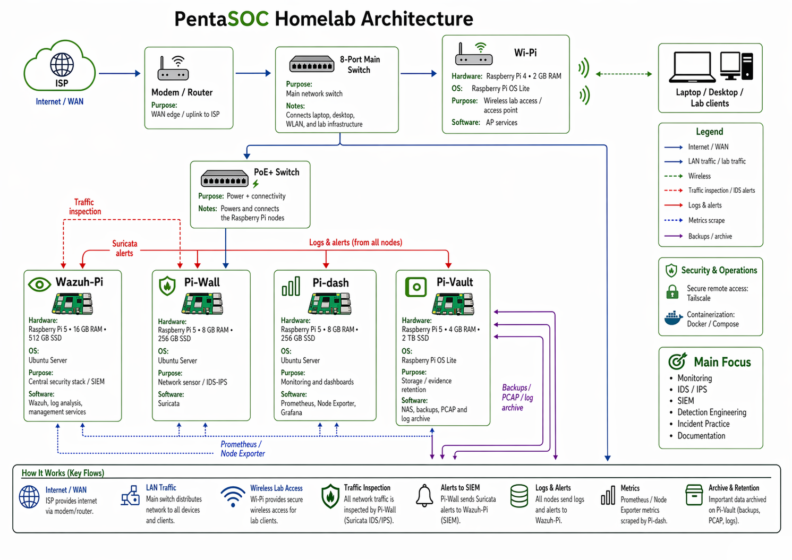

# Network Security Essentials


| Category | Description |
|---|---|
| **Topic** | Network Security Essentials |
| **Focus** | Network components, logs, perimeter monitoring |
| **Used By** | SOC Analysts, Blue Team, Network Defenders |
| **Main Idea** | You cannot defend what you cannot see |
| **Key Skills** | Log analysis, traffic monitoring, attack pattern recognition |

---

## What Is a Network?

A `network` is a group of connected systems that communicate with each other to share data, services, and resources.

A business network usually contains:

- `Endpoints`
- `Servers`
- `Network infrastructure`
- `Security devices`
- `Authentication systems`
- `Remote access services`

From a security perspective, every component is a possible:

- `Attack target`
- `Log source`
- `Pivot point`
- `Detection opportunity`

---

# Network Components

## Small Enterprise Network



A small enterprise network usually contains workstations, servers, firewalls, switches, routers, VPN gateways, and authentication systems.

---

## Core Assets

| Component | Purpose | Security Importance |
|---|---|---|
| **User Workstations** | Used by employees for daily work | Common entry point through phishing, malware, or malicious downloads |
| **File Servers** | Store shared documents and business data | High-value target for ransomware and data theft |
| **Database Servers** | Store structured data like customer or financial records | Often targeted for data exfiltration |
| **Application Servers** | Host web, email, VPN, and business applications | Externally exposed services are frequently scanned and attacked |
| **Active Directory** | Manages users, computers, groups, and access rights | Critical target for privilege escalation and lateral movement |
| **Routers & Switches** | Move traffic between systems and networks | Compromise can allow traffic interception or rerouting |
| **Firewalls** | Filter traffic between trusted and untrusted networks | First line of defense and important source of security logs |
| **VPN Gateways** | Allow remote access to internal systems | Common target for brute-force and credential attacks |

---

# Network Visibility

> **Key principle:** You cannot protect what you cannot see.

`Network visibility` means being able to monitor, understand, and investigate activity across the network.

Visibility helps analysts:

- Detect anomalies
- Investigate incidents
- Hunt for threats
- Build attack timelines
- Identify compromised systems
- Validate security controls

---

## Main Log Categories

| Log Type | Description | Example Sources |
|---|---|---|
| **Host-Centric Logs** | Show what happened on a specific system | Windows Event Logs, Linux syslog, EDR logs |
| **Network-Centric Logs** | Show communication between systems | Firewall, IDS/IPS, proxy, VPN, NetFlow |

---

## Host-Centric Logs

Host logs are generated by individual systems such as workstations, laptops, and servers.

### Common Sources

- `Windows Event Logs`
- `Linux syslog`
- `Application logs`
- `Antivirus logs`
- `EDR logs`
- `HIDS logs`

### Useful For Detecting

| Activity | Example |
|---|---|
| **Process execution** | Suspicious PowerShell command |
| **User logins** | Unusual login time or location |
| **Privilege abuse** | Admin login on abnormal host |
| **Malware activity** | Unknown process or persistence mechanism |
| **File changes** | Sensitive file access or deletion |

---

## Network-Centric Logs

Network logs show communication between devices.

### Common Sources

- `Firewall logs`
- `IDS/IPS alerts`
- `Proxy logs`
- `VPN logs`
- `Router flow data`
- `Switch logs`

### Useful For Detecting

| Activity | Example |
|---|---|
| **Reconnaissance** | Port scanning |
| **Brute-force attempts** | Repeated VPN login failures |
| **Command & Control** | Repeated outbound beaconing |
| **Lateral movement** | SMB, RDP, or SSH between internal hosts |
| **Data exfiltration** | Large outbound uploads |

---

## Host vs Network Logs

| Question | Best Log Source |
|---|---|
| What process executed? | Host logs |
| Which user logged in? | Host logs |
| Which IP connected to which system? | Network logs |
| Was traffic allowed or blocked? | Firewall logs |
| Was malicious traffic detected? | IDS/IPS logs |
| Was data sent outside the network? | Network and proxy logs |

> Host logs show what happened **inside the system**.  
> Network logs show what happened **between systems**.

---

# Network Perimeter

The `network perimeter` is the boundary between the internal trusted network and the external untrusted Internet.

It is where traffic enters and leaves the organization.

---

## Common Perimeter Components

| Component | Purpose |
|---|---|
| **Firewall** | Filters inbound and outbound traffic |
| **Router/Gateway** | Routes traffic between networks |
| **DMZ** | Hosts public-facing systems separately from the internal LAN |
| **VPN Gateway** | Provides remote access for employees |
| **WAF** | Protects web applications from attacks |
| **IDS/IPS** | Detects or blocks suspicious network activity |

---

## Why the Perimeter Matters

Attackers often start by scanning the perimeter.

Common perimeter risks include:

- Exposed `RDP`
- Exposed `SSH`
- Exposed `SMB`
- Weak VPN credentials
- Misconfigured firewall rules
- Vulnerable web applications
- Unmonitored outbound traffic

---

# Perimeter Monitoring

Monitoring the perimeter helps detect early signs of attack.

## What Analysts Look For

| Pattern | Possible Meaning |
|---|---|
| One source IP connecting to many ports | Port scan |
| Many failed logins from one IP | Brute-force attack |
| Repeated outbound traffic at fixed intervals | C2 beaconing |
| Large outbound uploads | Data exfiltration |
| External IP hitting web parameters | Web attack attempt |
| Internal host connecting to many internal systems | Lateral movement |

---

# Common Attack Scenarios

## 1. Port Scanning

### Example Pattern

```text
BLOCK TCP 203.0.113.10:50001 -> 10.0.0.20:21
BLOCK TCP 203.0.113.10:50002 -> 10.0.0.20:22
BLOCK TCP 203.0.113.10:50003 -> 10.0.0.20:23
BLOCK TCP 203.0.113.10:50004 -> 10.0.0.20:445
````

### Analysis

The same external IP is trying multiple ports on the same target.

### Verdict

`Port scanning / reconnaissance`

---

## 2. Web Attack

### Example Alerts

```text
attack_type="SQL Injection"
attack_type="XSS"
attack_type="Directory Traversal"
```

### Analysis

The attacker is targeting a web application with common payloads.

### Verdict

`Web application attack attempt`

---

## 3. VPN Brute-Force

### Example Pattern

```text
FAILED_AUTH 203.0.113.10 user=admin
FAILED_AUTH 203.0.113.10 user=guest
FAILED_AUTH 203.0.113.10 user=test
SUCCESS_AUTH 203.0.113.10 user=svc_backup
```

### Analysis

Many failed attempts followed by a successful login.

### Verdict

`Credential attack / possible VPN compromise`

---

## 4. Lateral Movement

### Example Pattern

```text
ALLOW TCP 10.8.0.23:2001 -> 10.0.0.20:445
ALLOW TCP 10.8.0.23:2002 -> 10.0.0.51:22
ALLOW TCP 10.8.0.23:2003 -> 10.0.0.60:3389
```

### Analysis

A VPN-assigned host is connecting to internal systems over SMB, SSH, and RDP.

### Verdict

`Possible lateral movement`

---

## 5. C2 Beaconing

### Example Pattern

```text
ET TROJAN Possible C2 Beaconing
10.0.0.60:30000 -> 198.51.100.200:4444
10.0.0.60:30001 -> 198.51.100.200:4444
10.0.0.60:30002 -> 198.51.100.200:4444
```

### Analysis

The same internal host repeatedly connects to the same external IP and port.

### Verdict

`Possible malware command and control`

---

## 6. Data Exfiltration

### Example Pattern

```text
ET INFO Possible HTTP POST Large Upload
10.0.0.60:40050 -> 198.51.100.200:8080
```

### Analysis

Large outbound HTTP uploads may indicate stolen data leaving the network.

### Verdict

`Possible data exfiltration`

---

# Basic Investigation Workflow

## Manual Log Analysis

Useful Linux commands:

```bash
head firewall.log
grep "BLOCK" firewall.log
grep "FAIL" vpn_auth.log
grep "C2" ids_alerts.log
grep "SMB" ids_alerts.log
```

---

## Count Source IPs

```bash
cat firewall.log | grep "BLOCK" | cut -d' ' -f5 | cut -d: -f1 | sort | uniq -c | sort -nr
```

Use this to identify which IP generated the most blocked traffic.

---

## Count Failed VPN Attempts

```bash
cat vpn_auth.log | grep "FAIL" | cut -d' ' -f3 | sort | uniq -c | sort -nr
```

Use this to identify brute-force sources.

---

# SOC Analyst Checklist

## When Reviewing Perimeter Logs

* [ ] Identify top blocked source IPs
* [ ] Look for repeated failed VPN logins
* [ ] Check for successful login after many failures
* [ ] Pivot from external IP to VPN assigned IP
* [ ] Check internal traffic from the VPN IP
* [ ] Look for SMB, RDP, and SSH lateral movement
* [ ] Search IDS alerts for exploit signatures
* [ ] Search for C2 beaconing
* [ ] Check for large outbound uploads
* [ ] Build a timeline of the attack

---

# Key Takeaways

* `Endpoints` are common initial access points.
* `Servers` hold valuable data and are major targets.
* `Active Directory` is one of the most critical enterprise assets.
* `Firewalls`, `IDS/IPS`, `VPN`, and `proxy logs` provide strong network visibility.
* `Host logs` explain what happened on a machine.
* `Network logs` explain communication between systems.
* `Port scanning`, `brute-force`, `lateral movement`, `C2`, and `exfiltration` all create recognizable patterns.
* Good SOC analysis depends on correlation between multiple log sources.

---

# Summary

Network security starts with understanding the environment.

A security analyst must know:

1. What assets exist.
2. What each asset does.
3. What logs are available.
4. What normal traffic looks like.
5. What suspicious patterns look like.

> Visibility + context = better detection.

