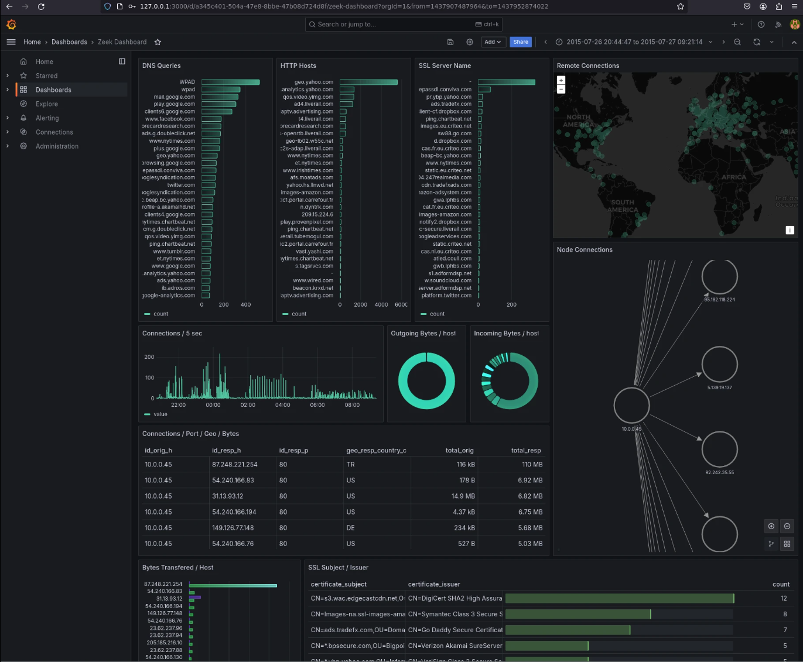

# Zeek

## Overview

Zeek is an open-source, **passive network traffic analyzer**. It is commonly used for **network security monitoring**, but it is also useful for **troubleshooting**, **measurements**, and **protocol-level visibility** across a network. Zeek runs on standard Unix-like systems and does not require custom hardware. ([docs.zeek.org][1])

What makes Zeek different from tools like Suricata and Snort is its focus on **high-level events, rich logs, and scripting**. In practice, Zeek is better thought of as an **NSM and analysis platform** than a pure signature-based IDS. Its scripting language lets defenders write custom logic for detection, enrichment, and long-term behavioral analysis. ([docs.zeek.org][2])

---

## Operation Modes

Zeek is primarily designed for **fully passive traffic analysis**. It supports:

* **live traffic analysis** from network interfaces
* **offline analysis** from PCAP files
* **libpcap-based packet capture**
* **clustered deployments** for larger environments ([docs.zeek.org][3])

For smaller environments, Zeek can be run directly from the command line. For larger environments, Zeek provides a **cluster framework** that distributes traffic across multiple worker processes while preserving session affinity. The official cluster docs state that this model can scale to **100G+** environments. ([docs.zeek.org][4])

---

## Architecture

Zeek has two main components:

### Event Engine

The event engine processes packets and converts them into **high-level events**. These events are descriptive, not judgmental. For example, Zeek can raise events such as a **new connection**, an **HTTP request**, or a **completed TLS handshake**. ([docs.zeek.org][5])

### Script Interpreter

The script interpreter processes those events using **Zeek scripts**. This is where the site’s logic lives: logging decisions, notices, detections, state tracking, and custom workflows. ([docs.zeek.org][2])

This split is the core of Zeek’s design: the engine extracts structured network meaning, and the scripting layer decides what to do with it. ([docs.zeek.org][2])

---

## Logs

One of Zeek’s biggest strengths is logging. In its default configuration, Zeek produces a large set of protocol and activity logs. Common examples include:

* `conn.log` — connection-level activity
* `dns.log` — DNS queries and responses
* `http.log` — HTTP request/response metadata
* `ftp.log` — FTP activity
* `smtp.log` — SMTP transactions
* `files.log` — files seen in network traffic
* `ssl.log` / `x509.log` — TLS and certificate metadata ([docs.zeek.org][6])

`conn.log` is one of the most important logs Zeek creates. It tracks both stateful and stateless protocols and is usually the starting point for investigations. `dns.log` and `http.log` are also high-value sources for analyst pivoting. ([docs.zeek.org][7])

For HTTP analysis, Zeek’s logging model records request/response pairs and the relevant metadata in a single record. In practice, useful HTTP fields include items such as **host**, **uri**, **referrer**, **user_agent**, and **status_code**. ([docs.zeek.org][8])

---

## Log Formats

By default, Zeek writes logs in **TSV format** using its ASCII writer. Zeek also supports **JSON output**, which can be enabled globally with `LogAscii::use_json=T`. ([docs.zeek.org][9])

When Zeek is run directly from the command line for offline analysis, logs are written to the **current working directory** unless you change the default log directory. ([docs.zeek.org][10])

When Zeek is managed through **ZeekControl**, live logs are written under `$PREFIX/logs/current`, and rotated logs are archived into date-based directories such as `YYYY-MM-DD`. In that setup, Zeek rotates logs hourly and compresses them with gzip. ([docs.zeek.org][11])

---

## Working With Logs

Zeek logs can be processed with normal Unix tools such as `cat`, `grep`, `zcat`, and `zgrep`, but Zeek also ships with **zeek-cut**, which is designed specifically for TSV logs. It reads the log headers and lets you select fields by name instead of by column position. ([docs.zeek.org][12])

This is one of the most practical parts of Zeek for day-to-day analysis: you can pivot through structured logs very quickly without needing a SIEM first. ([docs.zeek.org][12])

---

## Commands

### Run Zeek on a PCAP

```bash
zeek -r quickstart.pcap
```

Reads a PCAP file in **offline mode** and writes logs to the current directory. ([docs.zeek.org][10])

### Run Zeek on a live interface

```bash
zeek -i en0 -C
```

Monitors **live traffic** on an interface. The `-C` option tells Zeek to ignore invalid checksums, which is often useful in lab or mirrored traffic scenarios. ([docs.zeek.org][13])

### Run Zeek and output JSON logs

```bash
zeek -C LogAscii::use_json=T -r quickstart.pcap
```

Processes traffic and writes logs in **JSON** instead of TSV. ([docs.zeek.org][11])

### Extract selected columns with `zeek-cut`

```bash
cat conn.log | zeek-cut -m uid id.orig_h id.orig_p id.resp_h id.resp_p
```

Prints selected fields from a Zeek TSV log by field name. ([docs.zeek.org][9])

### View compressed rotated logs

```bash
zcat conn.log.gz
zgrep testmyids.com dns.log.gz
```

Useful when working with rotated and gzip-compressed logs in ZeekControl-managed environments. ([docs.zeek.org][11])

---

## Important Paths and Places

### Logs

* current working directory — default location for command-line offline runs
* `$PREFIX/logs/current` — active logs when using ZeekControl
* `$PREFIX/logs/YYYY-MM-DD/` — archived rotated logs when using ZeekControl ([docs.zeek.org][10])

### Common log files

* `conn.log`
* `dns.log`
* `http.log`
* `ftp.log`
* `smtp.log`
* `files.log`
* `ssl.log`
* `x509.log` ([docs.zeek.org][6])

### Event definitions and base scripts

* `/scripts/base/bif/` in the Zeek script tree contains many built-in event and interface definitions exposed by the platform. The Zeek docs expose these through the script reference. ([docs.zeek.org][14])

---

## Key Features



* comprehensive network activity logging
* protocol analysis across HTTP, DNS, FTP, SMTP, SSH, TLS, and more
* file visibility through `files.log`
* IPv4 and IPv6 support
* clustered scaling
* structured ASCII/TSV logging by default
* JSON logging support
* powerful domain-aware scripting language for custom analysis and detection ([docs.zeek.org][6])

Zeek also supports limited TLS decryption when the required key material is available, allowing decrypted content to be forwarded to higher-level analyzers such as HTTP. ([docs.zeek.org][15])

---

## Sources

* Zeek overview, architecture, and monitoring. ([docs.zeek.org][1])
* Quick start and command-line usage. ([docs.zeek.org][3])
* Logs, formats, and `zeek-cut`. ([docs.zeek.org][12])
* Common Zeek logs. ([docs.zeek.org][6])
* Cluster framework. ([docs.zeek.org][4])


[1]: https://docs.zeek.org/en/latest/intro/index.html?utm_source=chatgpt.com "About Zeek — Book of Zeek (8.2.0-dev.203)"
[2]: https://docs.zeek.org/en/v7.0.11/about.html?utm_source=chatgpt.com "About Zeek — Book of Zeek (v7.0.11)"
[3]: https://docs.zeek.org/en/lts/quickstart.html?utm_source=chatgpt.com "Quick Start Guide — Book of Zeek (8.0.6)"
[4]: https://docs.zeek.org/en/master/frameworks/cluster.html?utm_source=chatgpt.com "Cluster Framework — Book of Zeek (8.2.0-dev.448)"
[5]: https://docs.zeek.org/en/master/tutorial/scripting/basics.html?utm_source=chatgpt.com "The Basics — Book of Zeek (8.2.0-dev.435)"
[6]: https://docs.zeek.org/en/current/logs/index.html?utm_source=chatgpt.com "Zeek Logs — Book of Zeek (8.1.1)"
[7]: https://docs.zeek.org/en/v7.1.1/logs/conn.html?utm_source=chatgpt.com "conn.log — Book of Zeek (v7.1.1)"
[8]: https://docs.zeek.org/en/current/scripts/base/protocols/http/main.zeek.html?utm_source=chatgpt.com "base/protocols/http/main.zeek"
[9]: https://docs.zeek.org/en/master/tutorial/logs.html?utm_source=chatgpt.com "Logs — Book of Zeek (8.2.0-dev.496)"
[10]: https://docs.zeek.org/en/master/tutorial/invoking-zeek.html?utm_source=chatgpt.com "Invoking Zeek — Book of Zeek (8.2.0-dev.397)"
[11]: https://docs.zeek.org/en/current/quickstart.html?utm_source=chatgpt.com "Quick Start Guide — Book of Zeek (8.1.1)"
[12]: https://docs.zeek.org/en/current/log-formats.html?utm_source=chatgpt.com "Zeek Log Formats and Inspection"
[13]: https://docs.zeek.org/en/master/quickstart.html?utm_source=chatgpt.com "Quick Start Guide — Book of Zeek (8.2.0-dev.435)"
[14]: https://docs.zeek.org/en/current/scripts/base/bif/event.bif.zeek.html?utm_source=chatgpt.com "base/bif/event.bif.zeek — Book of Zeek (8.1.1)"
[15]: https://docs.zeek.org/en/current/frameworks/tls-decryption.html?utm_source=chatgpt.com "TLS Decryption — Book of Zeek (8.1.1)"
