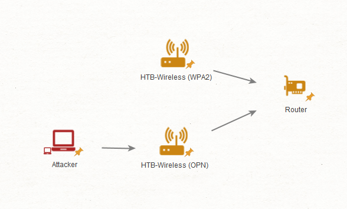
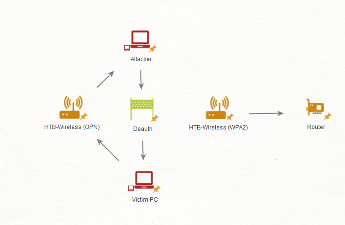
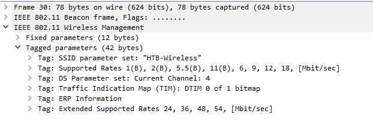
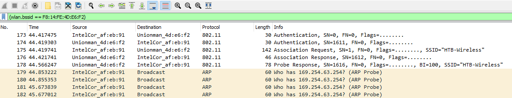

# Rogue Access Point & Evil-Twin Attacks – PCAP Analysis

## Analysis Information

| Field | Value |
|------|------|
| Attack Type | Rogue AP / Evil-Twin |
| PCAP File | rogueap.cap |
| Tools Used | Wireshark, airodump-ng |
| Protocol Focus | 802.11 (Wi-Fi) |
| Objective | Detect rogue and evil-twin access points |

---

# Overview

In this analysis, we investigate **rogue access points** and **evil-twin attacks**.

These attacks target wireless networks and are commonly used to:
- bypass network security controls
- capture credentials
- perform man-in-the-middle (MITM) attacks

---

# Rogue Access Point

A rogue access point is:



- physically connected to the internal network
- unauthorized
- used to bypass segmentation or perimeter controls

Typical examples:
- personal hotspot connected to corporate LAN
- unauthorized AP plugged into network

---

# Evil-Twin Attack

An evil-twin access point is:

- a fake AP created by an attacker
- not connected to the real network
- impersonates a legitimate SSID

Goal:

- trick users into connecting
- capture credentials (phishing / captive portal)
- intercept traffic

---

# Detection with Airodump-ng

We can detect suspicious APs using:

```

sudo airodump-ng -c 4 --essid HTB-Wireless wlan0 -w raw

```

Example output:

```

BSSID              PWR   ENC   ESSID
F8:14:FE:4D:E6:F2   -7   OPN   HTB-Wireless
F8:14:FE:4D:E6:F1   -5   WPA2  HTB-Wireless

```

Observation:

- Same ESSID
- Different BSSID
- One is open, one is secured

This is a strong indicator of an **evil-twin attack**.

---

# PCAP Analysis

## Step 1 – Open Capture

```

wireshark rogueap.cap

```

---

## Step 2 – Filter Beacon Frames

```

(wlan.fc.type == 0) && (wlan.fc.type_subtype == 8)

```

Beacon frames contain:

- SSID
- encryption info
- capabilities

---

## Step 3 – Identify Duplicate SSIDs

Look for:

- same SSID
- different BSSID

Example:

- Legitimate AP → WPA2 enabled
- Malicious AP → Open or misconfigured

---

## Step 4 – Analyze RSN Information

Legitimate AP:

- WPA2
- AES / TKIP
- PSK authentication

Malicious AP:

- missing RSN info
- or weaker / no encryption

This mismatch is a **key indicator**.

---

## Step 5 – Compare Additional Fields

If attacker is more advanced:

Check:

- vendor-specific tags
- supported rates
- beacon interval
- capabilities

Attackers often fail to perfectly replicate all parameters.

---

# Detecting Victims

Filter traffic for suspicious AP:

```

wlan.bssid == <attacker-bssid>

```

Look for:

- authentication frames
- association requests
- ARP traffic from clients

---

## Indicator of Compromise

If a client connects and sends:

- ARP requests
- DHCP requests
- HTTP traffic

This indicates:

> A user connected to the evil-twin network

---

## Extract Victim Info

From Wireshark:

- MAC address
- hostname (if visible)
- IP address

This helps incident response.

---

# Deauthentication Attacks

Attackers may force clients off real AP using:

- deauthentication frames

Goal:

- force reconnection to evil twin

Look for:

- sudden disconnects
- repeated deauth frames

---

# Rogue Access Point Detection

Unlike evil twins, rogue APs are:

- connected to internal network

Detection methods:

- check switch MAC tables
- unknown devices on network
- unusual strong Wi-Fi signals
- open networks near secured environment

---

# Indicators of Compromise (IOCs)

- Same SSID with multiple BSSIDs
- Open AP mimicking secured network
- Missing or inconsistent RSN info
- Clients associating with suspicious AP
- ARP/DHCP traffic from unknown AP
- Deauthentication bursts

---

# Response Actions

## 1. Identification

- Identify rogue or evil AP BSSID
- locate physically if possible

## 2. Containment

- block MAC at switch / controller
- disable rogue device
- isolate affected clients

## 3. Mitigation

- enforce WPA2/WPA3
- use wireless IDS/IPS
- monitor beacon frames
- user awareness training

---

# Summary

This analysis demonstrates how attackers abuse wireless networks using:

- rogue access points (internal threat)
- evil-twin attacks (external impersonation)

Key findings:

- duplicate SSIDs are critical indicators
- encryption differences expose fake APs
- client traffic reveals compromised users

---


