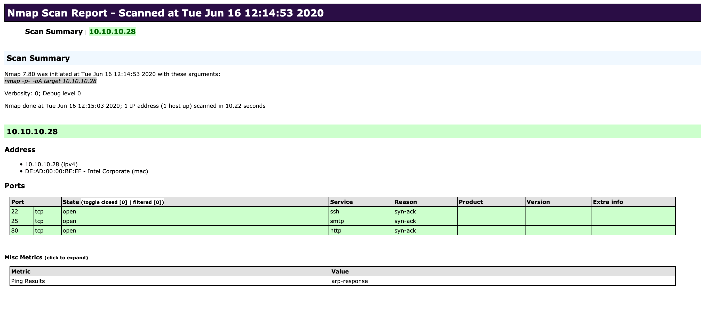

| Field                        | Value                                                                           |
| ---------------------------- | ------------------------------------------------------------------------------- |
| **Category**                 | Enumeration / Network Scanning / Service Discovery                              |
| **Primary Use**              | Discover hosts, open ports, services, versions, and possible attack surface     |
| **Protocols**                | TCP, UDP, ICMP, ARP                                                             |
| **Common Users**             | Pentesters, SOC analysts, sysadmins, defenders, network engineers               |
| **Best For**                 | Host discovery, port scanning, service enumeration, OS detection, NSE scripting |
| **Output Formats**           | Normal, grepable, XML                                                           |
| **Language / Extensibility** | C/C++ core, Lua for NSE scripts                                                 |

---

## Overview

`Nmap` is one of the most important tools for enumeration.
Its value is not in exploitation, but in identifying:

* live hosts
* open ports
* exposed services
* service versions
* possible operating systems
* filtering or firewall behavior
* extra information through scripts

> Enumeration is the key.
> The better the enumeration, the easier the next steps become.

---

## Why Nmap Matters

In most assessments, the hardest part is not getting access.
The hardest part is finding **where** and **how** to attack.

Nmap helps answer questions like:

* Which systems are alive?
* Which ports are reachable?
* Which services are running?
* Which versions are exposed?
* Is a firewall filtering traffic?
* Are there signs of weak or misconfigured services?

---

## Main Use Cases

* Security auditing
* Network mapping
* Host discovery
* Port discovery
* Service and version detection
* Operating system fingerprinting
* Firewall and filtering analysis
* Script-based enumeration with NSE
* Basic vulnerability discovery

---

## Nmap Architecture

Nmap can be divided into a few main areas:

1. **Host discovery**
2. **Port scanning**
3. **Service enumeration**
4. **OS detection**
5. **Scripted interaction with NSE**

---

## Basic Syntax

```bash
nmap <scan type> <options> <target>
```

### Example

```bash
sudo nmap -sS localhost
```

Example result:

```text
PORT     STATE SERVICE
22/tcp   open  ssh
80/tcp   open  http
5432/tcp open  postgresql
5901/tcp open  vnc-1
```

---

## How Nmap Interprets Responses

For TCP scans, Nmap often decides port state based on the response:

* `SYN-ACK` → port is **open**
* `RST` → port is **closed**
* no response / blocked response → port is often **filtered**

This makes Nmap useful not only for finding services, but also for understanding firewall behavior.

---

## Port States

Nmap can report different states for ports:

| State              | Description                                                                     |
| ------------------ | ------------------------------------------------------------------------------- |
| `open`             | A service is listening on the port                                              |
| `closed`           | The port is reachable but no service is listening                               |
| `filtered`         | Nmap cannot determine if the port is open because filtering blocks the response |
| `unfiltered`       | The port is reachable, but Nmap cannot determine open/closed state              |
| `open\|filtered`   | No response; could be open or filtered                                          |
| `closed\|filtered` | Used mainly in idle scans when Nmap cannot decide between closed or filtered    |

---

## Host Discovery

Host discovery is the first step in many scans.
It answers one question:

**Which systems are alive?**

### Scan a Network Range

```bash
sudo nmap 10.129.2.0/24 -sn -oA tnet
```

| Option          | Description                       |
| --------------- | --------------------------------- |
| `10.129.2.0/24` | Target subnet                     |
| `-sn`           | Host discovery only, no port scan |
| `-oA tnet`      | Save output in all formats        |

---

### Scan a List of Hosts

```bash
sudo nmap -sn -iL hosts.lst -oA tnet
```

| Option          | Description              |
| --------------- | ------------------------ |
| `-iL hosts.lst` | Read targets from a file |
| `-sn`           | Disable port scanning    |
| `-oA tnet`      | Save all output formats  |

---

### Scan Multiple IPs

```bash
sudo nmap -sn 10.129.2.18 10.129.2.19 10.129.2.20
```

Or shorter:

```bash
sudo nmap -sn 10.129.2.18-20
```

---

### Scan a Single Host

```bash
sudo nmap 10.129.2.18 -sn -oA host
```

Useful options:

| Option               | Description                    |
| -------------------- | ------------------------------ |
| `-PE`                | Use ICMP echo request          |
| `--reason`           | Show why Nmap made a decision  |
| `--packet-trace`     | Show sent and received packets |
| `--disable-arp-ping` | Disable ARP ping discovery     |

Example:

```bash
sudo nmap 10.129.2.18 -sn -PE --reason --packet-trace --disable-arp-ping
```

### Notes

* On local networks, Nmap often uses **ARP** to determine whether a host is alive.
* If ARP is disabled, it can rely on **ICMP echo requests** instead.
* A host marked as down does **not always mean it is offline**. Firewalls may simply block the probes.

---

## TCP Port Scanning

By default, Nmap scans the **top 1000 TCP ports** and usually uses a **SYN scan** (`-sS`) when run with sufficient privileges.

---

### SYN Scan

```bash
sudo nmap -sS 10.129.2.28
```

**Why it matters:**

* fast
* common default choice
* more discreet than a full TCP connect scan
* does not complete the full three-way handshake

---

### Trace the Packets

```bash
sudo nmap 10.129.2.28 -p 21 --packet-trace -Pn -n --disable-arp-ping
```

Useful for understanding what happens at packet level.

#### Interpreting the result

* `S` → SYN sent
* `SA` → SYN-ACK received → likely open
* `RA` → RST-ACK received → closed
* no response → likely filtered

---

### Connect Scan

```bash
sudo nmap -sT 10.129.2.28 -p 443 --reason
```

The **TCP Connect Scan** completes the full TCP three-way handshake.

#### Characteristics

* easier to detect
* less stealthy than SYN scan
* useful when raw packet privileges are not available

---

### Filtered Ports

A port marked as `filtered` usually means a firewall or packet filter is interfering.

```bash
sudo nmap 10.129.2.28 -p 139 --packet-trace -Pn -n --disable-arp-ping
```

Typical reasons:

* packets are silently dropped
* packets are actively rejected
* an intermediate firewall blocks responses

---

## UDP Scanning

UDP scanning is slower and often less reliable than TCP scanning because UDP is **stateless**.

```bash
sudo nmap 10.129.2.28 -F -sU
```

| Option | Description   |
| ------ | ------------- |
| `-sU`  | UDP scan      |
| `-F`   | Top 100 ports |

### Why UDP Scans Are Slower

* no TCP handshake
* many services do not reply to empty UDP probes
* Nmap often has to wait longer before making a decision

### Interpreting UDP Results

* UDP reply received → port is usually **open**
* ICMP type 3 code 3 (`port unreachable`) → port is **closed**
* no response → often `open|filtered`

Example:

```bash
sudo nmap 10.129.2.28 -sU -p 137 --reason --packet-trace -Pn -n --disable-arp-ping
```

---

## Service Enumeration

After finding open ports, the next step is identifying the service and version.

### Service Version Detection

```bash
sudo nmap 10.129.2.28 -p- -sV
```

| Option | Description              |
| ------ | ------------------------ |
| `-p-`  | Scan all 65535 TCP ports |
| `-sV`  | Detect service versions  |

Example output may show:

* service name
* version
* product details
* workgroup / hostname hints
* operating system clues

Example:

```text
445/tcp open  netbios-ssn syn-ack ttl 63 Samba smbd 3.X - 4.X
Service Info: Host: Ubuntu
```

---

### Verbose Mode

```bash
sudo nmap 10.129.2.28 -p- -sV -v
```

Useful because Nmap shows open ports as it discovers them.

---

### Progress Updates During Long Scans

```bash
sudo nmap 10.129.2.28 -p- -sV --stats-every=5s
```

Useful when scanning all ports or large targets.

---

## Banner Grabbing

Banner grabbing helps confirm what service is running and sometimes gives exact product details.

### With Nmap

```bash
sudo nmap 10.129.2.28 -p- -sV
```

### With Netcat

```bash
nc -nv 10.129.2.28 25
```

Example:

```text
220 inlane ESMTP Postfix (Ubuntu)
```

### With Tcpdump

```bash
sudo tcpdump -i eth0 host 10.10.14.2 and 10.129.2.28
```

This lets you inspect:

* TCP handshake
* service banner delivery
* server responses
* push and acknowledgment packets

### Typical TCP Flow

| Step | Packet    | Meaning                       |
| ---- | --------- | ----------------------------- |
| 1    | `SYN`     | Client initiates connection   |
| 2    | `SYN-ACK` | Server accepts connection     |
| 3    | `ACK`     | Client confirms               |
| 4    | `PSH-ACK` | Server sends application data |
| 5    | `ACK`     | Client confirms receipt       |

---

## Nmap Scripting Engine (NSE)



The **Nmap Scripting Engine** adds Lua-based scripts for deeper enumeration and testing.

### Common Uses

* banner grabbing
* protocol enumeration
* authentication checks
* vulnerability checks
* service interaction
* malware checks

### Script Categories

| Category    | Description                                    |
| ----------- | ---------------------------------------------- |
| `auth`      | Authentication-related checks                  |
| `broadcast` | Broadcast-based discovery                      |
| `brute`     | Brute-force login attempts                     |
| `default`   | Default scripts used with `-sC`                |
| `discovery` | Service and host discovery                     |
| `dos`       | Denial-of-service testing                      |
| `exploit`   | Known exploit attempts                         |
| `external`  | Uses external services/resources               |
| `fuzzer`    | Sends unusual inputs to identify weak handling |
| `intrusive` | Can affect the target negatively               |
| `malware`   | Malware-related checks                         |
| `safe`      | Safer, defensive scripts                       |
| `version`   | Extended version detection                     |
| `vuln`      | Vulnerability discovery scripts                |

---

### Default Scripts

```bash
sudo nmap <target> -sC
```

`-sC` runs the default NSE script set.

---

### Run a Script Category

```bash
sudo nmap <target> --script vuln
```

---

### Run Specific Scripts

```bash
sudo nmap <target> --script banner,smtp-commands
```

Example:

```bash
sudo nmap 10.129.2.28 -p 25 --script banner,smtp-commands
```

Possible result:

* SMTP banner
* supported SMTP commands
* TLS support
* VRFY support

---

### Aggressive Scan

```bash
sudo nmap 10.129.2.28 -p 80 -A
```

`-A` enables:

* service detection
* OS detection
* traceroute
* default NSE scripts

> `-A` is powerful, but noisy.
> It is useful in labs and authorized assessments, but not ideal when you want to stay low-noise.

---

## Vulnerability Checks

Nmap can help identify likely vulnerabilities through NSE scripts.

```bash
sudo nmap 10.129.2.28 -p 80 -sV --script vuln
```

This can reveal:

* interesting paths
* outdated service versions
* usernames
* known CVEs
* weak configurations

> Important: Nmap vulnerability scripts are useful for triage, not final proof.
> Always validate findings manually.

---

## OS Detection

Nmap can try to identify the operating system based on TCP/IP fingerprinting.

```bash
sudo nmap 10.129.2.28 -O
```

Or as part of an aggressive scan:

```bash
sudo nmap 10.129.2.28 -A
```

### Notes

* OS detection works better when Nmap can see at least one open and one closed port.
* Results are often probabilistic, not guaranteed.

---

## Saving Results

Saving scans is important for documentation, reporting, and later review.

### Output Formats

| Option     | Description      |
| ---------- | ---------------- |
| `-oN file` | Normal output    |
| `-oG file` | Grepable output  |
| `-oX file` | XML output       |
| `-oA file` | Save all formats |

### Example

```bash
sudo nmap 10.129.2.28 -p- -oA target
```

This creates:

* `target.nmap`
* `target.gnmap`
* `target.xml`

### Convert XML to HTML

```bash
xsltproc target.xml -o target.html
```

This is useful when you want a cleaner, browser-friendly report.

---

## Performance Tuning

Nmap can be tuned for speed, but faster scans may reduce accuracy.

### RTT Timeouts

```bash
sudo nmap 10.129.2.0/24 -F --initial-rtt-timeout 50ms --max-rtt-timeout 100ms
```

| Option                  | Description           |
| ----------------------- | --------------------- |
| `--initial-rtt-timeout` | Initial timeout value |
| `--max-rtt-timeout`     | Maximum timeout value |

---

### Max Retries

```bash
sudo nmap 10.129.2.0/24 -F --max-retries 0
```

Lower retries make scans faster, but you may miss results.

---

### Minimum Packet Rate

```bash
sudo nmap 10.129.2.0/24 -F --min-rate 300
```

This increases the number of packets Nmap tries to send per second.

---

### Timing Templates

| Template | Name       | Notes                               |
| -------- | ---------- | ----------------------------------- |
| `-T0`    | paranoid   | Very slow                           |
| `-T1`    | sneaky     | Slow                                |
| `-T2`    | polite     | Reduced impact                      |
| `-T3`    | normal     | Default-style balance               |
| `-T4`    | aggressive | Faster, commonly used in labs       |
| `-T5`    | insane     | Very fast, more risk of missed data |

Example:

```bash
sudo nmap 10.129.2.0/24 -F -T5
```

> Faster is not always better.
> Aggressive timing can increase packet loss, detection, and false negatives.

---

## Firewall and IDS/IPS Evasion

Nmap can help identify filtering behavior and test how traffic is handled.

### Dropped vs Rejected

A firewall may:

* **drop** packets silently
* **reject** packets with TCP RST or ICMP errors

This affects how Nmap labels the port.

---

### ACK Scan

ACK scans help determine whether a port is filtered by a firewall.

```bash
sudo nmap 10.129.2.28 -p 21,22,25 -sA -Pn -n --disable-arp-ping --packet-trace
```

Possible states:

* `unfiltered` → reachable, but open/closed unknown
* `filtered` → likely blocked by firewall

---

### Decoys

```bash
sudo nmap 10.129.2.28 -p 80 -sS -D RND:5 -Pn -n --disable-arp-ping
```

This inserts random decoy IP addresses into the scan traffic.

#### Purpose

* obscure the real source
* complicate log analysis
* sometimes bypass basic filtering assumptions

---

### Spoofed Source IP

```bash
sudo nmap 10.129.2.28 -p 445 -O -S 10.129.2.200 -e tun0 -Pn -n
```

| Option | Description      |
| ------ | ---------------- |
| `-S`   | Spoof source IP  |
| `-e`   | Select interface |

> This only works in specific network situations and with proper routing support.

---

### Source Port Manipulation

Some poorly configured firewalls trust traffic from certain source ports.

```bash
sudo nmap 10.129.2.28 -p 50000 -sS --source-port 53 -Pn -n --disable-arp-ping
```

This can be useful when a firewall incorrectly trusts traffic from DNS port `53`.

Equivalent short option:

```bash
-g 53
```

---

## Practical Workflow

A common Nmap workflow looks like this:

### 1. Discover Live Hosts

```bash
sudo nmap 10.10.10.0/24 -sn
```

### 2. Scan Important Ports

```bash
sudo nmap 10.10.10.5 -F
```

### 3. Scan All TCP Ports

```bash
sudo nmap 10.10.10.5 -p-
```

### 4. Enumerate Services

```bash
sudo nmap 10.10.10.5 -p- -sV
```

### 5. Run Default Scripts

```bash
sudo nmap 10.10.10.5 -sC -sV
```

### 6. Run Focused NSE Scripts

```bash
sudo nmap 10.10.10.5 -p 80,443 --script http-enum,http-title
```

### 7. Save Results

```bash
sudo nmap 10.10.10.5 -p- -sV -oA scan_full
```

---

## Recommended Commands

### Quick Host Discovery

```bash
sudo nmap 10.10.10.0/24 -sn
```

### Fast Top Ports Scan

```bash
sudo nmap 10.10.10.5 -F
```

### Full TCP Scan

```bash
sudo nmap 10.10.10.5 -p-
```

### Service Enumeration

```bash
sudo nmap 10.10.10.5 -p- -sV
```

### Default Script Scan

```bash
sudo nmap 10.10.10.5 -sC -sV
```

### Aggressive Enumeration

```bash
sudo nmap 10.10.10.5 -A
```

### UDP Scan

```bash
sudo nmap 10.10.10.5 -sU -F
```

### Save Everything

```bash
sudo nmap 10.10.10.5 -p- -sV -oA target
```

---

## Important Nmap Options

### Scanning Options

| Option               | Description                           |
| -------------------- | ------------------------------------- |
| `-sn`                | Host discovery only                   |
| `-Pn`                | Skip host discovery, treat host as up |
| `-n`                 | Disable DNS resolution                |
| `-PE`                | ICMP echo request ping                |
| `--packet-trace`     | Show sent and received packets        |
| `--reason`           | Show why Nmap made a decision         |
| `--disable-arp-ping` | Disable ARP-based discovery           |
| `--top-ports=<num>`  | Scan top most common ports            |
| `-p-`                | Scan all TCP ports                    |
| `-p22-110`           | Scan a range of ports                 |
| `-p22,25`            | Scan specific ports                   |
| `-F`                 | Scan top 100 ports                    |
| `-sS`                | SYN scan                              |
| `-sT`                | TCP connect scan                      |
| `-sA`                | ACK scan                              |
| `-sU`                | UDP scan                              |
| `-sV`                | Service version detection             |
| `-sC`                | Default NSE scripts                   |
| `--script <name>`    | Run selected script(s)                |
| `-O`                 | OS detection                          |
| `-A`                 | Aggressive scan                       |
| `-D RND:5`           | Use 5 random decoys                   |
| `-e <iface>`         | Use a specific interface              |
| `-S <ip>`            | Use a specific source IP              |
| `-g <port>`          | Use a specific source port            |
| `--dns-server <ns>`  | Use a specific DNS server             |

---

## Output Options

| Option         | Description             |
| -------------- | ----------------------- |
| `-oA filename` | Save all output formats |
| `-oN filename` | Save normal output      |
| `-oG filename` | Save grepable output    |
| `-oX filename` | Save XML output         |

---

## Performance Options

| Option                       | Description                   |
| ---------------------------- | ----------------------------- |
| `--max-retries <num>`        | Maximum retries per probe     |
| `--stats-every=5s`           | Show progress every 5 seconds |
| `-v` / `-vv`                 | Verbose output                |
| `--initial-rtt-timeout 50ms` | Initial RTT timeout           |
| `--max-rtt-timeout 100ms`    | Maximum RTT timeout           |
| `--min-rate 300`             | Minimum packet send rate      |
| `-T <0-5>`                   | Timing template               |

---

## Notes and Limitations

* A host may appear down while actually filtering probes.
* UDP results are often less clear than TCP results.
* Service version detection is strong, but not perfect.
* OS detection is probabilistic.
* Aggressive scans are noisy.
* Fast scans can miss ports or services.
* NSE vulnerability results should be manually validated.

---

