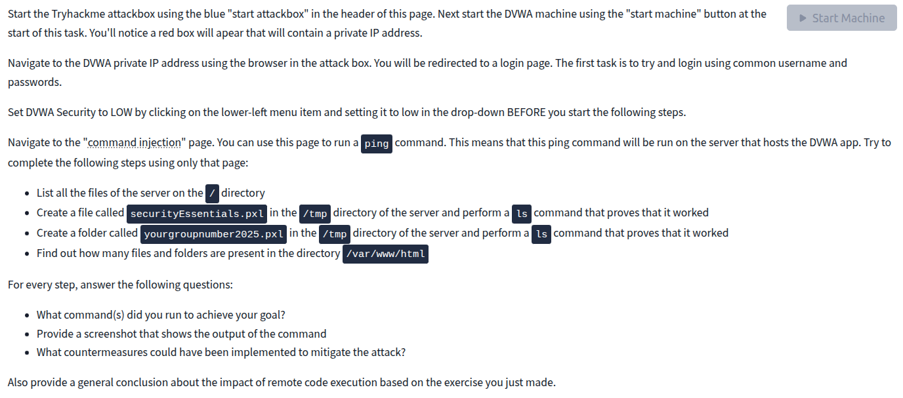
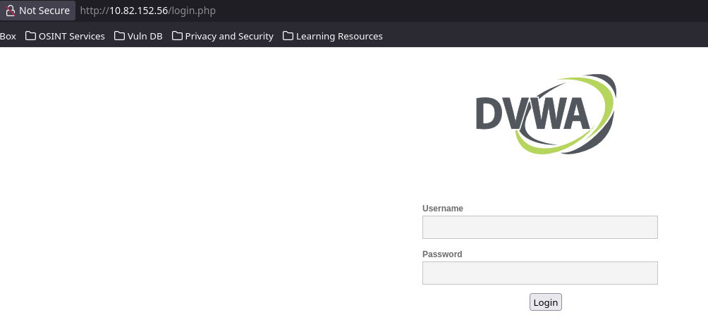
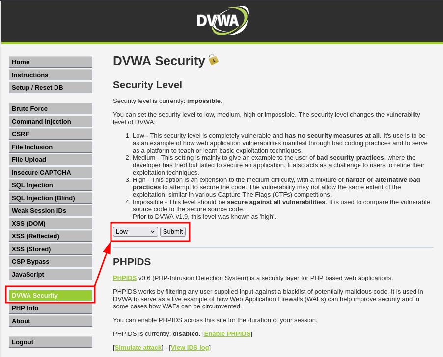
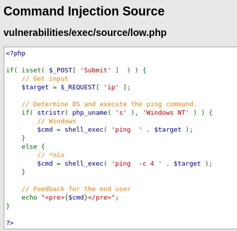
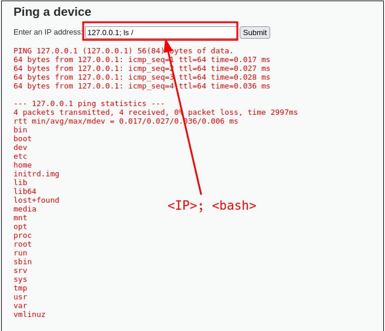
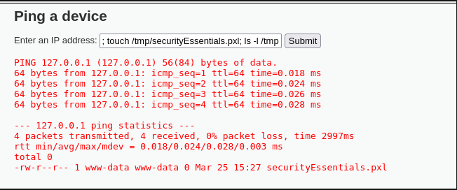
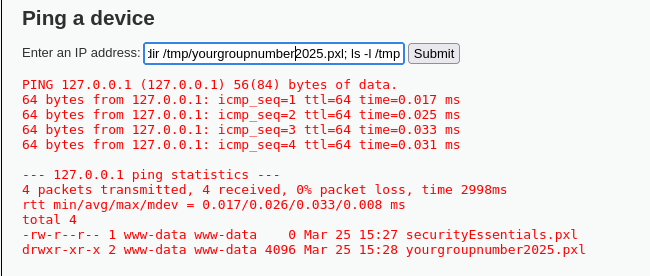
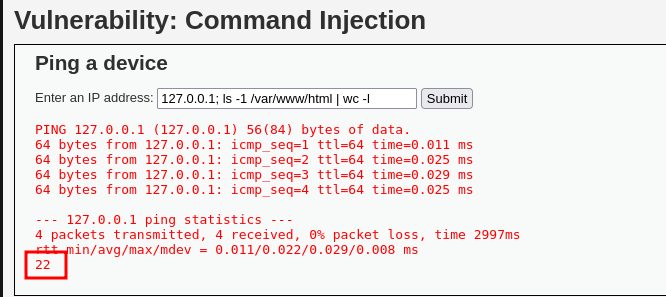
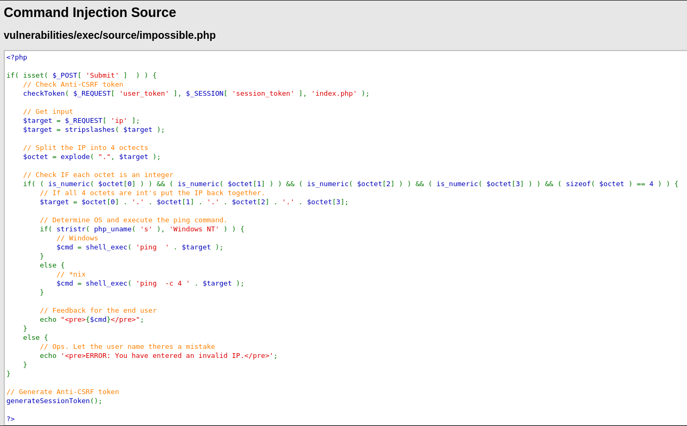

# DVWA command Injection

| Field | Value |
|------|------| 
| **Platform:** | TryHackMe |  
| **Room:** | DVWA | 
| **Task:** | Task 5 | 
|**Difficulty:** | Easy | 
| **Type:** | Web / Command Injection / RCE |



---

## 1. Objective

In this task, the goal was to exploit a **command injection** vulnerability in DVWA in order to achieve **remote code execution** through the vulnerable **Command Injection** page.

The exercise required the following:

- Log in to the DVWA web application using common/default credentials
- Set DVWA security to **Low**
- Use only the **command injection** functionality to:
  - List all files in the root (`/`) directory
  - Create a file named `securityEssentials.pxl` in `/tmp` and prove it exists
  - Create a directory named `yourgroupnumber2025.pxl` in `/tmp` and prove it exists
  - Determine how many files and directories are present in `/var/www/html`
- For each action:
  - State the command(s) used
  - Provide proof via screenshot
  - Explain countermeasures
- End with a general conclusion on the impact of RCE

---

## 2. Initial Access

The first step was to navigate to the DVWA login page using the private IP address of the target machine.

### Login Credentials

The application accepted the default DVWA credentials:

- **Username:** `admin`
- **Password:** `password`



After authentication, DVWA security was changed to **Low** via the **DVWA Security** page in the lower-left menu.



---

## 3. Vulnerability Overview

The vulnerable functionality is located under the **Command Injection** page.



This page is intended to run a `ping` command against a supplied IP address. However, on **Low** security, the application does not properly sanitize user input. As a result, an attacker can append additional shell commands using separators such as:

```bash
;
````

This turns a simple ping input into a command injection primitive, allowing arbitrary OS commands to be executed on the server.

Example concept:

```bash
127.0.0.1; whoami
```

In practice, the application executes the intended `ping`, but also executes the injected command after the separator.

---

## 4. Step 1 — List All Files in the Root Directory

### Goal

List the files and directories present in `/`.

### Command Used

```bash
127.0.0.1; ls /
```

### Explanation

* `127.0.0.1` is a valid value for the ping function
* `;` terminates the first command and starts a second one
* `ls /` lists the contents of the root directory

### Result

The application returned the normal ping output, followed by the output of `ls /`, proving that arbitrary shell commands were executed successfully on the remote host.



### Why This Matters

At this point, the attacker has moved beyond normal user interaction and is now executing operating system commands on the server. Even simple enumeration commands can reveal:

* Filesystem structure
* Installed components
* Writable directories
* Potential secrets or configuration files

### Countermeasures

* Never pass unsanitized user input into shell commands
* Avoid shell execution entirely where possible
* Use safe server-side APIs instead of system shell calls
* Strictly validate and whitelist input values
* Run the web server with the least privileges possible
* Use web application firewalls and logging for suspicious payloads

---

## 5. Step 2 — Create a File in `/tmp`

### Goal

Create a file named `securityEssentials.pxl` in `/tmp` and prove it was created.

### Command Used

```bash
127.0.0.1; touch /tmp/securityEssentials.pxl; ls -l /tmp
```

### Explanation

* `touch /tmp/securityEssentials.pxl` creates the file
* `ls -l /tmp` lists the contents of `/tmp` and shows the new file

### Result

The output showed the presence of `securityEssentials.pxl` in `/tmp`, proving that the file was created on the remote server.



### Why This Matters

Being able to create files on a target system is a serious escalation in attacker capability. This can be abused to:

* Drop web shells
* Write malicious scripts
* Create staging files for further exploitation
* Plant persistence mechanisms

### Countermeasures

* Disable shell-based command execution in the application
* Restrict write permissions for the web server account
* Harden filesystem permissions
* Use containerization or sandboxing where appropriate
* Monitor for unusual file creation in writable directories like `/tmp`

---

## 6. Step 3 — Create a Directory in `/tmp`

### Goal

Create a directory called `yourgroupnumber2025.pxl` in `/tmp` and prove it was created.

### Command Used

```bash
127.0.0.1; mkdir /tmp/yourgroupnumber2025.pxl; ls -l /tmp
```
> use your actual group I forgot lol

### Explanation

* `mkdir /tmp/yourgroupnumber2025.pxl` creates a new directory
* `ls -l /tmp` confirms its presence

### Result

The output showed the newly created directory in `/tmp`, again confirming that arbitrary OS-level actions could be performed through the vulnerable web page.



### Why This Matters

Directory creation shows that the attacker is not limited to read-only actions. They can manipulate the filesystem and prepare a controlled workspace for malicious tooling, uploaded payloads, or further abuse.

### Countermeasures

* Apply strict input validation and reject special shell metacharacters
* Remove dangerous functionality that invokes OS commands directly
* Enforce least privilege on the web application account
* Use application allowlists instead of passing raw input to the shell
* Detect and alert on abnormal filesystem modifications

---

## 7. Step 4 — Count Files and Directories in `/var/www/html`

### Goal

Determine how many files and folders are present in `/var/www/html`.

### Command Used

```bash
127.0.0.1; ls -1 /var/www/html | wc -l
```

### Explanation

* `ls -1 /var/www/html` lists each entry on a separate line
* `wc -l` counts the number of lines
* The result equals the number of visible files/directories in that location

### Result

The command returned the total number of entries in `/var/www/html`.


```text
wc -l returned: 22
```



### Why This Matters

This demonstrates that the attacker can inspect the application directory and gather intelligence about the structure of the hosted web application. This type of reconnaissance can lead to:

* Identification of web roots
* Discovery of sensitive files
* Location of scripts, configs, or upload directories
* More targeted follow-up exploitation

### Countermeasures

* Never expose direct shell execution through user-controlled parameters
* Separate the web application from sensitive system locations
* Restrict access rights to application directories
* Use secure coding practices and parameterized APIs
* Audit and log all abnormal command-like input patterns

---

## 8. Technical Analysis of the Vulnerability

This is a classic **OS Command Injection** issue that leads directly to **Remote Code Execution (RCE)**.

### Root Cause

The vulnerable application accepts user input and inserts it directly into a shell command without proper sanitization.

A likely insecure pattern behind the scenes would resemble:



```php
system("ping -c 4 " . $_GET['ip']);
```

If the user supplies only an IP address, the function behaves as intended. If the user appends a shell separator and another command, the shell interprets both.

Example payload:

```bash
127.0.0.1; ls /
```

### Security Impact

Because the server executes attacker-controlled commands, the attacker may be able to:

* Enumerate the operating system
* Read sensitive files
* Create or modify files
* Download or launch payloads
* Establish persistence
* Pivot to full system compromise

The exact impact depends on the privileges of the web server process. Even with limited rights, RCE is still considered a high-severity vulnerability because it provides direct code execution on the target host.

---

## 9. Indicators of Successful Exploitation

The following behaviors confirmed successful command injection:

* Valid ping output still appeared
* Additional command output was displayed below the ping results
* Files and directories could be created in `/tmp`
* Directory contents could be enumerated remotely
* File and directory counts could be retrieved from the target filesystem

These outputs prove that the application was not only vulnerable to injection, but that it allowed meaningful command execution on the underlying server.

---

## 10. Defensive Recommendations

To mitigate this class of vulnerability, the following controls should be implemented:

### Secure Coding

* Do not call shell commands with raw user input
* Use built-in language functions or safe libraries instead of `system()`, `exec()`, or similar functions
* Validate input against a strict allowlist

### Input Validation

* Accept only valid IP address formats if the page is intended for ping functionality
* Reject metacharacters such as:

  * `;`
  * `&&`
  * `|`
  * `` ` ``
  * `$()`

### Principle of Least Privilege

* Run the web server as a low-privileged account
* Restrict write access to the filesystem
* Prevent execution from writable directories

### Monitoring and Detection

* Log suspicious input patterns
* Alert on command separators and shell syntax in user parameters
* Monitor file creation in temporary directories
* Use EDR or audit tooling for shell execution from web services

### Hardening

* Disable dangerous PHP functions where possible
* Segment the application environment
* Use containers, chroot jails, or sandboxing to reduce blast radius

---

## 11. Conclusion

This task demonstrated how a seemingly simple input field can become a full **remote code execution** vector when user input is passed directly to a shell command.

By exploiting the command injection flaw in DVWA on **Low** security, it was possible to:

* Enumerate the root directory
* Create files on the target system
* Create directories on the target system
* Inspect the web application directory structure

This shows the real-world severity of command injection vulnerabilities. Once arbitrary commands can be executed on the server, the attacker is no longer limited to interacting with the web application itself, but can directly interact with the underlying operating system. From a defensive perspective, this can lead to data exposure, persistence, lateral movement, service disruption, and full compromise of the host.

In short, **command injection is one of the most dangerous classes of web vulnerabilities because it can quickly escalate from a simple input flaw to complete system-level impact**.

---

## 12. Answers Summary

### DVWA Credentials

* **Username:** `admin`
* **Password:** `password`

### Commands Used

#### List files in `/`

```bash
127.0.0.1; ls /
```

#### Create file in `/tmp`

```bash
127.0.0.1; touch /tmp/securityEssentials.pxl; ls -l /tmp
```

#### Create directory in `/tmp`

```bash
127.0.0.1; mkdir /tmp/yourgroupnumber2025.pxl; ls -l /tmp
```

#### Count entries in `/var/www/html`

```bash
127.0.0.1; ls -1 /var/www/html | wc -l
```


