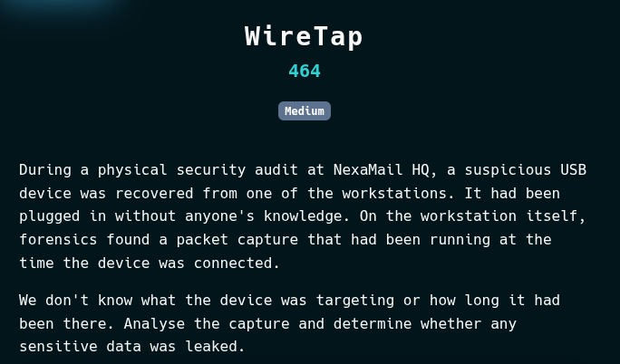
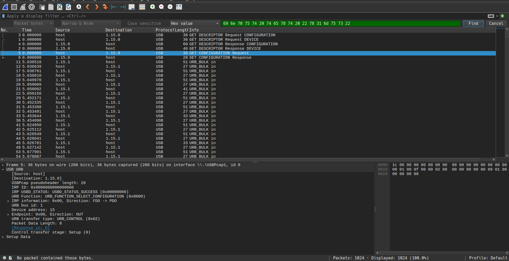
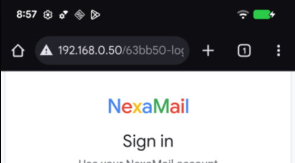
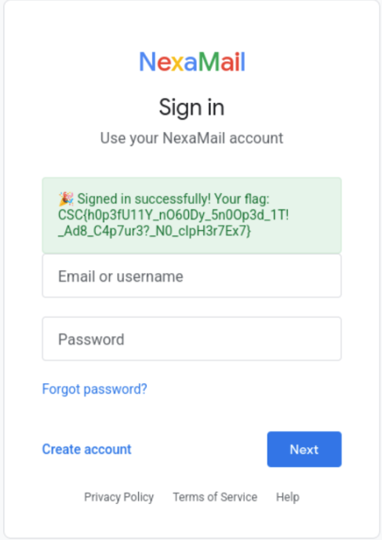

# WireTap 
| Field | Value |
|------|------|
| **Platform** | CSCBE |  
| **CTF** | Qualifiers 2026 |  
| **Difficulty** | Medium |
| **Type** | Forensics |
| **Vulnerability** | ADB injection |
| **File** | `capture.pcapng` |



---

## 1. Initial Analysis

We start by identifying the nature of the capture.

```bash
file capture.pcapng
```

Result:

```
pcapng capture file
```

Open in Wireshark or use `tshark` for quick triage:

```bash
tshark -r capture.pcapng -q -z io,phs
```

### Key Observation

- No typical network protocols (HTTP, DNS, etc.)
    
- Traffic is **USB-based**
    

This indicates:

> The capture is not network traffic → it is **USBPcap**

---

## 2. Identify Protocol (ADB over USB)

Search for readable strings:

```bash
strings capture.pcapng | less
```

You will find:

```
OPEN
WRTE
OKAY
CLSE
shell,v2
```

### Conclusion

This is **ADB (Android Debug Bridge)** communication over USB.

---

## 3. Reconstruct Attacker Activity

Filter for readable command input:

```bash
strings capture.pcapng | grep -i "input text"
```

Result:

```
input text "x1mus"
input text "Please0p3nTh3D00R!!!_b6ec8bd3"
```

### Interpretation

The USB device is acting like a **BadUSB / Rubber Ducky**:

- Injects username
    
- Injects password
    
- Automates login

# Critical Observation

The PCAP is **USBPcap (ADB over USB)**.

We saw:
- `shell,v2`
- `input text ...`
- `sync:`
- `raw:screencap`

This is not just credential injection.

This looks like:
1. Open shell
2. Inject credentials
3. Take screenshot
4. Possibly pull file
### full injection of attacker
```
echo CSC{d1d_y0u_us3_Cl4ud3_t0_f1nd_m3?_k33p_l00k1ng!_f3225309987939a9}   <-- bait
input text "x1mus"
input text "Please0p3nTh3D00R!!!_b6ec8bd3"
exit
```
---

## 4. Detect Bait Flag

Search for flags:

```bash
strings capture.pcapng | grep CSC
```

You will find:

```
CSC{d1d_y0u_us3_Cl4ud3...}
```

### Important

This is a **bait flag**:

- Generated via `echo`
    
- Not actual exfiltration
    

---

## 5. Identify Screenshot Capture

ADB command observed:

```
screencap
```

Search for PNG signature:

```bash
tshark -r capture.pcapng -Y 'frame contains 89:50:4e:47'
```

Result:

```
Frame 1011 → USB bulk transfer (large payload)
```

---

## 6. Extract the Screenshot

### Step 1 — Extract raw payload

```bash
tshark -r capture.pcapng -Y "frame.number == 1011" -T fields -e usb.capdata > raw_hex.txt
```

### Step 2 — Convert hex → binary

```bash
cat raw_hex.txt | tr -d ':' | xxd -r -p > screenshot.png
```

### Step 3 — Verify

```bash
file screenshot.png
```

Result:


```
PNG image data
```

---

## 7. Analyze Screenshot

The screenshot shows:

- NexaMail login page
    
- Internal address:
    
    ```
    192.168.0.50/63bb50-login
    ```
    

### Key Insight

The attacker accessed:

- Internal service
    
- Specific endpoint (`63bb50-login`)
    
- Using injected credentials
    

---

## 8. Pivot to Live Service

The challenge provides:

```
http://wiretap.7711a73519b9e6d7.challenge.zone:8080
```

Using information from the screenshot:

```
http://wiretap...:8080/63bb50-login
```

---

## 9. Authenticate with Extracted Credentials

From PCAP:

```
username: x1mus
password: Please0p3nTh3D00R!!!_b6ec8bd3
```

Login via browser  with **http://wiretap.7711a73519b9e6d7.challenge.zone:8080/63bb50-login**



---

## 10. Retrieve the Flag

After successful login:

```
Signed in successfully! Your flag:
CSC{h0p3fu11y_n060Dy_5n00p3d_1T!_Ad8_c4p7ur3?_N0_clpH3r7Ex7}
```

---

# Final Answer

```
CSC{h0p3fu11y_n060Dy_5n00p3d_1T!_Ad8_c4p7ur3?_N0_clpH3r7Ex7}
```

---

# Key Takeaways

- USB captures can contain **ADB traffic**, not just network protocols
    
- `strings` is extremely effective for quick triage
    
- **ADB input injection = credential compromise**
    
- Screenshots (`screencap`) are a common exfiltration method
    
- Always verify flags — **CTFs often include bait**
    

---
